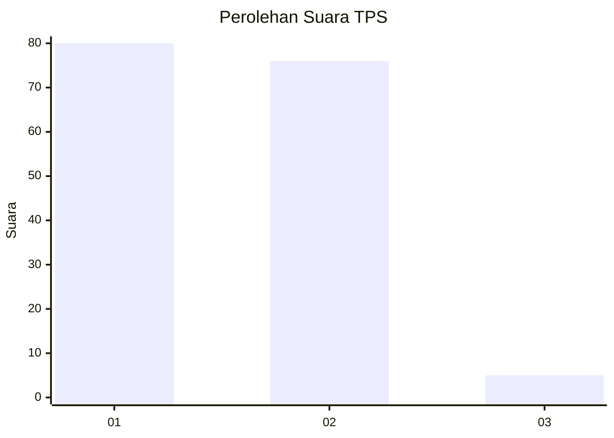
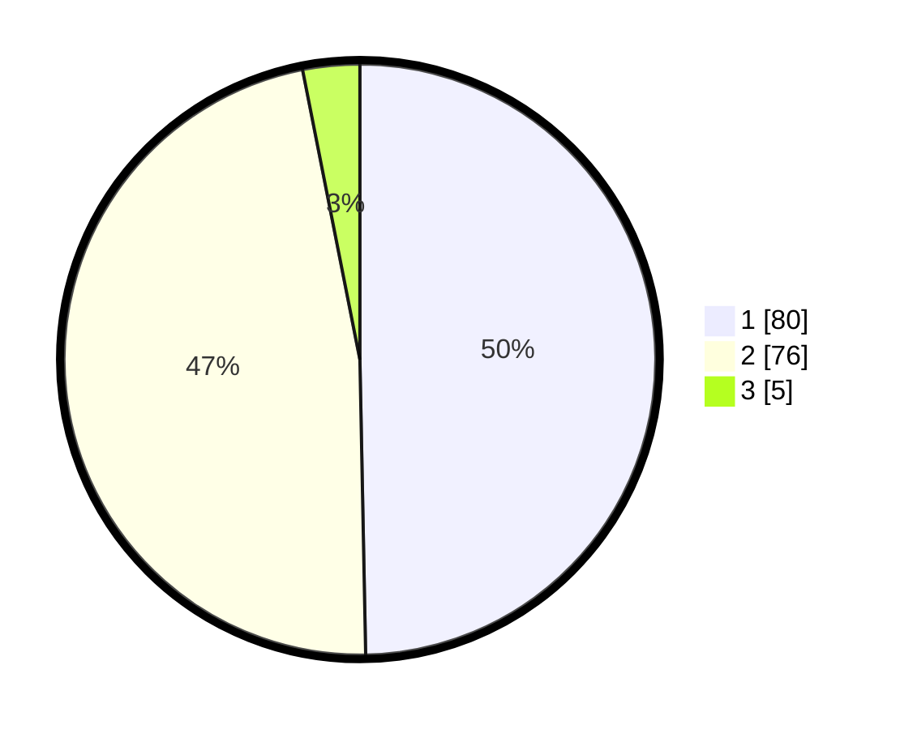

# Hasil

## Grafik

## Tabel

| No. | Nama Paslon    | Suara | Suara (raw) | Persentase |
|:--- |:-------------- | -----:| -----------:| ----------:|
| 1   | ANIES MUHAIMIN | 80    | [80][p-1]   | 49,69      |
| 2   | PRABOWO GIBRAN | 76    | [76][p-2]   | 47,20      |
| 3   | GANJAR MAHFUD  | 5     | [5][p-3]    | 3,11       |

[p-1]: https://github.com/gigit-pemilu/pemilu-2024-14-riau/blob/main/pilpres/hitung-suara/sub/14-riau/sub/03-bengkalis/sub/14-bandar-laksamana/sub/2003-api-api/sub/003-tps/sub/paslon-1.txt
[p-2]: https://github.com/gigit-pemilu/pemilu-2024-14-riau/blob/main/pilpres/hitung-suara/sub/14-riau/sub/03-bengkalis/sub/14-bandar-laksamana/sub/2003-api-api/sub/003-tps/sub/paslon-2.txt
[p-3]: https://github.com/gigit-pemilu/pemilu-2024-14-riau/blob/main/pilpres/hitung-suara/sub/14-riau/sub/03-bengkalis/sub/14-bandar-laksamana/sub/2003-api-api/sub/003-tps/sub/paslon-3.txt

## Foto C Plano

https://sirekap-obj-formc.kpu.go.id/702e/pemilu/ppwp/14/03/14/20/03/1403142003003-20240214-160059--a757ba16-371f-4fb2-bcfc-9f09d02313aa.jpg

https://sirekap-obj-formc.kpu.go.id/702e/pemilu/ppwp/14/03/14/20/03/1403142003003-20240214-155901--3281711b-7b79-413f-984f-5fffc80edd88.jpg

https://sirekap-obj-formc.kpu.go.id/702e/pemilu/ppwp/14/03/14/20/03/1403142003003-20240214-160056--c076789e-ffa2-49f6-b471-217bbe3ba7c1.jpg

## Metadata

| Key        | Value               |
| ---------- | ------------------- |
| Time Stamp | 2024-02-25 13:00:00 |

