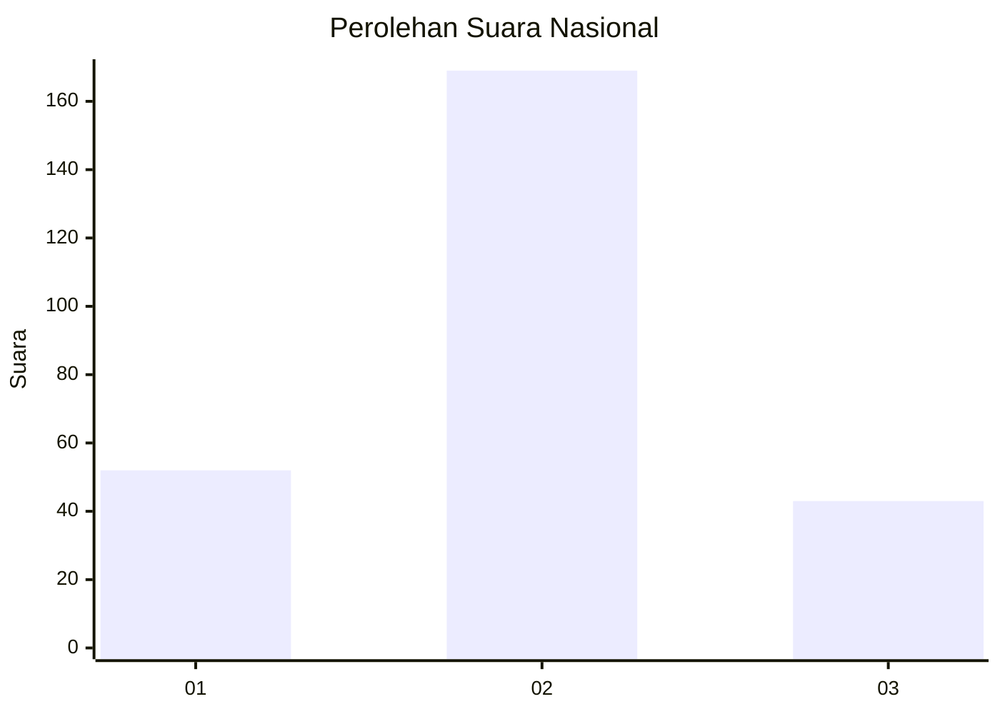

# Hasil

## Grafik

## Tabel

| No. | Nama Paslon    | Suara | Suara (raw) | Persentase |
|:--- |:-------------- | -----:| -----------:| ----------:|
| 1   | ANIES MUHAIMIN | 52    | [52][p-1]   | 19,70      |
| 2   | PRABOWO GIBRAN | 169   | [169][p-2]  | 64,02      |
| 3   | GANJAR MAHFUD  | 43    | [43][p-3]   | 16,29      |

[p-1]: https://github.com/gigit-pemilu/pemilu-2024/blob/main/pilpres/hitung-suara/sub/14-riau/sub/03-bengkalis/sub/14-bandar-laksamana/sub/2006-bukit-kerikil/sub/010-tps/sub/paslon-1.txt
[p-2]: https://github.com/gigit-pemilu/pemilu-2024/blob/main/pilpres/hitung-suara/sub/14-riau/sub/03-bengkalis/sub/14-bandar-laksamana/sub/2006-bukit-kerikil/sub/010-tps/sub/paslon-2.txt
[p-3]: https://github.com/gigit-pemilu/pemilu-2024/blob/main/pilpres/hitung-suara/sub/14-riau/sub/03-bengkalis/sub/14-bandar-laksamana/sub/2006-bukit-kerikil/sub/010-tps/sub/paslon-3.txt

## Foto C Plano

https://sirekap-obj-formc.kpu.go.id/3932/pemilu/ppwp/14/03/14/20/06/1403142006010-20240215-073953--bf1d7089-fb9c-424d-9e39-7523750ce72b.jpg

https://sirekap-obj-formc.kpu.go.id/3932/pemilu/ppwp/14/03/14/20/06/1403142006010-20240215-074130--58911e0e-0ff5-4990-b790-189bc512a9d0.jpg

https://sirekap-obj-formc.kpu.go.id/3932/pemilu/ppwp/14/03/14/20/06/1403142006010-20240215-074242--1fe9edd4-b642-4099-9ec1-b145848ccddb.jpg

## Metadata

| Key        | Value               |
| ---------- | ------------------- |
| Time Stamp | 2024-02-15 17:00:25 |

