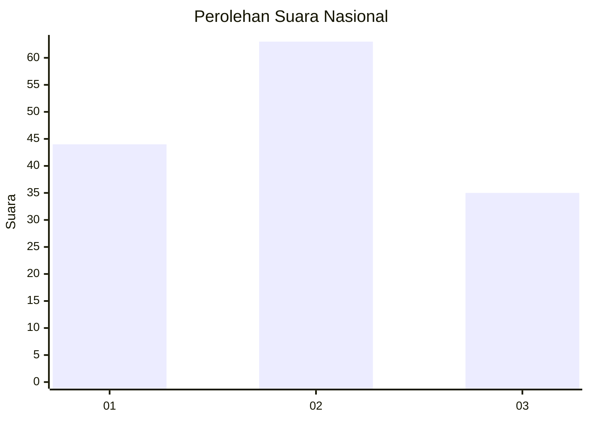
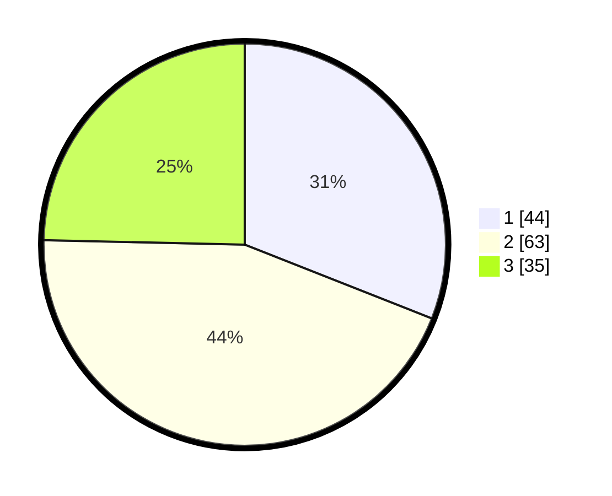

# Hasil

## Grafik

## Tabel

| No. | Nama Paslon    | Suara | Suara (raw) | Persentase |
|:--- |:-------------- | -----:| -----------:| ----------:|
| 1   | ANIES MUHAIMIN | 44    | [44][p-1]   | 30,99      |
| 2   | PRABOWO GIBRAN | 63    | [63][p-2]   | 44,37      |
| 3   | GANJAR MAHFUD  | 35    | [35][p-3]   | 24,65      |

[p-1]: https://github.com/gigit-pemilu/pemilu-2024/blob/main/pilpres/hitung-suara/sub/14-riau/sub/03-bengkalis/sub/15-talang-muandau/sub/2001-tasik-serai/sub/004-tps/sub/paslon-1.txt
[p-2]: https://github.com/gigit-pemilu/pemilu-2024/blob/main/pilpres/hitung-suara/sub/14-riau/sub/03-bengkalis/sub/15-talang-muandau/sub/2001-tasik-serai/sub/004-tps/sub/paslon-2.txt
[p-3]: https://github.com/gigit-pemilu/pemilu-2024/blob/main/pilpres/hitung-suara/sub/14-riau/sub/03-bengkalis/sub/15-talang-muandau/sub/2001-tasik-serai/sub/004-tps/sub/paslon-3.txt

## Foto C Plano

https://sirekap-obj-formc.kpu.go.id/16a8/pemilu/ppwp/14/03/15/20/01/1403152001004-20240214-212855--ae3c4818-8171-45d9-8a43-e1fd5cc2a5d1.jpg

https://sirekap-obj-formc.kpu.go.id/16a8/pemilu/ppwp/14/03/15/20/01/1403152001004-20240214-213048--e85f925f-8e5e-4b1f-a9af-635e225702ec.jpg

https://sirekap-obj-formc.kpu.go.id/16a8/pemilu/ppwp/14/03/15/20/01/1403152001004-20240214-232741--d9fe12fc-7fe0-48fa-8bf9-bf9b53ce38ec.jpg

## Metadata

| Key        | Value               |
| ---------- | ------------------- |
| Time Stamp | 2024-02-16 16:25:10 |

