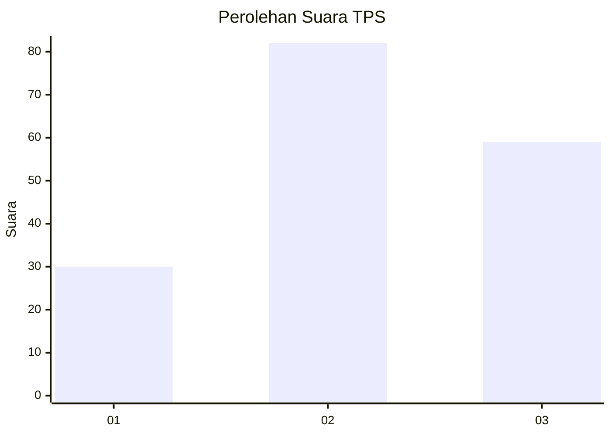
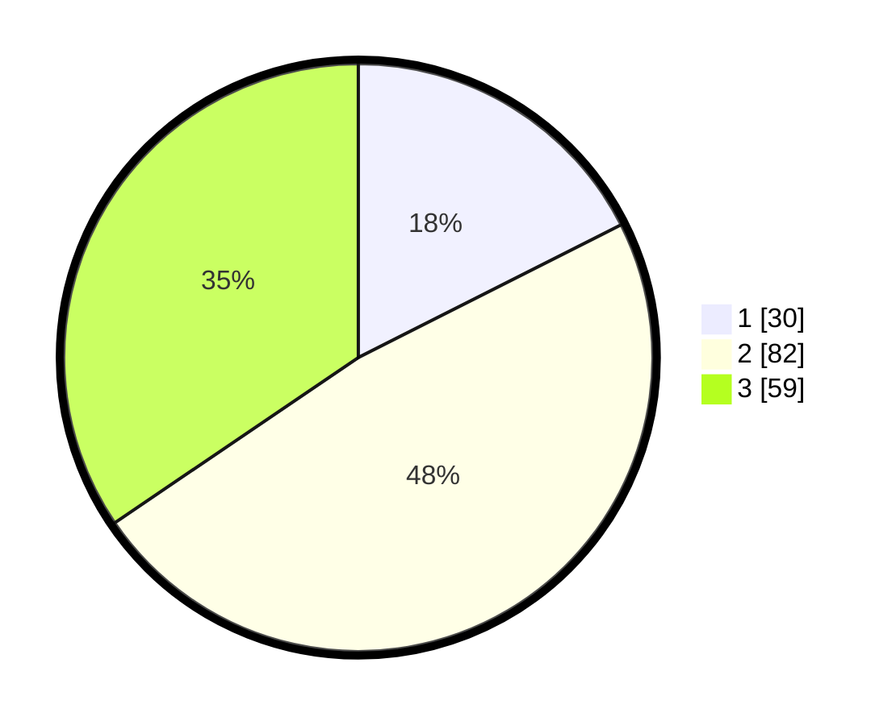

# Hasil

## Grafik

## Tabel

| No. | Nama Paslon    | Suara | Suara (raw) | Persentase |
|:--- |:-------------- | -----:| -----------:| ----------:|
| 1   | ANIES MUHAIMIN | 30    | [30][p-1]   | 17,54      |
| 2   | PRABOWO GIBRAN | 82    | [82][p-2]   | 47,95      |
| 3   | GANJAR MAHFUD  | 59    | [59][p-3]   | 34,50      |

[p-1]: https://github.com/gigit-pemilu/pemilu-2024-14-riau/blob/main/pilpres/hitung-suara/sub/14-riau/sub/03-bengkalis/sub/15-talang-muandau/sub/2001-tasik-serai/sub/005-tps/sub/paslon-1.txt
[p-2]: https://github.com/gigit-pemilu/pemilu-2024-14-riau/blob/main/pilpres/hitung-suara/sub/14-riau/sub/03-bengkalis/sub/15-talang-muandau/sub/2001-tasik-serai/sub/005-tps/sub/paslon-2.txt
[p-3]: https://github.com/gigit-pemilu/pemilu-2024-14-riau/blob/main/pilpres/hitung-suara/sub/14-riau/sub/03-bengkalis/sub/15-talang-muandau/sub/2001-tasik-serai/sub/005-tps/sub/paslon-3.txt

## Foto C Plano

https://sirekap-obj-formc.kpu.go.id/8b9f/pemilu/ppwp/14/03/15/20/01/1403152001005-20240214-222649--acf10564-13f4-4cc2-ae2a-81185622be24.jpg

https://sirekap-obj-formc.kpu.go.id/8b9f/pemilu/ppwp/14/03/15/20/01/1403152001005-20240214-222737--22df84d6-54a1-4d0e-b6b3-7f6db5f1ff54.jpg

https://sirekap-obj-formc.kpu.go.id/8b9f/pemilu/ppwp/14/03/15/20/01/1403152001005-20240214-222822--f8f19fff-0433-46c6-9eae-b16348a6a2f1.jpg

## Metadata

| Key        | Value               |
| ---------- | ------------------- |
| Time Stamp | 2024-02-15 15:00:29 |

