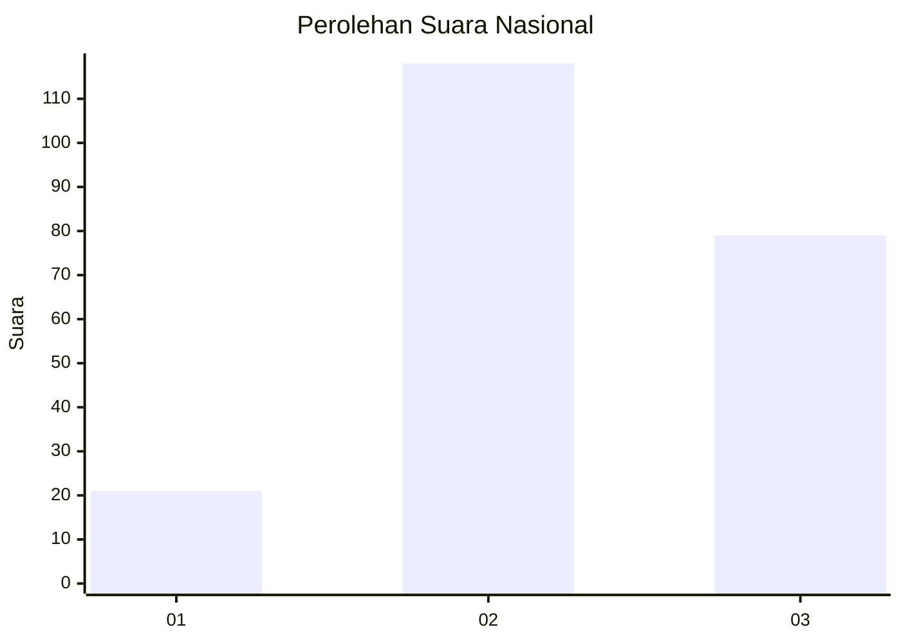
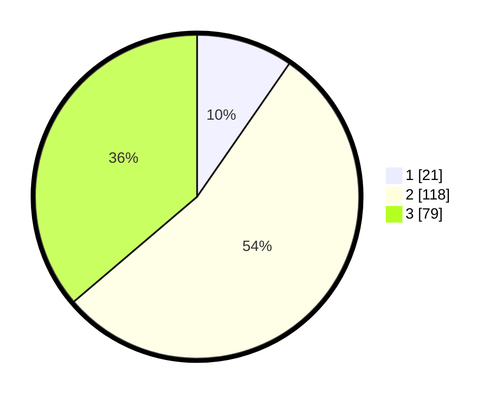

# Hasil

## Grafik

## Tabel

| No. | Nama Paslon    | Suara | Suara (raw) | Persentase |
|:--- |:-------------- | -----:| -----------:| ----------:|
| 1   | ANIES MUHAIMIN | 21    | [21][p-1]   | 9,63       |
| 2   | PRABOWO GIBRAN | 118   | [118][p-2]  | 54,13      |
| 3   | GANJAR MAHFUD  | 79    | [79][p-3]   | 36,24      |

[p-1]: https://github.com/gigit-pemilu/pemilu-2024/blob/main/pilpres/hitung-suara/sub/14-riau/sub/03-bengkalis/sub/15-talang-muandau/sub/2001-tasik-serai/sub/009-tps/sub/paslon-1.txt
[p-2]: https://github.com/gigit-pemilu/pemilu-2024/blob/main/pilpres/hitung-suara/sub/14-riau/sub/03-bengkalis/sub/15-talang-muandau/sub/2001-tasik-serai/sub/009-tps/sub/paslon-2.txt
[p-3]: https://github.com/gigit-pemilu/pemilu-2024/blob/main/pilpres/hitung-suara/sub/14-riau/sub/03-bengkalis/sub/15-talang-muandau/sub/2001-tasik-serai/sub/009-tps/sub/paslon-3.txt

## Foto C Plano

https://sirekap-obj-formc.kpu.go.id/5f83/pemilu/ppwp/14/03/15/20/01/1403152001009-20240215-032708--efb7c236-7434-4f51-b517-cf42e7fd929b.jpg

https://sirekap-obj-formc.kpu.go.id/5f83/pemilu/ppwp/14/03/15/20/01/1403152001009-20240215-032740--5f78423f-31e8-4642-ac93-257abb90da5e.jpg

https://sirekap-obj-formc.kpu.go.id/5f83/pemilu/ppwp/14/03/15/20/01/1403152001009-20240215-032914--b1ca5a59-74a0-4f45-b3b6-0e4d84191d26.jpg

## Metadata

| Key        | Value               |
| ---------- | ------------------- |
| Time Stamp | 2024-02-15 16:00:26 |

