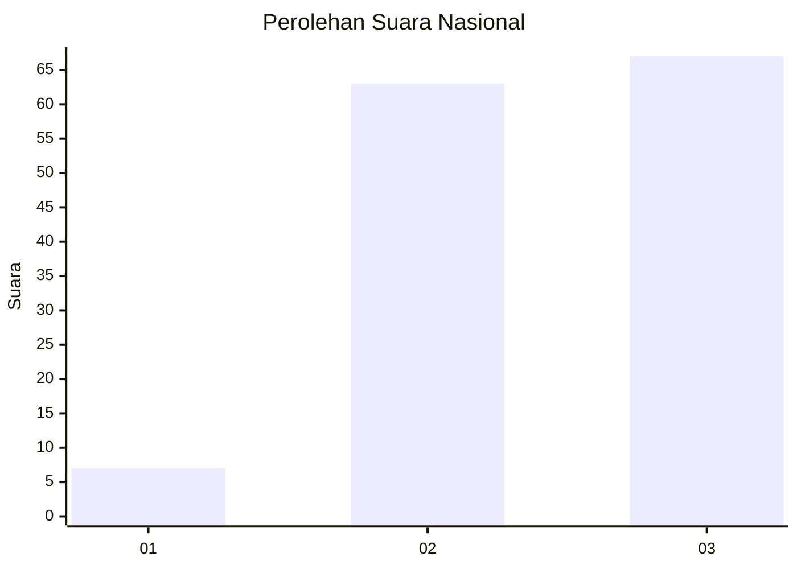
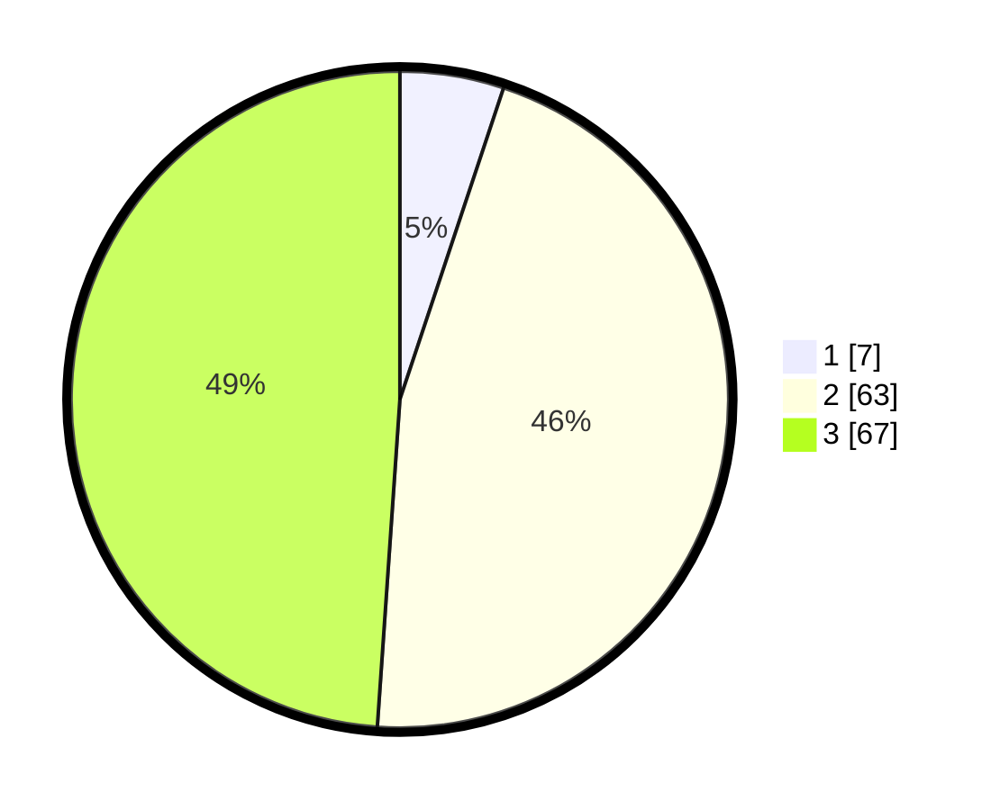

# Hasil

## Grafik

## Tabel

| No. | Nama Paslon    | Suara | Suara (raw) | Persentase |
|:--- |:-------------- | -----:| -----------:| ----------:|
| 1   | ANIES MUHAIMIN | 7     | [7][p-1]    | 5,11       |
| 2   | PRABOWO GIBRAN | 63    | [63][p-2]   | 45,99      |
| 3   | GANJAR MAHFUD  | 67    | [67][p-3]   | 48,91      |

[p-1]: https://github.com/gigit-pemilu/pemilu-2024/blob/main/pilpres/hitung-suara/sub/14-riau/sub/03-bengkalis/sub/15-talang-muandau/sub/2008-tasik-tebing-serai/sub/006-tps/sub/paslon-1.txt
[p-2]: https://github.com/gigit-pemilu/pemilu-2024/blob/main/pilpres/hitung-suara/sub/14-riau/sub/03-bengkalis/sub/15-talang-muandau/sub/2008-tasik-tebing-serai/sub/006-tps/sub/paslon-2.txt
[p-3]: https://github.com/gigit-pemilu/pemilu-2024/blob/main/pilpres/hitung-suara/sub/14-riau/sub/03-bengkalis/sub/15-talang-muandau/sub/2008-tasik-tebing-serai/sub/006-tps/sub/paslon-3.txt

## Foto C Plano

https://sirekap-obj-formc.kpu.go.id/3560/pemilu/ppwp/14/03/15/20/08/1403152008006-20240214-235244--53d4f617-e0eb-421e-8f55-d11131ac155e.jpg

https://sirekap-obj-formc.kpu.go.id/3560/pemilu/ppwp/14/03/15/20/08/1403152008006-20240214-225046--82ce0c30-55a0-4429-8bd8-5fc5a3bd922c.jpg

https://sirekap-obj-formc.kpu.go.id/3560/pemilu/ppwp/14/03/15/20/08/1403152008006-20240214-235631--8dfaf2dd-bdfa-4f52-abba-6c9baf69184f.jpg

## Metadata

| Key        | Value               |
| ---------- | ------------------- |
| Time Stamp | 2024-02-24 22:31:28 |

