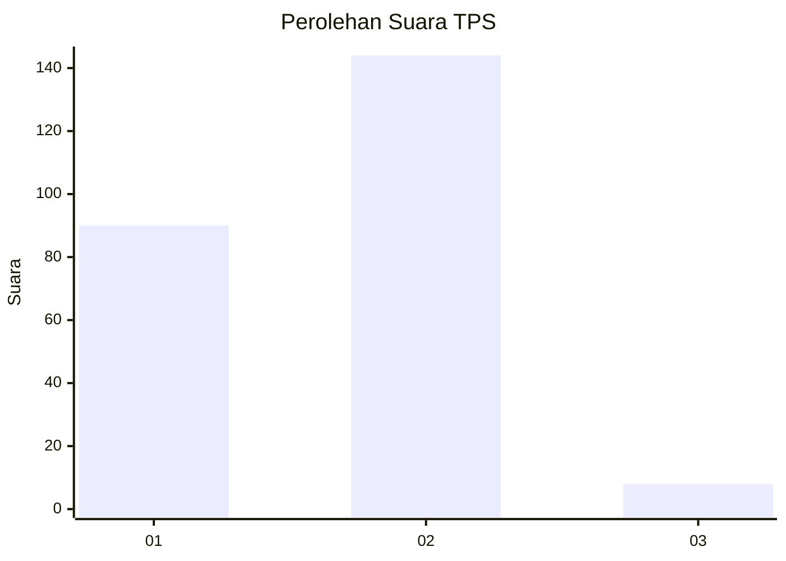
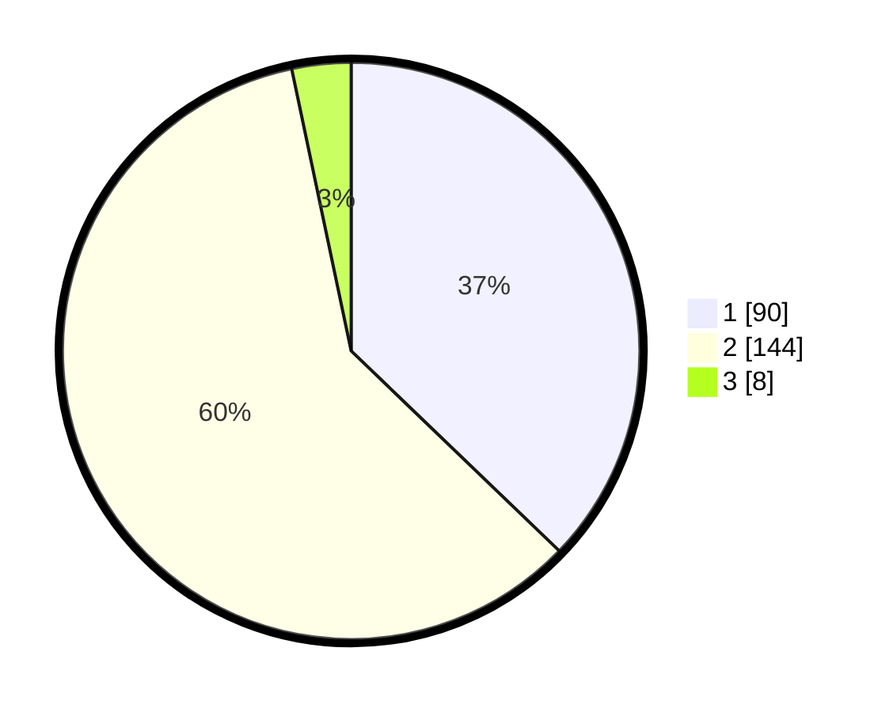

# Hasil

## Grafik

## Tabel

| No. | Nama Paslon    | Suara | Suara (raw) | Persentase |
|:--- |:-------------- | -----:| -----------:| ----------:|
| 1   | ANIES MUHAIMIN | 90    | [90][p-1]   | 37,19      |
| 2   | PRABOWO GIBRAN | 144   | [144][p-2]  | 59,50      |
| 3   | GANJAR MAHFUD  | 8     | [8][p-3]    | 3,31       |

[p-1]: https://github.com/gigit-pemilu/pemilu-2024-14-riau/blob/main/pilpres/hitung-suara/sub/14-riau/sub/03-bengkalis/sub/16-bathin-solapan/sub/2001-petani/sub/002-tps/sub/paslon-1.txt
[p-2]: https://github.com/gigit-pemilu/pemilu-2024-14-riau/blob/main/pilpres/hitung-suara/sub/14-riau/sub/03-bengkalis/sub/16-bathin-solapan/sub/2001-petani/sub/002-tps/sub/paslon-2.txt
[p-3]: https://github.com/gigit-pemilu/pemilu-2024-14-riau/blob/main/pilpres/hitung-suara/sub/14-riau/sub/03-bengkalis/sub/16-bathin-solapan/sub/2001-petani/sub/002-tps/sub/paslon-3.txt

## Foto C Plano

https://sirekap-obj-formc.kpu.go.id/aebc/pemilu/ppwp/14/03/16/20/01/1403162001002-20240215-064333--36ae691b-2d89-4b54-964e-a6efdb1e7147.jpg

https://sirekap-obj-formc.kpu.go.id/aebc/pemilu/ppwp/14/03/16/20/01/1403162001002-20240215-064633--fb0e645b-f3a6-491a-b603-1bde74ff6c5f.jpg

https://sirekap-obj-formc.kpu.go.id/aebc/pemilu/ppwp/14/03/16/20/01/1403162001002-20240215-065354--af920b85-0a38-4615-b308-d3819c01213e.jpg

## Metadata

| Key        | Value               |
| ---------- | ------------------- |
| Time Stamp | 2024-02-15 21:30:27 |

