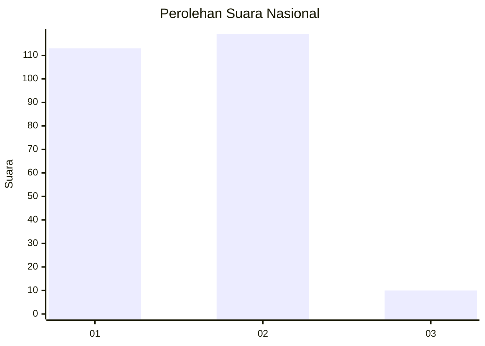
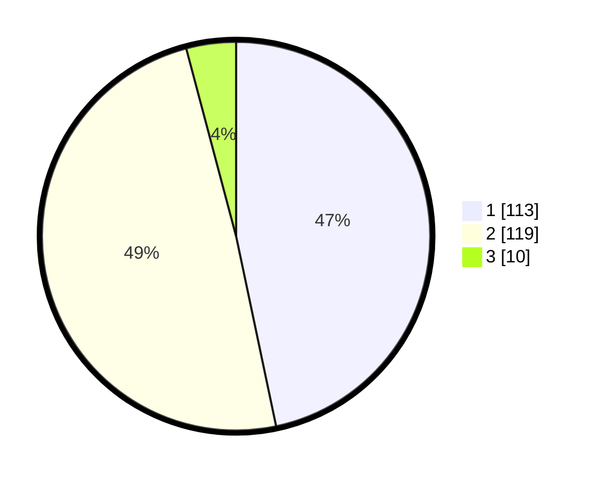

# Hasil

## Grafik

## Tabel

| No. | Nama Paslon    | Suara | Suara (raw) | Persentase |
|:--- |:-------------- | -----:| -----------:| ----------:|
| 1   | ANIES MUHAIMIN | 113   | [113][p-1]  | 46,69      |
| 2   | PRABOWO GIBRAN | 119   | [119][p-2]  | 49,17      |
| 3   | GANJAR MAHFUD  | 10    | [10][p-3]   | 4,13       |

[p-1]: https://github.com/gigit-pemilu/pemilu-2024/blob/main/pilpres/hitung-suara/sub/14-riau/sub/03-bengkalis/sub/16-bathin-solapan/sub/2001-petani/sub/003-tps/sub/paslon-1.txt
[p-2]: https://github.com/gigit-pemilu/pemilu-2024/blob/main/pilpres/hitung-suara/sub/14-riau/sub/03-bengkalis/sub/16-bathin-solapan/sub/2001-petani/sub/003-tps/sub/paslon-2.txt
[p-3]: https://github.com/gigit-pemilu/pemilu-2024/blob/main/pilpres/hitung-suara/sub/14-riau/sub/03-bengkalis/sub/16-bathin-solapan/sub/2001-petani/sub/003-tps/sub/paslon-3.txt

## Foto C Plano

https://sirekap-obj-formc.kpu.go.id/593a/pemilu/ppwp/14/03/16/20/01/1403162001003-20240215-022015--50ecf770-ff6a-42b4-acd6-d2c0f6a9d9d7.jpg

https://sirekap-obj-formc.kpu.go.id/593a/pemilu/ppwp/14/03/16/20/01/1403162001003-20240215-022108--f64fa9f6-ea23-4840-b467-5e5e8b622c28.jpg

https://sirekap-obj-formc.kpu.go.id/593a/pemilu/ppwp/14/03/16/20/01/1403162001003-20240215-022712--c62ba179-f4f5-49bd-b63c-d91405a7f290.jpg

## Metadata

| Key        | Value               |
| ---------- | ------------------- |
| Time Stamp | 2024-02-15 15:00:29 |

