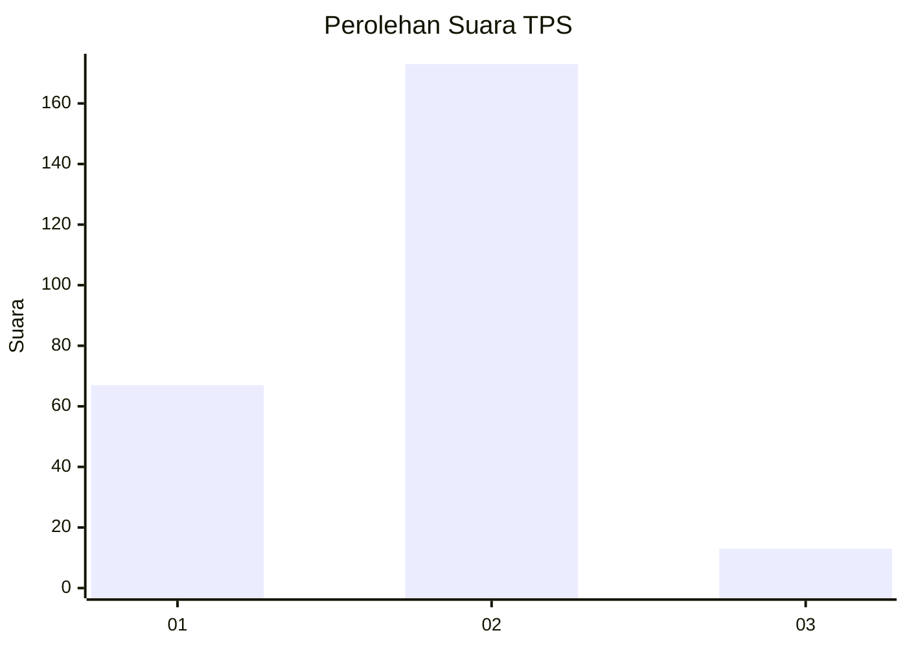
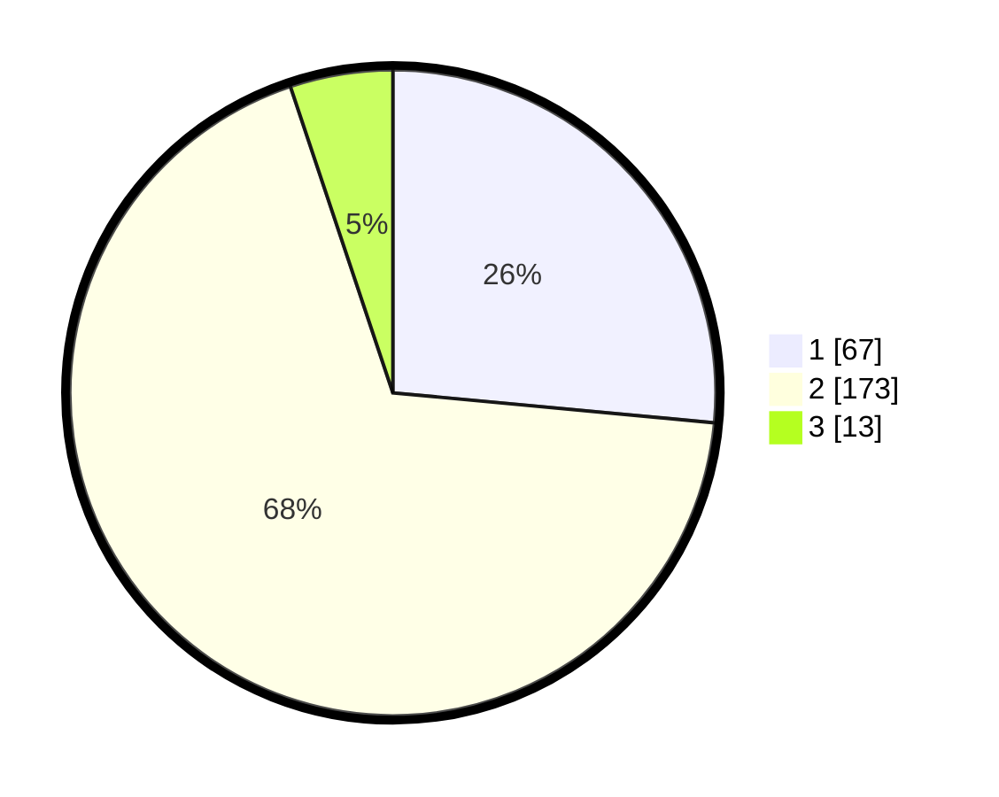

# Hasil

## Grafik

## Tabel

| No. | Nama Paslon    | Suara | Suara (raw) | Persentase |
|:--- |:-------------- | -----:| -----------:| ----------:|
| 1   | ANIES MUHAIMIN | 67    | [67][p-1]   | 26,48      |
| 2   | PRABOWO GIBRAN | 173   | [173][p-2]  | 68,38      |
| 3   | GANJAR MAHFUD  | 13    | [13][p-3]   | 5,14       |

[p-1]: https://github.com/gigit-pemilu/pemilu-2024-14-riau/blob/main/pilpres/hitung-suara/sub/14-riau/sub/03-bengkalis/sub/16-bathin-solapan/sub/2001-petani/sub/008-tps/sub/paslon-1.txt
[p-2]: https://github.com/gigit-pemilu/pemilu-2024-14-riau/blob/main/pilpres/hitung-suara/sub/14-riau/sub/03-bengkalis/sub/16-bathin-solapan/sub/2001-petani/sub/008-tps/sub/paslon-2.txt
[p-3]: https://github.com/gigit-pemilu/pemilu-2024-14-riau/blob/main/pilpres/hitung-suara/sub/14-riau/sub/03-bengkalis/sub/16-bathin-solapan/sub/2001-petani/sub/008-tps/sub/paslon-3.txt

## Foto C Plano

https://sirekap-obj-formc.kpu.go.id/4326/pemilu/ppwp/14/03/16/20/01/1403162001008-20240215-044709--b09ca0ca-8b3d-4345-a661-fe9bff970480.jpg

https://sirekap-obj-formc.kpu.go.id/4326/pemilu/ppwp/14/03/16/20/01/1403162001008-20240214-195155--3cb22760-54aa-45f4-b611-44c85fc1dc60.jpg

https://sirekap-obj-formc.kpu.go.id/4326/pemilu/ppwp/14/03/16/20/01/1403162001008-20240215-050034--67d2cad3-4043-41b0-8a20-c1368d66bfbc.jpg

## Metadata

| Key        | Value               |
| ---------- | ------------------- |
| Time Stamp | 2024-02-15 15:00:29 |

