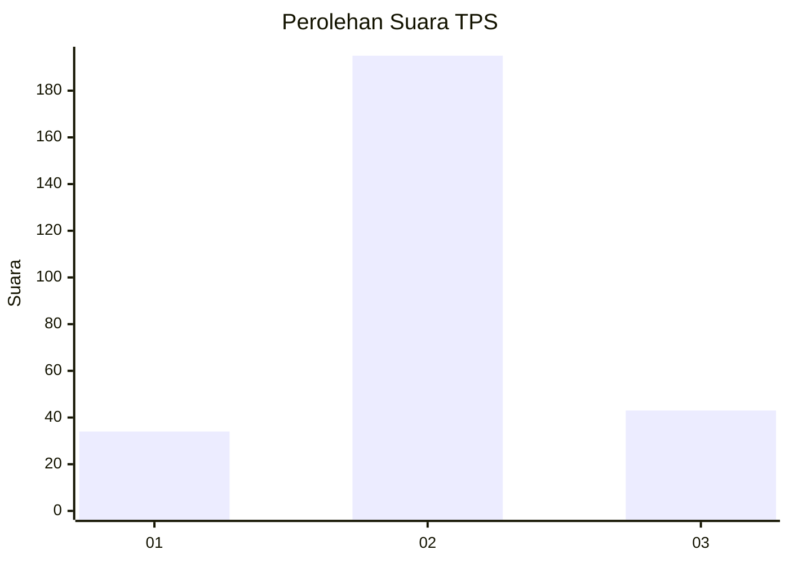
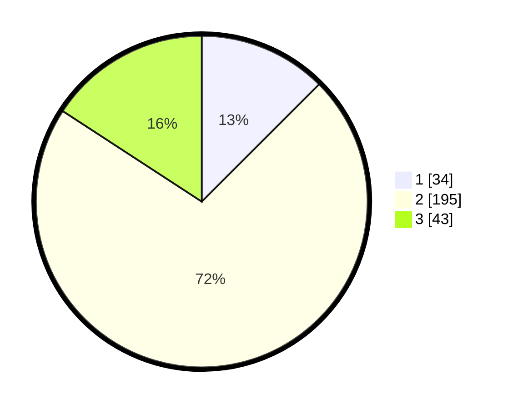

# Hasil

## Grafik

## Tabel

| No. | Nama Paslon    | Suara | Suara (raw) | Persentase |
|:--- |:-------------- | -----:| -----------:| ----------:|
| 1   | ANIES MUHAIMIN | 34    | [34][p-1]   | 12,50      |
| 2   | PRABOWO GIBRAN | 195   | [195][p-2]  | 71,69      |
| 3   | GANJAR MAHFUD  | 43    | [43][p-3]   | 15,81      |

[p-1]: https://github.com/gigit-pemilu/pemilu-2024-14-riau/blob/main/pilpres/hitung-suara/sub/14-riau/sub/03-bengkalis/sub/16-bathin-solapan/sub/2001-petani/sub/009-tps/sub/paslon-1.txt
[p-2]: https://github.com/gigit-pemilu/pemilu-2024-14-riau/blob/main/pilpres/hitung-suara/sub/14-riau/sub/03-bengkalis/sub/16-bathin-solapan/sub/2001-petani/sub/009-tps/sub/paslon-2.txt
[p-3]: https://github.com/gigit-pemilu/pemilu-2024-14-riau/blob/main/pilpres/hitung-suara/sub/14-riau/sub/03-bengkalis/sub/16-bathin-solapan/sub/2001-petani/sub/009-tps/sub/paslon-3.txt

## Foto C Plano

https://sirekap-obj-formc.kpu.go.id/8191/pemilu/ppwp/14/03/16/20/01/1403162001009-20240215-025044--f2c19309-bca9-4e81-af50-7443ad63fb5b.jpg

https://sirekap-obj-formc.kpu.go.id/8191/pemilu/ppwp/14/03/16/20/01/1403162001009-20240215-022300--3ca1afee-a5eb-4b9f-b90c-3662ead9b809.jpg

https://sirekap-obj-formc.kpu.go.id/8191/pemilu/ppwp/14/03/16/20/01/1403162001009-20240215-022338--28efef5f-31c1-4de1-b262-8eac93da32db.jpg

## Metadata

| Key        | Value               |
| ---------- | ------------------- |
| Time Stamp | 2024-02-15 15:00:29 |

