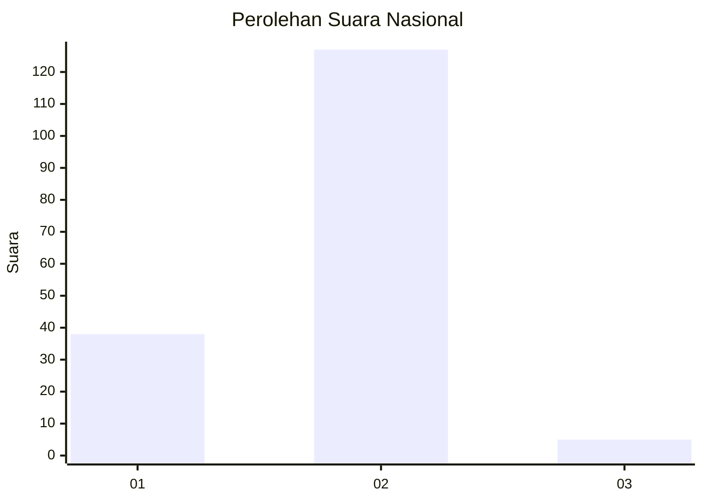

# Hasil

## Grafik

## Tabel

| No. | Nama Paslon    | Suara | Suara (raw) | Persentase |
|:--- |:-------------- | -----:| -----------:| ----------:|
| 1   | ANIES MUHAIMIN | 38    | [38][p-1]   | 22,35      |
| 2   | PRABOWO GIBRAN | 127   | [127][p-2]  | 74,71      |
| 3   | GANJAR MAHFUD  | 5     | [5][p-3]    | 2,94       |

[p-1]: https://github.com/gigit-pemilu/pemilu-2024/blob/main/pilpres/hitung-suara/sub/14-riau/sub/03-bengkalis/sub/16-bathin-solapan/sub/2009-boncah-mahang/sub/006-tps/sub/paslon-1.txt
[p-2]: https://github.com/gigit-pemilu/pemilu-2024/blob/main/pilpres/hitung-suara/sub/14-riau/sub/03-bengkalis/sub/16-bathin-solapan/sub/2009-boncah-mahang/sub/006-tps/sub/paslon-2.txt
[p-3]: https://github.com/gigit-pemilu/pemilu-2024/blob/main/pilpres/hitung-suara/sub/14-riau/sub/03-bengkalis/sub/16-bathin-solapan/sub/2009-boncah-mahang/sub/006-tps/sub/paslon-3.txt

## Foto C Plano

https://sirekap-obj-formc.kpu.go.id/4dd1/pemilu/ppwp/14/03/16/20/09/1403162009006-20240214-155538--8c067b91-1b29-4586-8bc2-841146df3451.jpg

https://sirekap-obj-formc.kpu.go.id/4dd1/pemilu/ppwp/14/03/16/20/09/1403162009006-20240214-155732--d339643b-c89b-4055-b31f-8383cbb6a375.jpg

https://sirekap-obj-formc.kpu.go.id/4dd1/pemilu/ppwp/14/03/16/20/09/1403162009006-20240214-155858--da9e3feb-1f7e-4318-bd45-c34b94f59a4e.jpg

## Metadata

| Key        | Value               |
| ---------- | ------------------- |
| Time Stamp | 2024-02-15 16:30:25 |

