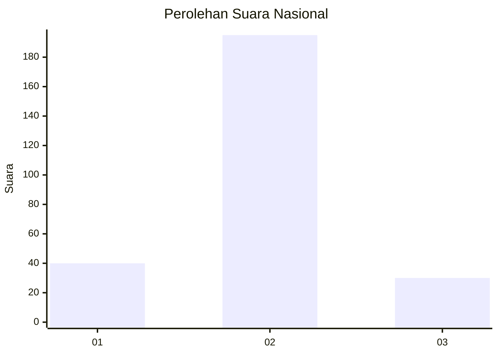
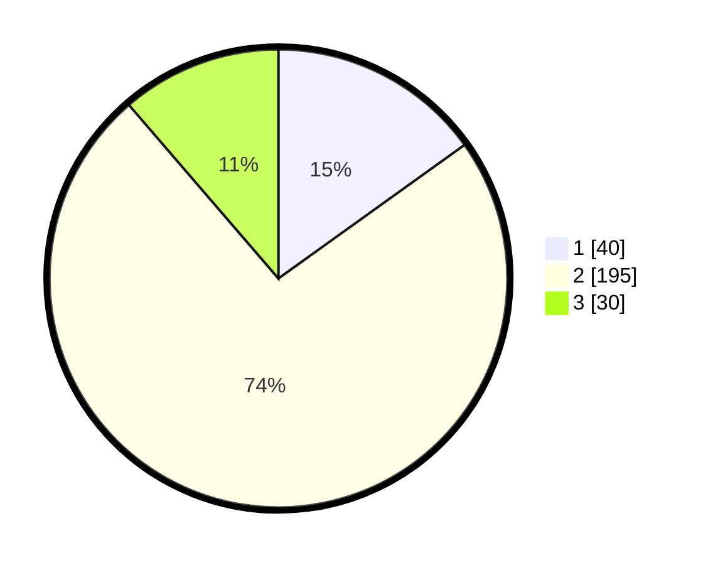

# Hasil

## Grafik

## Tabel

| No. | Nama Paslon    | Suara | Suara (raw) | Persentase |
|:--- |:-------------- | -----:| -----------:| ----------:|
| 1   | ANIES MUHAIMIN | 40    | [40][p-1]   | 15,09      |
| 2   | PRABOWO GIBRAN | 195   | [195][p-2]  | 73,58      |
| 3   | GANJAR MAHFUD  | 30    | [30][p-3]   | 11,32      |

[p-1]: https://github.com/gigit-pemilu/pemilu-2024/blob/main/pilpres/hitung-suara/sub/14-riau/sub/03-bengkalis/sub/16-bathin-solapan/sub/2009-boncah-mahang/sub/011-tps/sub/paslon-1.txt
[p-2]: https://github.com/gigit-pemilu/pemilu-2024/blob/main/pilpres/hitung-suara/sub/14-riau/sub/03-bengkalis/sub/16-bathin-solapan/sub/2009-boncah-mahang/sub/011-tps/sub/paslon-2.txt
[p-3]: https://github.com/gigit-pemilu/pemilu-2024/blob/main/pilpres/hitung-suara/sub/14-riau/sub/03-bengkalis/sub/16-bathin-solapan/sub/2009-boncah-mahang/sub/011-tps/sub/paslon-3.txt

## Foto C Plano

https://sirekap-obj-formc.kpu.go.id/0665/pemilu/ppwp/14/03/16/20/09/1403162009011-20240214-192916--ed6bb548-51f3-4ebf-8027-9c646a3a79c7.jpg

https://sirekap-obj-formc.kpu.go.id/0665/pemilu/ppwp/14/03/16/20/09/1403162009011-20240214-194407--87302e12-da3f-4713-96df-494ef98c3cd7.jpg

https://sirekap-obj-formc.kpu.go.id/0665/pemilu/ppwp/14/03/16/20/09/1403162009011-20240214-194356--5b93564e-c8f2-4353-b365-05e5aa930d0a.jpg

## Metadata

| Key        | Value               |
| ---------- | ------------------- |
| Time Stamp | 2024-02-16 00:30:27 |

