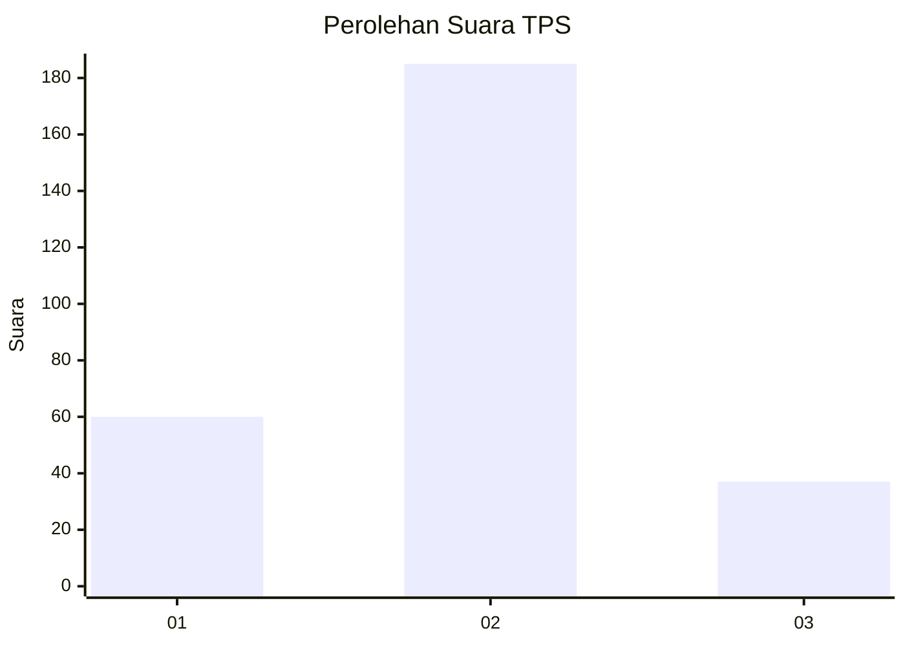
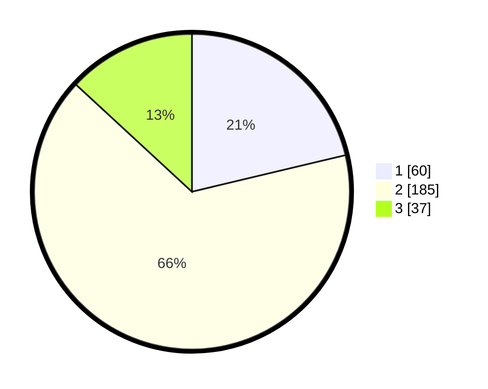

# Hasil

## Grafik

## Tabel

| No. | Nama Paslon    | Suara | Suara (raw) | Persentase |
|:--- |:-------------- | -----:| -----------:| ----------:|
| 1   | ANIES MUHAIMIN | 60    | [60][p-1]   | 21,28      |
| 2   | PRABOWO GIBRAN | 185   | [185][p-2]  | 65,60      |
| 3   | GANJAR MAHFUD  | 37    | [37][p-3]   | 13,12      |

[p-1]: https://github.com/gigit-pemilu/pemilu-2024-14-riau/blob/main/pilpres/hitung-suara/sub/14-riau/sub/03-bengkalis/sub/16-bathin-solapan/sub/2009-boncah-mahang/sub/022-tps/sub/paslon-1.txt
[p-2]: https://github.com/gigit-pemilu/pemilu-2024-14-riau/blob/main/pilpres/hitung-suara/sub/14-riau/sub/03-bengkalis/sub/16-bathin-solapan/sub/2009-boncah-mahang/sub/022-tps/sub/paslon-2.txt
[p-3]: https://github.com/gigit-pemilu/pemilu-2024-14-riau/blob/main/pilpres/hitung-suara/sub/14-riau/sub/03-bengkalis/sub/16-bathin-solapan/sub/2009-boncah-mahang/sub/022-tps/sub/paslon-3.txt

## Foto C Plano

https://sirekap-obj-formc.kpu.go.id/338a/pemilu/ppwp/14/03/16/20/09/1403162009022-20240215-011731--ae7950c1-d221-4143-bfda-04d820301b3e.jpg

https://sirekap-obj-formc.kpu.go.id/338a/pemilu/ppwp/14/03/16/20/09/1403162009022-20240215-011832--68a59a87-dd96-4c63-b20b-7eb3fda913e5.jpg

https://sirekap-obj-formc.kpu.go.id/338a/pemilu/ppwp/14/03/16/20/09/1403162009022-20240215-011921--5f0cab94-5d6b-4e26-b5bc-d3ba82a8fd53.jpg

## Metadata

| Key        | Value               |
| ---------- | ------------------- |
| Time Stamp | 2024-02-15 16:30:25 |

