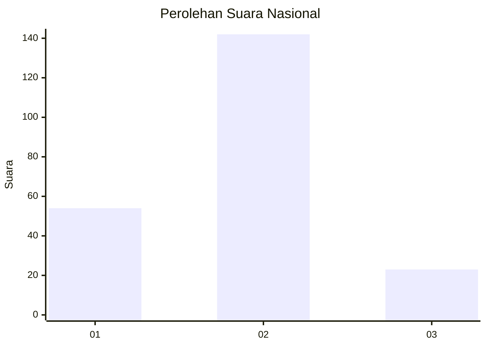
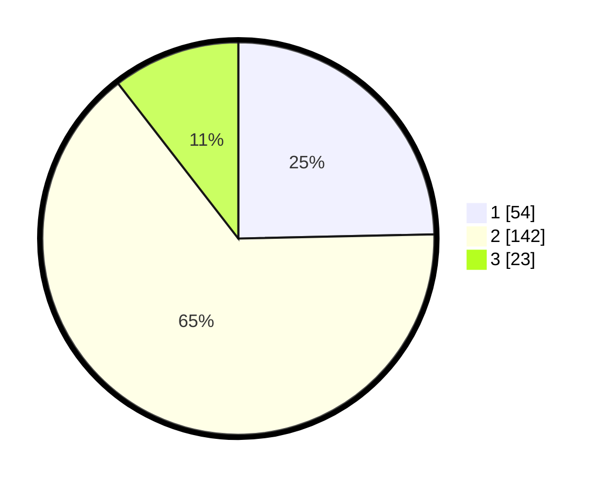

# Hasil

## Grafik

## Tabel

| No. | Nama Paslon    | Suara | Suara (raw) | Persentase |
|:--- |:-------------- | -----:| -----------:| ----------:|
| 1   | ANIES MUHAIMIN | 54    | [54][p-1]   | 24,66      |
| 2   | PRABOWO GIBRAN | 142   | [142][p-2]  | 64,84      |
| 3   | GANJAR MAHFUD  | 23    | [23][p-3]   | 10,50      |

[p-1]: https://github.com/gigit-pemilu/pemilu-2024/blob/main/pilpres/hitung-suara/sub/14-riau/sub/03-bengkalis/sub/16-bathin-solapan/sub/2010-balai-makam/sub/008-tps/sub/paslon-1.txt
[p-2]: https://github.com/gigit-pemilu/pemilu-2024/blob/main/pilpres/hitung-suara/sub/14-riau/sub/03-bengkalis/sub/16-bathin-solapan/sub/2010-balai-makam/sub/008-tps/sub/paslon-2.txt
[p-3]: https://github.com/gigit-pemilu/pemilu-2024/blob/main/pilpres/hitung-suara/sub/14-riau/sub/03-bengkalis/sub/16-bathin-solapan/sub/2010-balai-makam/sub/008-tps/sub/paslon-3.txt

## Foto C Plano

https://sirekap-obj-formc.kpu.go.id/eaf3/pemilu/ppwp/14/03/16/20/10/1403162010008-20240214-230424--6534e04e-daae-4da0-8058-a61e64b06d3f.jpg

https://sirekap-obj-formc.kpu.go.id/eaf3/pemilu/ppwp/14/03/16/20/10/1403162010008-20240214-230619--f078d7f3-0f32-427e-a41c-0ffc1c5cae56.jpg

https://sirekap-obj-formc.kpu.go.id/eaf3/pemilu/ppwp/14/03/16/20/10/1403162010008-20240214-230758--b4b0a7e1-fda2-477e-a151-6093581f46f7.jpg

## Metadata

| Key        | Value               |
| ---------- | ------------------- |
| Time Stamp | 2024-02-15 21:01:18 |

