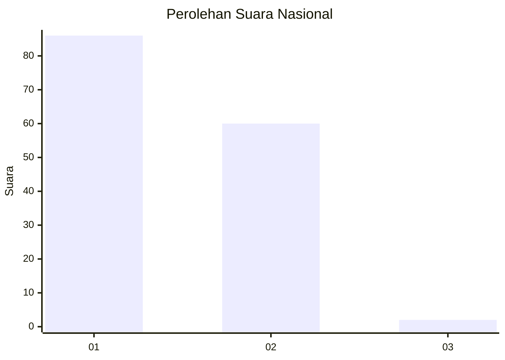
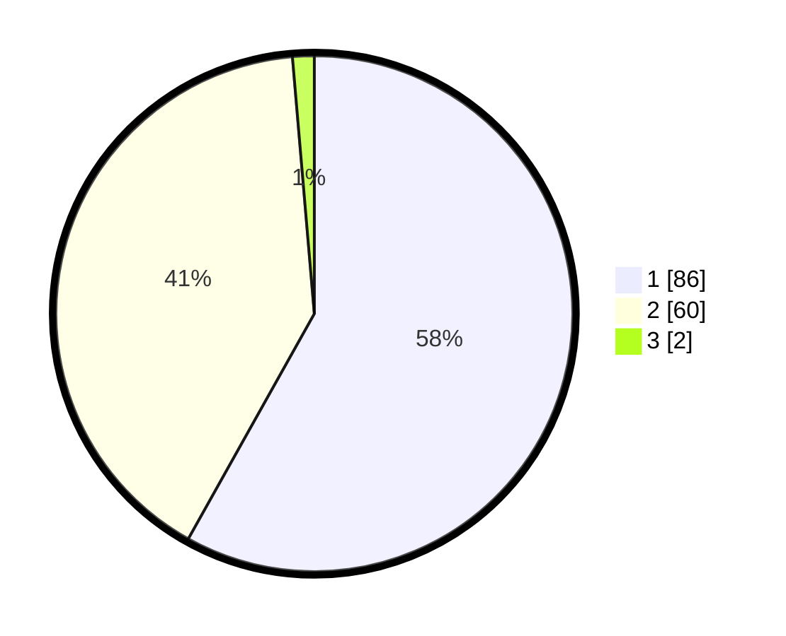

# Hasil

## Grafik

## Tabel

| No. | Nama Paslon    | Suara | Suara (raw) | Persentase |
|:--- |:-------------- | -----:| -----------:| ----------:|
| 1   | ANIES MUHAIMIN | 86    | [86][p-1]   | 58,11      |
| 2   | PRABOWO GIBRAN | 60    | [60][p-2]   | 40,54      |
| 3   | GANJAR MAHFUD  | 2     | [2][p-3]    | 1,35       |

[p-1]: https://github.com/gigit-pemilu/pemilu-2024/blob/main/pilpres/hitung-suara/sub/14-riau/sub/03-bengkalis/sub/16-bathin-solapan/sub/2010-balai-makam/sub/023-tps/sub/paslon-1.txt
[p-2]: https://github.com/gigit-pemilu/pemilu-2024/blob/main/pilpres/hitung-suara/sub/14-riau/sub/03-bengkalis/sub/16-bathin-solapan/sub/2010-balai-makam/sub/023-tps/sub/paslon-2.txt
[p-3]: https://github.com/gigit-pemilu/pemilu-2024/blob/main/pilpres/hitung-suara/sub/14-riau/sub/03-bengkalis/sub/16-bathin-solapan/sub/2010-balai-makam/sub/023-tps/sub/paslon-3.txt

## Foto C Plano

https://sirekap-obj-formc.kpu.go.id/6e36/pemilu/ppwp/14/03/16/20/10/1403162010023-20240214-220048--308a55bc-b005-45a7-872b-09982ae0128b.jpg

https://sirekap-obj-formc.kpu.go.id/6e36/pemilu/ppwp/14/03/16/20/10/1403162010023-20240215-024739--25a098d1-d060-48f8-9500-b61292ea00b1.jpg

https://sirekap-obj-formc.kpu.go.id/6e36/pemilu/ppwp/14/03/16/20/10/1403162010023-20240215-024759--5644be6c-00e3-4684-acf9-9bc7398dbed7.jpg

## Metadata

| Key        | Value               |
| ---------- | ------------------- |
| Time Stamp | 2024-02-24 22:31:28 |

