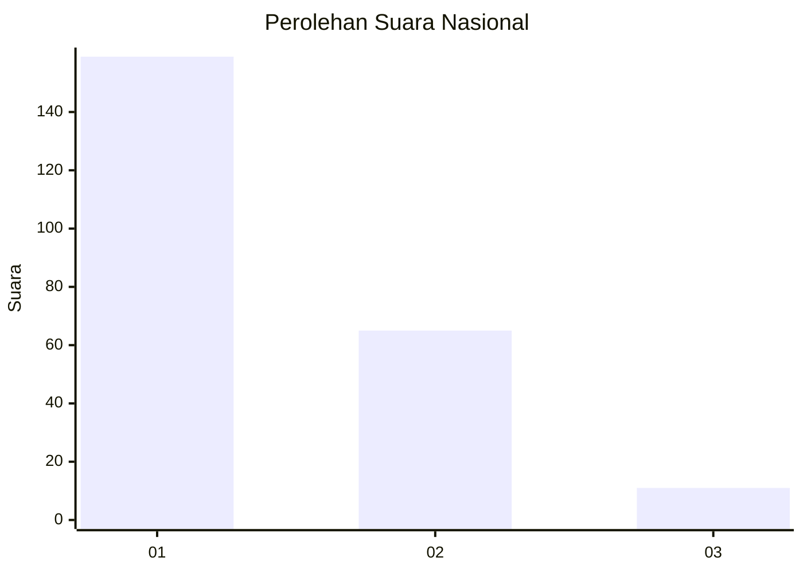
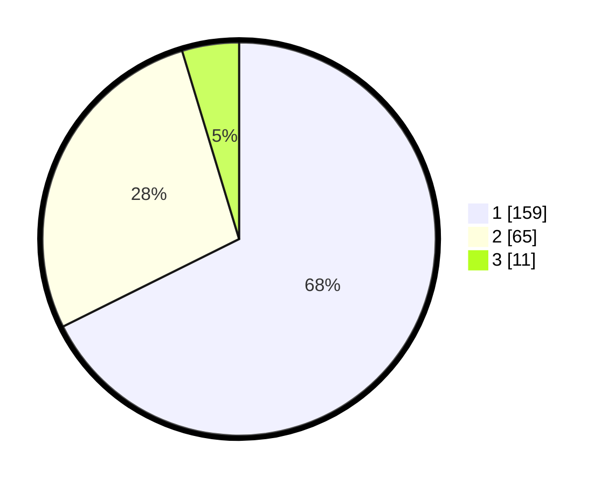

# Hasil

## Grafik

## Tabel

| No. | Nama Paslon    | Suara | Suara (raw) | Persentase |
|:--- |:-------------- | -----:| -----------:| ----------:|
| 1   | ANIES MUHAIMIN | 159   | [159][p-1]  | 67,66      |
| 2   | PRABOWO GIBRAN | 65    | [65][p-2]   | 27,66      |
| 3   | GANJAR MAHFUD  | 11    | [11][p-3]   | 4,68       |

[p-1]: https://github.com/gigit-pemilu/pemilu-2024/blob/main/pilpres/hitung-suara/sub/14-riau/sub/03-bengkalis/sub/16-bathin-solapan/sub/2011-tambusai-batang-dui/sub/013-tps/sub/paslon-1.txt
[p-2]: https://github.com/gigit-pemilu/pemilu-2024/blob/main/pilpres/hitung-suara/sub/14-riau/sub/03-bengkalis/sub/16-bathin-solapan/sub/2011-tambusai-batang-dui/sub/013-tps/sub/paslon-2.txt
[p-3]: https://github.com/gigit-pemilu/pemilu-2024/blob/main/pilpres/hitung-suara/sub/14-riau/sub/03-bengkalis/sub/16-bathin-solapan/sub/2011-tambusai-batang-dui/sub/013-tps/sub/paslon-3.txt

## Foto C Plano

https://sirekap-obj-formc.kpu.go.id/ad57/pemilu/ppwp/14/03/16/20/11/1403162011013-20240214-213126--7332e836-4ebe-4e14-ac65-7527778c433d.jpg

https://sirekap-obj-formc.kpu.go.id/ad57/pemilu/ppwp/14/03/16/20/11/1403162011013-20240214-213210--50113ef8-7c75-45fe-9d80-dc6468ddb882.jpg

https://sirekap-obj-formc.kpu.go.id/ad57/pemilu/ppwp/14/03/16/20/11/1403162011013-20240214-213250--e81202a1-05d3-4940-b7b6-211b0c74fb20.jpg

## Metadata

| Key        | Value               |
| ---------- | ------------------- |
| Time Stamp | 2024-02-16 00:30:27 |

