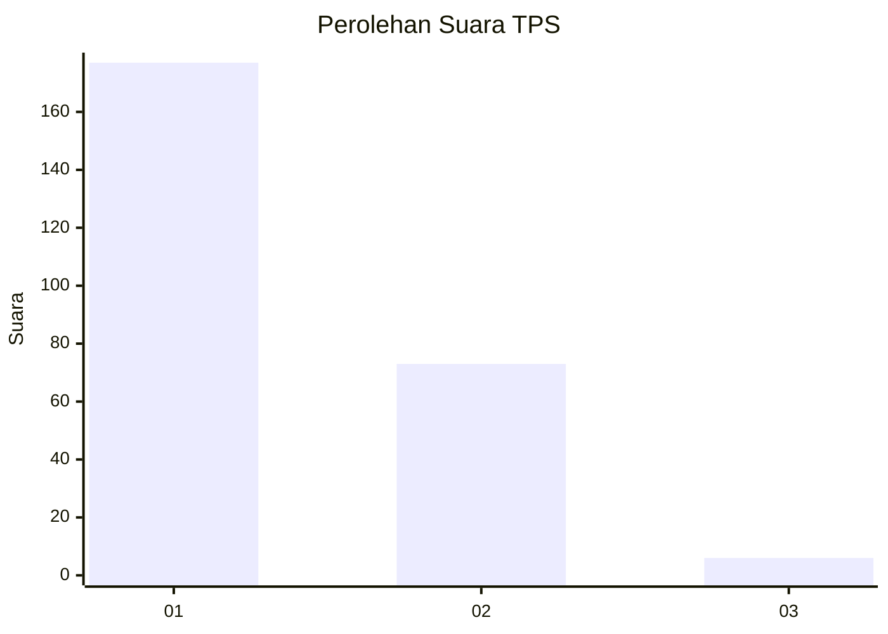
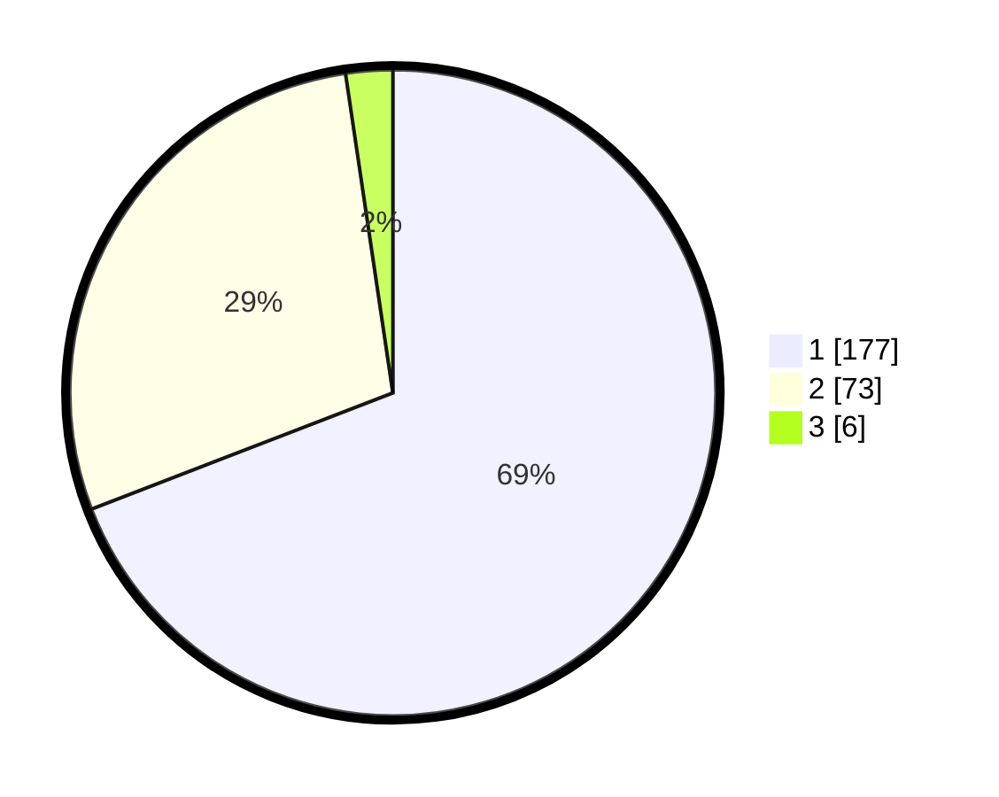

# Hasil

## Grafik

## Tabel

| No. | Nama Paslon    | Suara | Suara (raw) | Persentase |
|:--- |:-------------- | -----:| -----------:| ----------:|
| 1   | ANIES MUHAIMIN | 177   | [177][p-1]  | 69,14      |
| 2   | PRABOWO GIBRAN | 73    | [73][p-2]   | 28,52      |
| 3   | GANJAR MAHFUD  | 6     | [6][p-3]    | 2,34       |

[p-1]: https://github.com/gigit-pemilu/pemilu-2024-14-riau/blob/main/pilpres/hitung-suara/sub/14-riau/sub/03-bengkalis/sub/16-bathin-solapan/sub/2011-tambusai-batang-dui/sub/021-tps/sub/paslon-1.txt
[p-2]: https://github.com/gigit-pemilu/pemilu-2024-14-riau/blob/main/pilpres/hitung-suara/sub/14-riau/sub/03-bengkalis/sub/16-bathin-solapan/sub/2011-tambusai-batang-dui/sub/021-tps/sub/paslon-2.txt
[p-3]: https://github.com/gigit-pemilu/pemilu-2024-14-riau/blob/main/pilpres/hitung-suara/sub/14-riau/sub/03-bengkalis/sub/16-bathin-solapan/sub/2011-tambusai-batang-dui/sub/021-tps/sub/paslon-3.txt

## Foto C Plano

https://sirekap-obj-formc.kpu.go.id/e174/pemilu/ppwp/14/03/16/20/11/1403162011021-20240215-031023--bb96771f-9e0b-4195-8938-9f262eda2cf0.jpg

https://sirekap-obj-formc.kpu.go.id/e174/pemilu/ppwp/14/03/16/20/11/1403162011021-20240215-031118--4f6da3b5-6652-403b-9618-dd6879d51f00.jpg

https://sirekap-obj-formc.kpu.go.id/e174/pemilu/ppwp/14/03/16/20/11/1403162011021-20240215-031217--911a5e6d-15b5-4bea-b61e-be8522fe7798.jpg

## Metadata

| Key        | Value               |
| ---------- | ------------------- |
| Time Stamp | 2024-02-25 12:00:00 |

