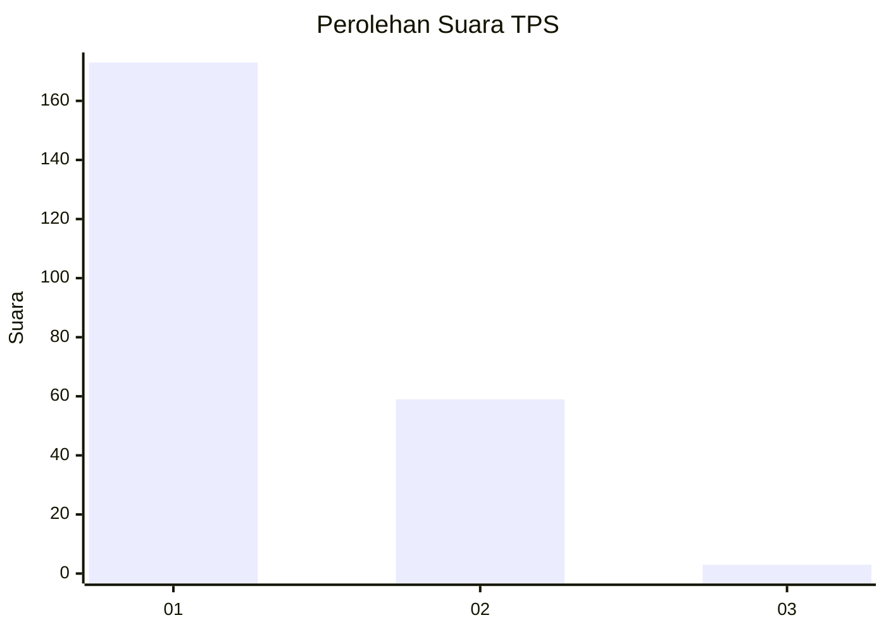
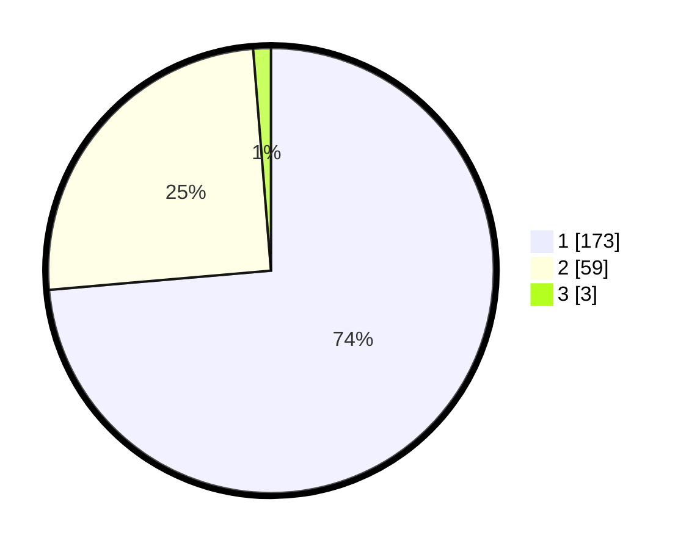

# Hasil

## Grafik

## Tabel

| No. | Nama Paslon    | Suara | Suara (raw) | Persentase |
|:--- |:-------------- | -----:| -----------:| ----------:|
| 1   | ANIES MUHAIMIN | 173   | [173][p-1]  | 73,62      |
| 2   | PRABOWO GIBRAN | 59    | [59][p-2]   | 25,11      |
| 3   | GANJAR MAHFUD  | 3     | [3][p-3]    | 1,28       |

[p-1]: https://github.com/gigit-pemilu/pemilu-2024-14-riau/blob/main/pilpres/hitung-suara/sub/14-riau/sub/03-bengkalis/sub/16-bathin-solapan/sub/2012-simpang-padang/sub/036-tps/sub/paslon-1.txt
[p-2]: https://github.com/gigit-pemilu/pemilu-2024-14-riau/blob/main/pilpres/hitung-suara/sub/14-riau/sub/03-bengkalis/sub/16-bathin-solapan/sub/2012-simpang-padang/sub/036-tps/sub/paslon-2.txt
[p-3]: https://github.com/gigit-pemilu/pemilu-2024-14-riau/blob/main/pilpres/hitung-suara/sub/14-riau/sub/03-bengkalis/sub/16-bathin-solapan/sub/2012-simpang-padang/sub/036-tps/sub/paslon-3.txt

## Foto C Plano

https://sirekap-obj-formc.kpu.go.id/ab0a/pemilu/ppwp/14/03/16/20/12/1403162012036-20240215-035630--127b6fda-ebe5-48c1-ae03-8c48e2122871.jpg

https://sirekap-obj-formc.kpu.go.id/ab0a/pemilu/ppwp/14/03/16/20/12/1403162012036-20240215-032544--25c4b0cb-b254-425d-a540-6bc945621f16.jpg

https://sirekap-obj-formc.kpu.go.id/ab0a/pemilu/ppwp/14/03/16/20/12/1403162012036-20240215-032641--30c9444a-33fe-4511-ae09-bc59d441f221.jpg

## Metadata

| Key        | Value               |
| ---------- | ------------------- |
| Time Stamp | 2024-02-15 21:30:27 |

