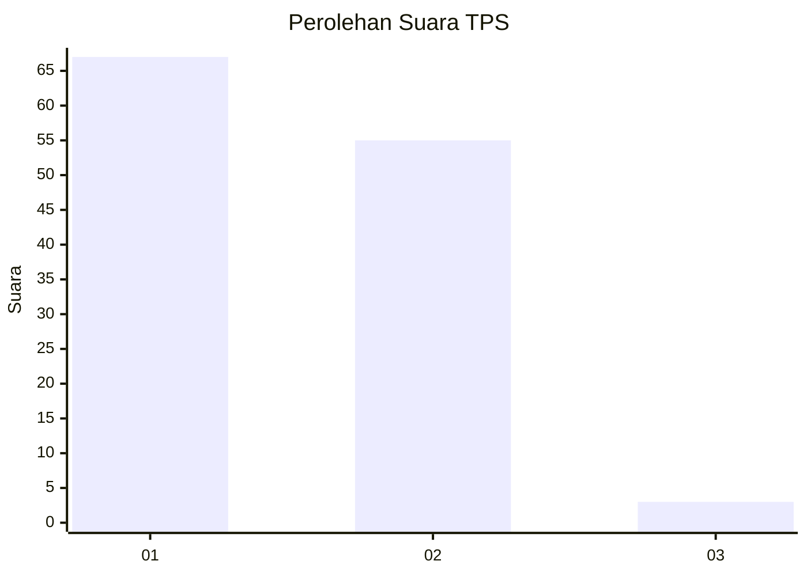
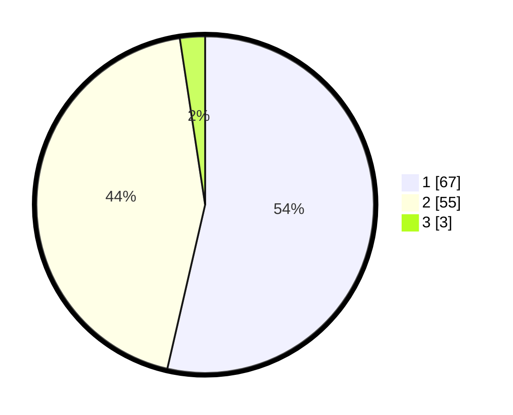

# Hasil

## Grafik

## Tabel

| No. | Nama Paslon    | Suara | Suara (raw) | Persentase |
|:--- |:-------------- | -----:| -----------:| ----------:|
| 1   | ANIES MUHAIMIN | 67    | [67][p-1]   | 53,60      |
| 2   | PRABOWO GIBRAN | 55    | [55][p-2]   | 44,00      |
| 3   | GANJAR MAHFUD  | 3     | [3][p-3]    | 2,40       |

[p-1]: https://github.com/gigit-pemilu/pemilu-2024-14-riau/blob/main/pilpres/hitung-suara/sub/14-riau/sub/04-indragiri-hilir/sub/01-reteh/sub/1001-pulaukijang/sub/002-tps/sub/paslon-1.txt
[p-2]: https://github.com/gigit-pemilu/pemilu-2024-14-riau/blob/main/pilpres/hitung-suara/sub/14-riau/sub/04-indragiri-hilir/sub/01-reteh/sub/1001-pulaukijang/sub/002-tps/sub/paslon-2.txt
[p-3]: https://github.com/gigit-pemilu/pemilu-2024-14-riau/blob/main/pilpres/hitung-suara/sub/14-riau/sub/04-indragiri-hilir/sub/01-reteh/sub/1001-pulaukijang/sub/002-tps/sub/paslon-3.txt

## Foto C Plano

https://sirekap-obj-formc.kpu.go.id/9fd3/pemilu/ppwp/14/04/01/10/01/1404011001002-20240214-185213--1c4b5660-32f7-42ec-88be-f204343d1309.jpg

https://sirekap-obj-formc.kpu.go.id/9fd3/pemilu/ppwp/14/04/01/10/01/1404011001002-20240214-160147--429b1bc7-7ceb-4f55-a44e-10021652ef6b.jpg

https://sirekap-obj-formc.kpu.go.id/9fd3/pemilu/ppwp/14/04/01/10/01/1404011001002-20240214-185157--df76e0c3-523a-475c-a88b-1f1ffb58410b.jpg

## Metadata

| Key        | Value               |
| ---------- | ------------------- |
| Time Stamp | 2024-02-25 15:00:00 |

