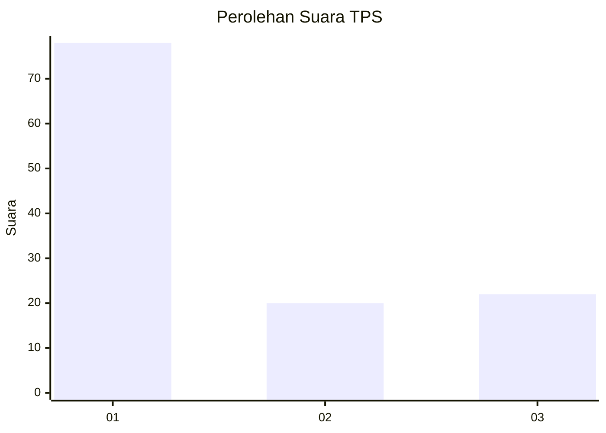
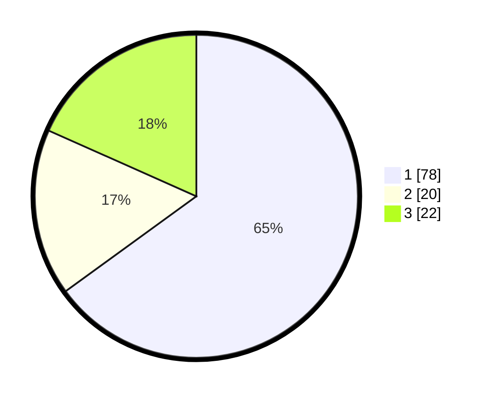

# Hasil

## Grafik

## Tabel

| No. | Nama Paslon    | Suara | Suara (raw) | Persentase |
|:--- |:-------------- | -----:| -----------:| ----------:|
| 1   | ANIES MUHAIMIN | 78    | [78][p-1]   | 65,00      |
| 2   | PRABOWO GIBRAN | 20    | [20][p-2]   | 16,67      |
| 3   | GANJAR MAHFUD  | 22    | [22][p-3]   | 18,33      |

[p-1]: https://github.com/gigit-pemilu/pemilu-2024-14-riau/blob/main/pilpres/hitung-suara/sub/14-riau/sub/04-indragiri-hilir/sub/01-reteh/sub/1001-pulaukijang/sub/003-tps/sub/paslon-1.txt
[p-2]: https://github.com/gigit-pemilu/pemilu-2024-14-riau/blob/main/pilpres/hitung-suara/sub/14-riau/sub/04-indragiri-hilir/sub/01-reteh/sub/1001-pulaukijang/sub/003-tps/sub/paslon-2.txt
[p-3]: https://github.com/gigit-pemilu/pemilu-2024-14-riau/blob/main/pilpres/hitung-suara/sub/14-riau/sub/04-indragiri-hilir/sub/01-reteh/sub/1001-pulaukijang/sub/003-tps/sub/paslon-3.txt

## Foto C Plano

https://sirekap-obj-formc.kpu.go.id/acea/pemilu/ppwp/14/04/01/10/01/1404011001003-20240214-215602--cf39ee13-a606-4737-9184-e3003fe26e28.jpg

https://sirekap-obj-formc.kpu.go.id/acea/pemilu/ppwp/14/04/01/10/01/1404011001003-20240214-215630--728eeba6-d9c7-453a-9e6c-da9a6073e452.jpg

https://sirekap-obj-formc.kpu.go.id/acea/pemilu/ppwp/14/04/01/10/01/1404011001003-20240214-215651--7f6d4820-820c-44fd-bbce-4c8105027158.jpg

## Metadata

| Key        | Value               |
| ---------- | ------------------- |
| Time Stamp | 2024-02-16 14:30:33 |

