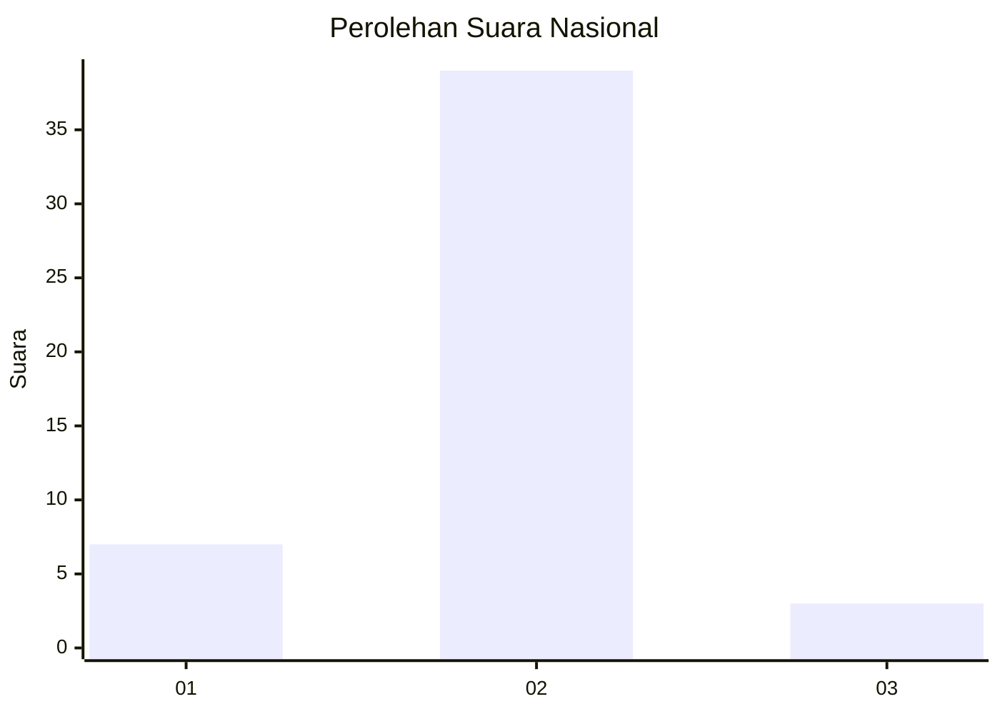
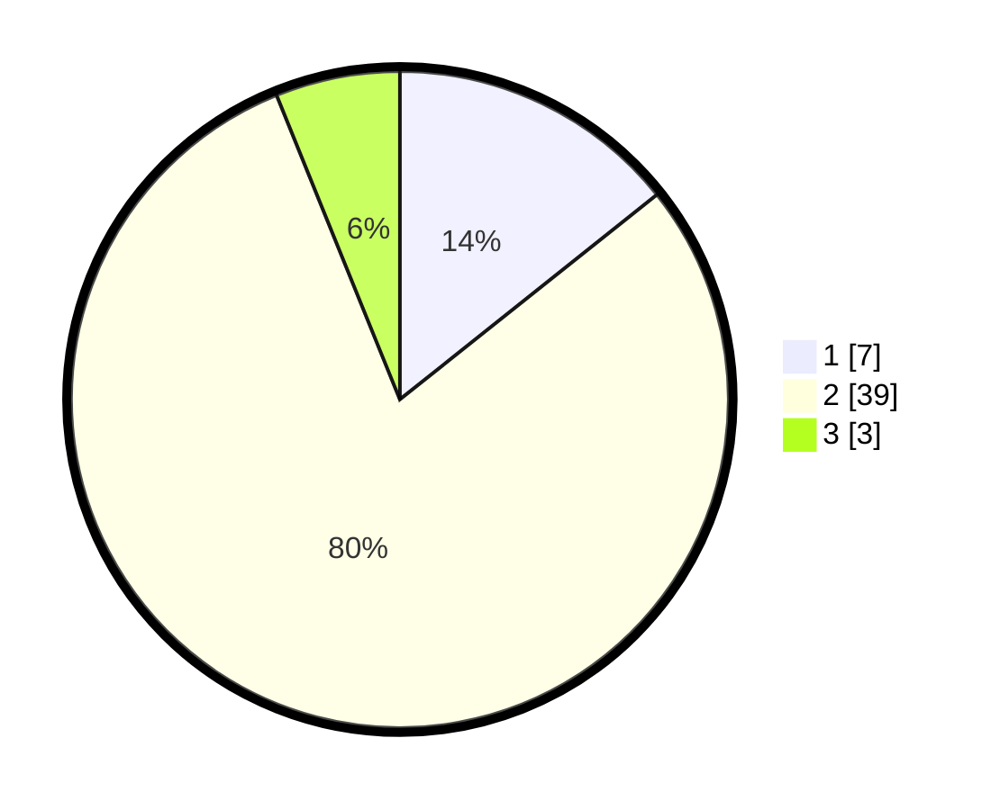

# Hasil

## Grafik

## Tabel

| No. | Nama Paslon    | Suara | Suara (raw) | Persentase |
|:--- |:-------------- | -----:| -----------:| ----------:|
| 1   | ANIES MUHAIMIN | 7     | [7][p-1]    | 14,29      |
| 2   | PRABOWO GIBRAN | 39    | [39][p-2]   | 79,59      |
| 3   | GANJAR MAHFUD  | 3     | [3][p-3]    | 6,12       |

[p-1]: https://github.com/gigit-pemilu/pemilu-2024/blob/main/pilpres/hitung-suara/sub/14-riau/sub/04-indragiri-hilir/sub/01-reteh/sub/2004-sungaiterap/sub/002-tps/sub/paslon-1.txt
[p-2]: https://github.com/gigit-pemilu/pemilu-2024/blob/main/pilpres/hitung-suara/sub/14-riau/sub/04-indragiri-hilir/sub/01-reteh/sub/2004-sungaiterap/sub/002-tps/sub/paslon-2.txt
[p-3]: https://github.com/gigit-pemilu/pemilu-2024/blob/main/pilpres/hitung-suara/sub/14-riau/sub/04-indragiri-hilir/sub/01-reteh/sub/2004-sungaiterap/sub/002-tps/sub/paslon-3.txt

## Foto C Plano

https://sirekap-obj-formc.kpu.go.id/f3f5/pemilu/ppwp/14/04/01/20/04/1404012004002-20240215-175824--1e280e6a-f56d-4865-a85a-52c61421794a.jpg

https://sirekap-obj-formc.kpu.go.id/f3f5/pemilu/ppwp/14/04/01/20/04/1404012004002-20240215-175839--2e2f3db1-c965-487f-ba49-3904aa287ab0.jpg

https://sirekap-obj-formc.kpu.go.id/f3f5/pemilu/ppwp/14/04/01/20/04/1404012004002-20240215-175856--6779edf2-d8cd-4363-97c5-6364baa0954f.jpg

## Metadata

| Key        | Value               |
| ---------- | ------------------- |
| Time Stamp | 2024-02-24 22:31:28 |

