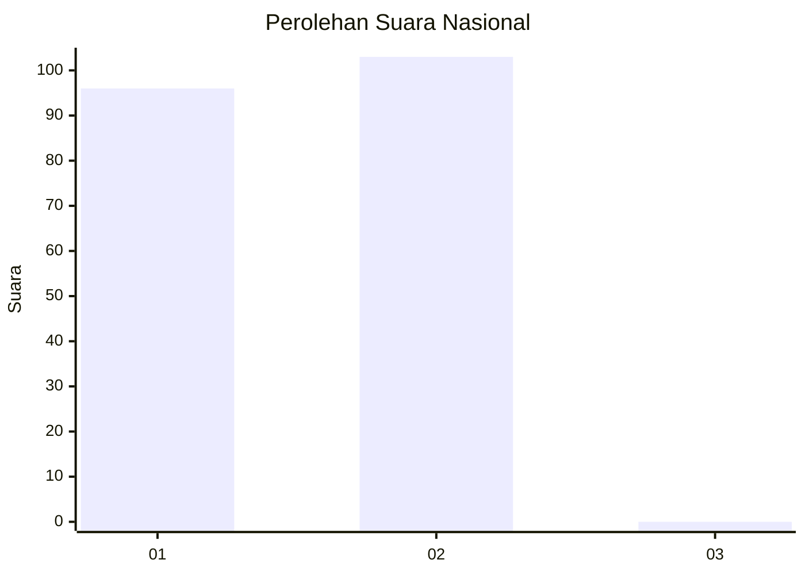
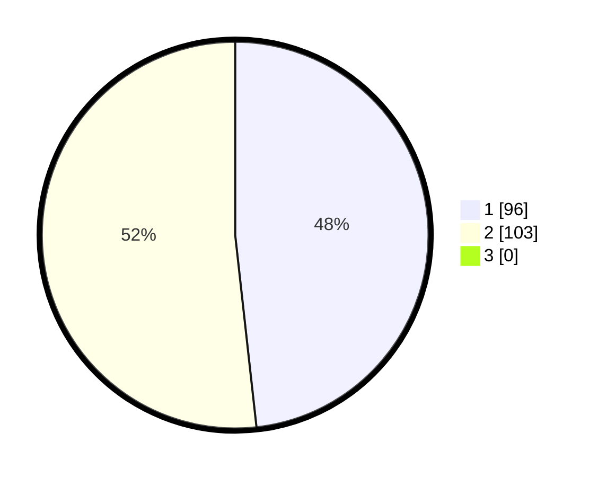

# Hasil

## Grafik

## Tabel

| No. | Nama Paslon    | Suara | Suara (raw) | Persentase |
|:--- |:-------------- | -----:| -----------:| ----------:|
| 1   | ANIES MUHAIMIN | 96    | [96][p-1]   | 48,24      |
| 2   | PRABOWO GIBRAN | 103   | [103][p-2]  | 51,76      |
| 3   | GANJAR MAHFUD  | 0     | [0][p-3]    | 0,00       |

[p-1]: https://github.com/gigit-pemilu/pemilu-2024/blob/main/pilpres/hitung-suara/sub/14-riau/sub/04-indragiri-hilir/sub/01-reteh/sub/2010-seberang-sanglar/sub/009-tps/sub/paslon-1.txt
[p-2]: https://github.com/gigit-pemilu/pemilu-2024/blob/main/pilpres/hitung-suara/sub/14-riau/sub/04-indragiri-hilir/sub/01-reteh/sub/2010-seberang-sanglar/sub/009-tps/sub/paslon-2.txt
[p-3]: https://github.com/gigit-pemilu/pemilu-2024/blob/main/pilpres/hitung-suara/sub/14-riau/sub/04-indragiri-hilir/sub/01-reteh/sub/2010-seberang-sanglar/sub/009-tps/sub/paslon-3.txt

## Foto C Plano

https://sirekap-obj-formc.kpu.go.id/e455/pemilu/ppwp/14/04/01/20/10/1404012010009-20240215-032337--89ac9a7c-daf6-4c0f-ba1c-3421b30e12ce.jpg

https://sirekap-obj-formc.kpu.go.id/e455/pemilu/ppwp/14/04/01/20/10/1404012010009-20240215-033106--f36a5d95-2bc2-48c7-a76c-b9fb04dbf266.jpg

https://sirekap-obj-formc.kpu.go.id/e455/pemilu/ppwp/14/04/01/20/10/1404012010009-20240215-032944--f7db5f8e-47ba-40a9-bbf8-d62fc01b4f72.jpg

## Metadata

| Key        | Value               |
| ---------- | ------------------- |
| Time Stamp | 2024-02-16 14:30:33 |

