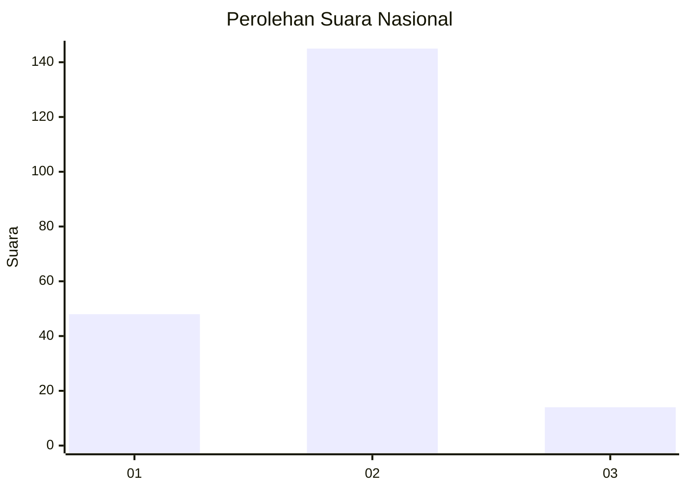
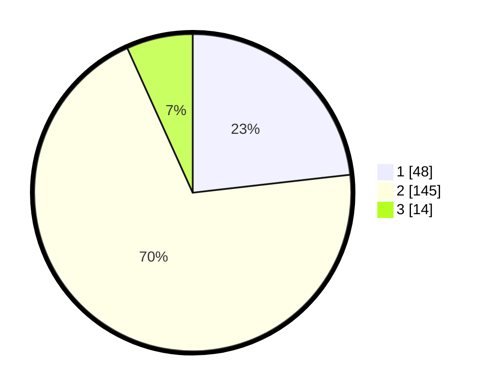

# Hasil

## Grafik

## Tabel

| No. | Nama Paslon    | Suara | Suara (raw) | Persentase |
|:--- |:-------------- | -----:| -----------:| ----------:|
| 1   | ANIES MUHAIMIN | 48    | [48][p-1]   | 23,19      |
| 2   | PRABOWO GIBRAN | 145   | [145][p-2]  | 70,05      |
| 3   | GANJAR MAHFUD  | 14    | [14][p-3]   | 6,76       |

[p-1]: https://github.com/gigit-pemilu/pemilu-2024/blob/main/pilpres/hitung-suara/sub/14-riau/sub/04-indragiri-hilir/sub/02-enok/sub/1001-enok/sub/009-tps/sub/paslon-1.txt
[p-2]: https://github.com/gigit-pemilu/pemilu-2024/blob/main/pilpres/hitung-suara/sub/14-riau/sub/04-indragiri-hilir/sub/02-enok/sub/1001-enok/sub/009-tps/sub/paslon-2.txt
[p-3]: https://github.com/gigit-pemilu/pemilu-2024/blob/main/pilpres/hitung-suara/sub/14-riau/sub/04-indragiri-hilir/sub/02-enok/sub/1001-enok/sub/009-tps/sub/paslon-3.txt

## Foto C Plano

https://sirekap-obj-formc.kpu.go.id/bcb7/pemilu/ppwp/14/04/02/10/01/1404021001009-20240214-235412--a498384e-aaf4-4055-a574-429c3e0b4f4f.jpg

https://sirekap-obj-formc.kpu.go.id/bcb7/pemilu/ppwp/14/04/02/10/01/1404021001009-20240214-235547--47a921ee-3385-4c4b-96ed-37c0ea338a69.jpg

https://sirekap-obj-formc.kpu.go.id/bcb7/pemilu/ppwp/14/04/02/10/01/1404021001009-20240214-235644--73259160-bdb3-40db-91e6-188350748eba.jpg

## Metadata

| Key        | Value               |
| ---------- | ------------------- |
| Time Stamp | 2024-02-16 14:30:33 |

