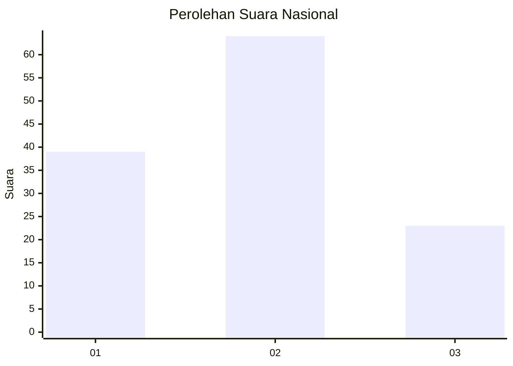
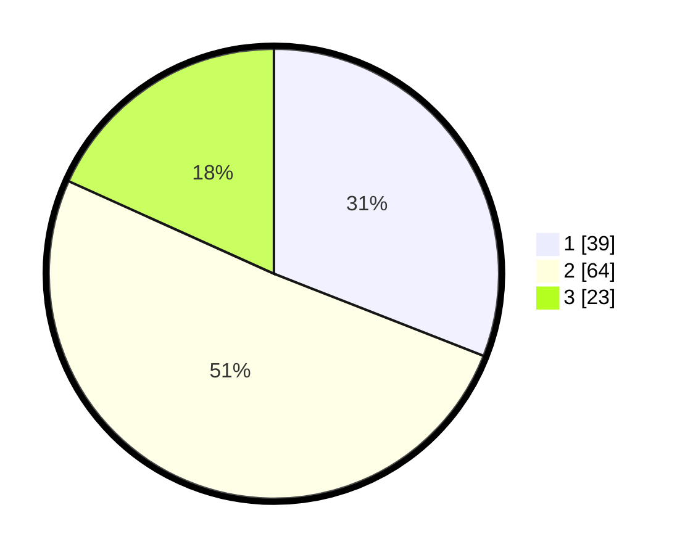

# Hasil

## Grafik

## Tabel

| No. | Nama Paslon    | Suara | Suara (raw) | Persentase |
|:--- |:-------------- | -----:| -----------:| ----------:|
| 1   | ANIES MUHAIMIN | 39    | [39][p-1]   | 30,95      |
| 2   | PRABOWO GIBRAN | 64    | [64][p-2]   | 50,79      |
| 3   | GANJAR MAHFUD  | 23    | [23][p-3]   | 18,25      |

[p-1]: https://github.com/gigit-pemilu/pemilu-2024/blob/main/pilpres/hitung-suara/sub/14-riau/sub/04-indragiri-hilir/sub/02-enok/sub/2004-pengalihan/sub/008-tps/sub/paslon-1.txt
[p-2]: https://github.com/gigit-pemilu/pemilu-2024/blob/main/pilpres/hitung-suara/sub/14-riau/sub/04-indragiri-hilir/sub/02-enok/sub/2004-pengalihan/sub/008-tps/sub/paslon-2.txt
[p-3]: https://github.com/gigit-pemilu/pemilu-2024/blob/main/pilpres/hitung-suara/sub/14-riau/sub/04-indragiri-hilir/sub/02-enok/sub/2004-pengalihan/sub/008-tps/sub/paslon-3.txt

## Foto C Plano

https://sirekap-obj-formc.kpu.go.id/ac05/pemilu/ppwp/14/04/02/20/04/1404022004008-20240214-212623--d592675d-8545-405e-975f-440ca4cbb11e.jpg

https://sirekap-obj-formc.kpu.go.id/ac05/pemilu/ppwp/14/04/02/20/04/1404022004008-20240215-032142--f7f3e6ce-d562-4ece-8689-d0e60513b1c5.jpg

https://sirekap-obj-formc.kpu.go.id/ac05/pemilu/ppwp/14/04/02/20/04/1404022004008-20240215-032327--8bbc93b0-834f-46cb-8108-1bf38ead0798.jpg

## Metadata

| Key        | Value               |
| ---------- | ------------------- |
| Time Stamp | 2024-02-16 16:25:10 |

