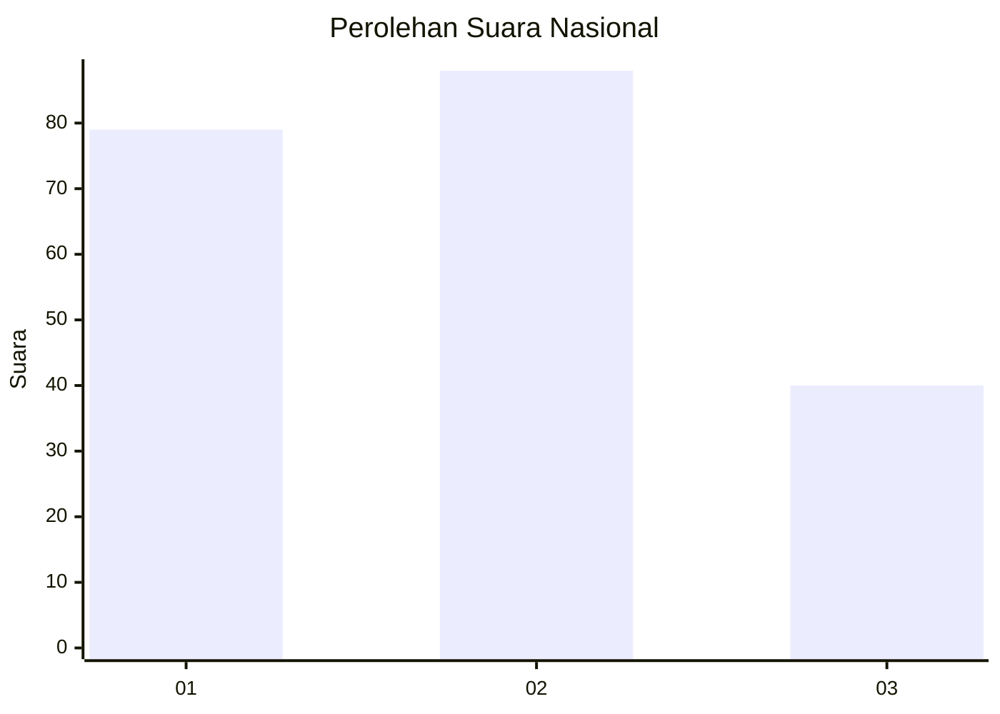
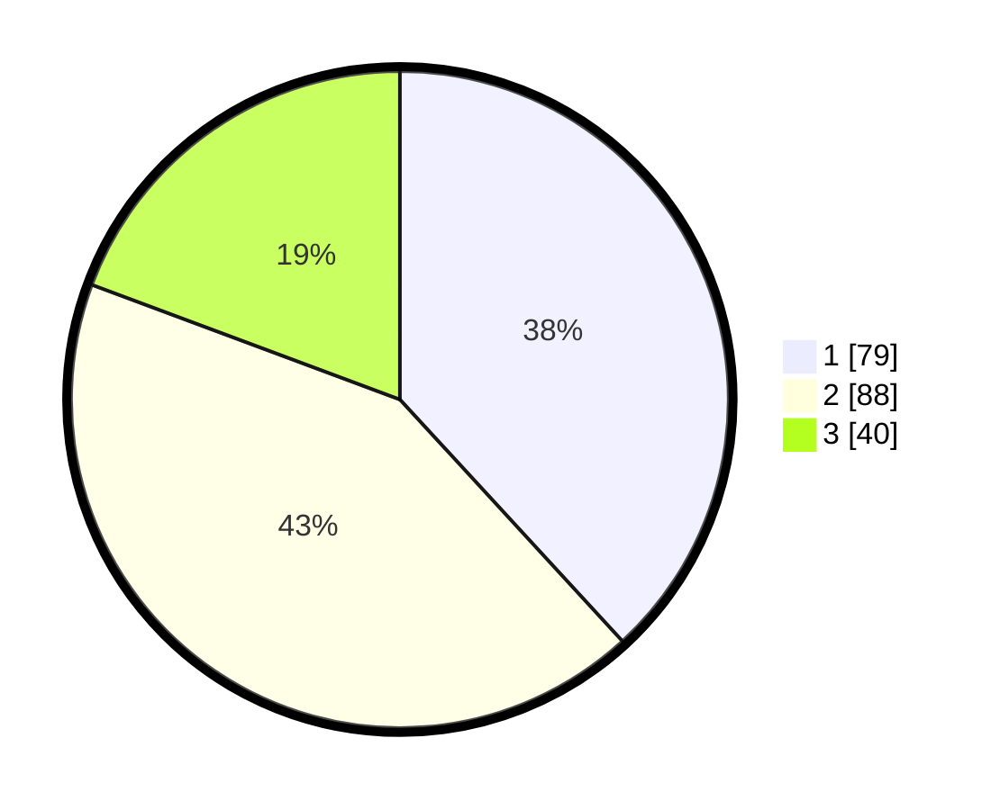

# Hasil

## Grafik

## Tabel

| No. | Nama Paslon    | Suara | Suara (raw) | Persentase |
|:--- |:-------------- | -----:| -----------:| ----------:|
| 1   | ANIES MUHAIMIN | 79    | [79][p-1]   | 38,16      |
| 2   | PRABOWO GIBRAN | 88    | [88][p-2]   | 42,51      |
| 3   | GANJAR MAHFUD  | 40    | [40][p-3]   | 19,32      |

[p-1]: https://github.com/gigit-pemilu/pemilu-2024/blob/main/pilpres/hitung-suara/sub/14-riau/sub/04-indragiri-hilir/sub/02-enok/sub/2008-sungairukam/sub/007-tps/sub/paslon-1.txt
[p-2]: https://github.com/gigit-pemilu/pemilu-2024/blob/main/pilpres/hitung-suara/sub/14-riau/sub/04-indragiri-hilir/sub/02-enok/sub/2008-sungairukam/sub/007-tps/sub/paslon-2.txt
[p-3]: https://github.com/gigit-pemilu/pemilu-2024/blob/main/pilpres/hitung-suara/sub/14-riau/sub/04-indragiri-hilir/sub/02-enok/sub/2008-sungairukam/sub/007-tps/sub/paslon-3.txt

## Foto C Plano

https://sirekap-obj-formc.kpu.go.id/4ca2/pemilu/ppwp/14/04/02/20/08/1404022008007-20240215-100648--002d25c7-f4d2-4a92-bfc2-1a4f946be89f.jpg

https://sirekap-obj-formc.kpu.go.id/4ca2/pemilu/ppwp/14/04/02/20/08/1404022008007-20240215-100708--e3f2262b-9617-438c-bff4-bcfdb24f4af5.jpg

https://sirekap-obj-formc.kpu.go.id/4ca2/pemilu/ppwp/14/04/02/20/08/1404022008007-20240215-100736--d1af1977-e5ae-4aa6-8a05-2b19ef2ba4b1.jpg

## Metadata

| Key        | Value               |
| ---------- | ------------------- |
| Time Stamp | 2024-02-15 15:00:29 |

