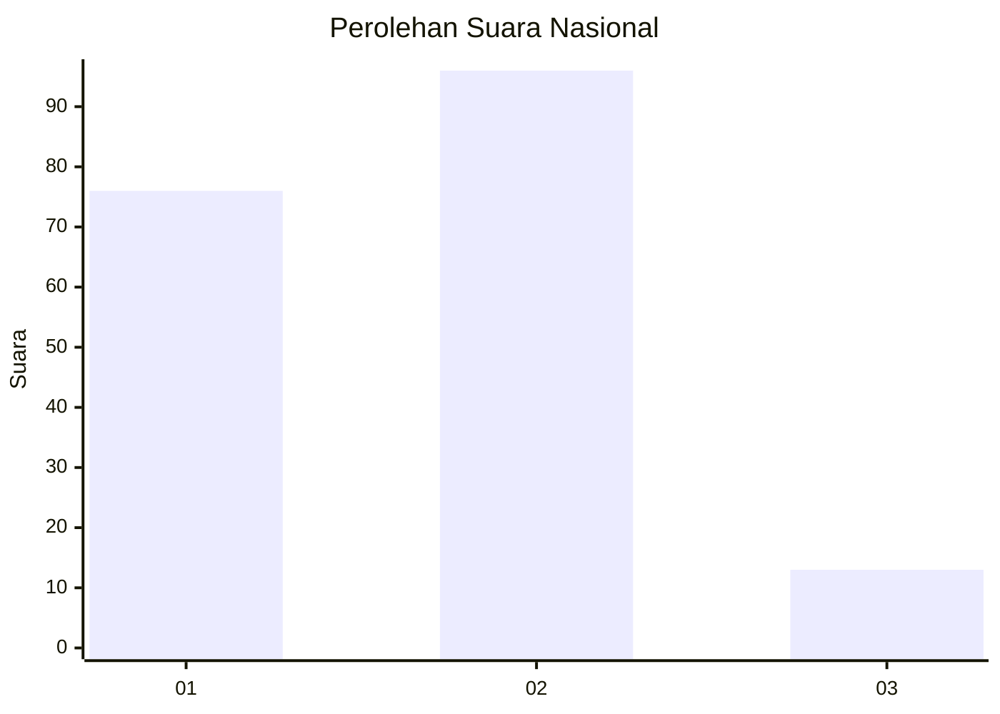
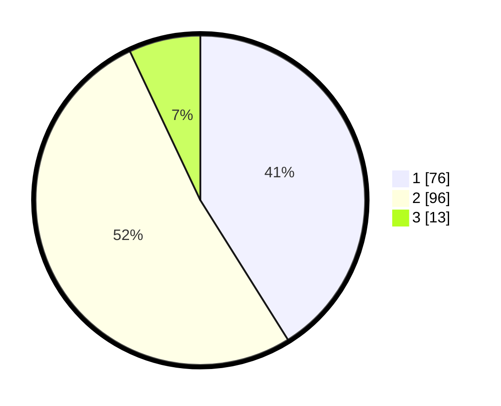

# Hasil

## Grafik

## Tabel

| No. | Nama Paslon    | Suara | Suara (raw) | Persentase |
|:--- |:-------------- | -----:| -----------:| ----------:|
| 1   | ANIES MUHAIMIN | 76    | [76][p-1]   | 41,08      |
| 2   | PRABOWO GIBRAN | 96    | [96][p-2]   | 51,89      |
| 3   | GANJAR MAHFUD  | 13    | [13][p-3]   | 7,03       |

[p-1]: https://github.com/gigit-pemilu/pemilu-2024/blob/main/pilpres/hitung-suara/sub/14-riau/sub/04-indragiri-hilir/sub/03-kuala-indragiri/sub/2002-tanjunglajau/sub/002-tps/sub/paslon-1.txt
[p-2]: https://github.com/gigit-pemilu/pemilu-2024/blob/main/pilpres/hitung-suara/sub/14-riau/sub/04-indragiri-hilir/sub/03-kuala-indragiri/sub/2002-tanjunglajau/sub/002-tps/sub/paslon-2.txt
[p-3]: https://github.com/gigit-pemilu/pemilu-2024/blob/main/pilpres/hitung-suara/sub/14-riau/sub/04-indragiri-hilir/sub/03-kuala-indragiri/sub/2002-tanjunglajau/sub/002-tps/sub/paslon-3.txt

## Foto C Plano

https://sirekap-obj-formc.kpu.go.id/00af/pemilu/ppwp/14/04/03/20/02/1404032002002-20240215-013341--43bab922-6eb9-47a5-ae09-9270c989bbbb.jpg

https://sirekap-obj-formc.kpu.go.id/00af/pemilu/ppwp/14/04/03/20/02/1404032002002-20240215-013802--d34c657b-ae32-491b-9ac2-45c01d44a474.jpg

https://sirekap-obj-formc.kpu.go.id/00af/pemilu/ppwp/14/04/03/20/02/1404032002002-20240215-014650--d9eb96a9-a9c7-4e87-9cc0-edf9c61cd837.jpg

## Metadata

| Key        | Value               |
| ---------- | ------------------- |
| Time Stamp | 2024-02-25 21:00:00 |

