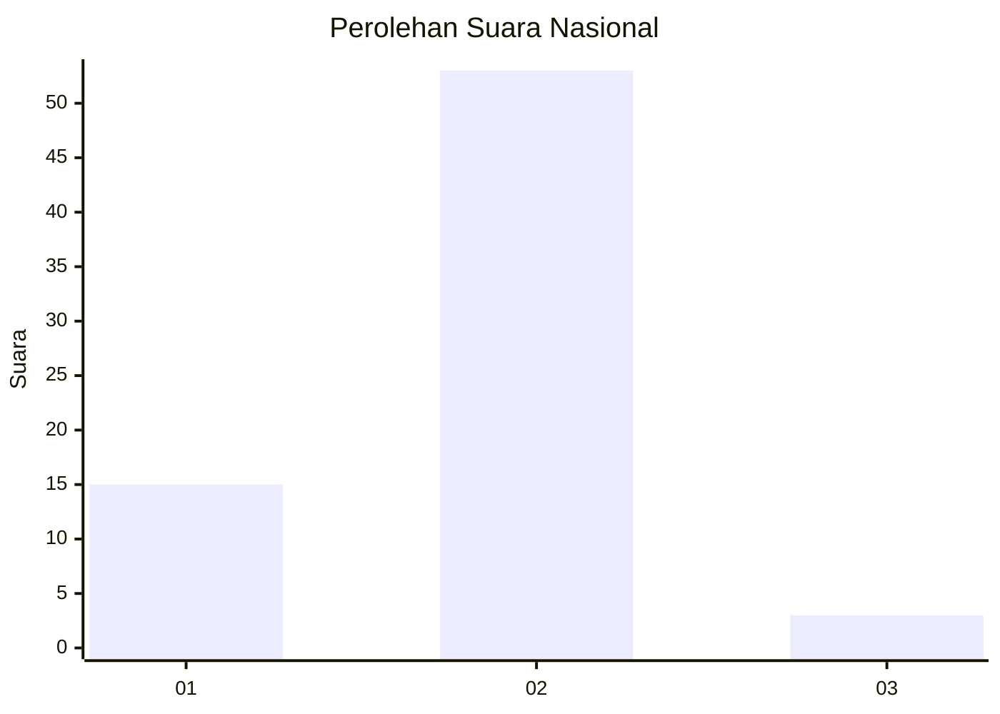
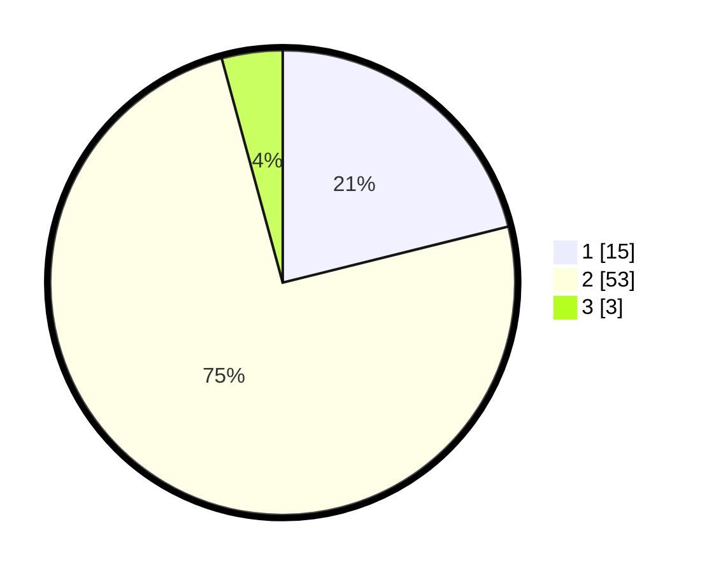

# Hasil

## Grafik

## Tabel

| No. | Nama Paslon    | Suara | Suara (raw) | Persentase |
|:--- |:-------------- | -----:| -----------:| ----------:|
| 1   | ANIES MUHAIMIN | 15    | [15][p-1]   | 21,13      |
| 2   | PRABOWO GIBRAN | 53    | [53][p-2]   | 74,65      |
| 3   | GANJAR MAHFUD  | 3     | [3][p-3]    | 4,23       |

[p-1]: https://github.com/gigit-pemilu/pemilu-2024/blob/main/pilpres/hitung-suara/sub/14-riau/sub/04-indragiri-hilir/sub/03-kuala-indragiri/sub/2002-tanjunglajau/sub/006-tps/sub/paslon-1.txt
[p-2]: https://github.com/gigit-pemilu/pemilu-2024/blob/main/pilpres/hitung-suara/sub/14-riau/sub/04-indragiri-hilir/sub/03-kuala-indragiri/sub/2002-tanjunglajau/sub/006-tps/sub/paslon-2.txt
[p-3]: https://github.com/gigit-pemilu/pemilu-2024/blob/main/pilpres/hitung-suara/sub/14-riau/sub/04-indragiri-hilir/sub/03-kuala-indragiri/sub/2002-tanjunglajau/sub/006-tps/sub/paslon-3.txt

## Foto C Plano

https://sirekap-obj-formc.kpu.go.id/82d6/pemilu/ppwp/14/04/03/20/02/1404032002006-20240215-072521--76e4b5c6-b50e-44e1-a991-5fbda1d13dbe.jpg

https://sirekap-obj-formc.kpu.go.id/82d6/pemilu/ppwp/14/04/03/20/02/1404032002006-20240215-072611--5c8d562e-1846-44fb-b4a9-659a0889d172.jpg

https://sirekap-obj-formc.kpu.go.id/82d6/pemilu/ppwp/14/04/03/20/02/1404032002006-20240215-072754--a975dc92-2bf7-4db2-bbf2-8d7fb94ca957.jpg

## Metadata

| Key        | Value               |
| ---------- | ------------------- |
| Time Stamp | 2024-02-25 11:00:00 |

