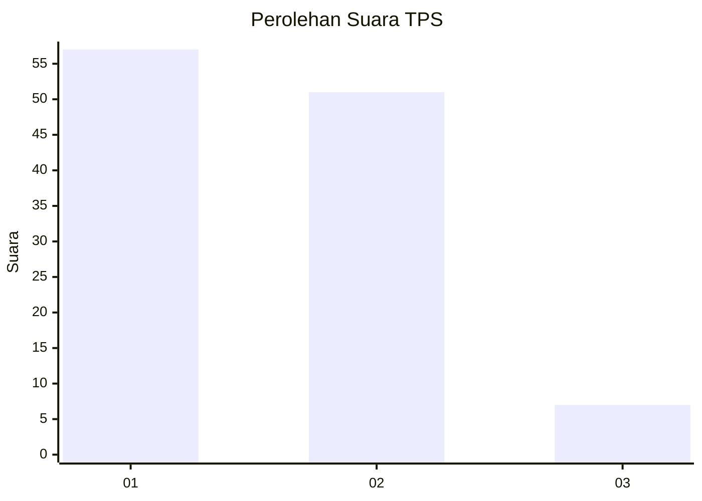
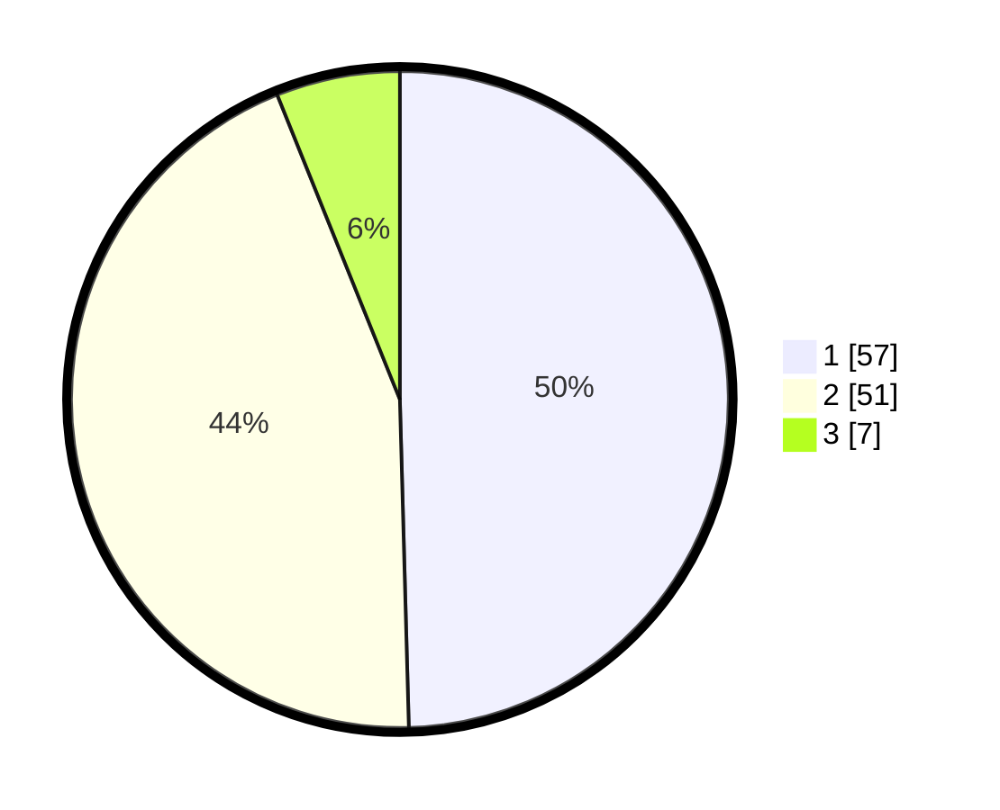

# Hasil

## Grafik

## Tabel

| No. | Nama Paslon    | Suara | Suara (raw) | Persentase |
|:--- |:-------------- | -----:| -----------:| ----------:|
| 1   | ANIES MUHAIMIN | 57    | [57][p-1]   | 49,57      |
| 2   | PRABOWO GIBRAN | 51    | [51][p-2]   | 44,35      |
| 3   | GANJAR MAHFUD  | 7     | [7][p-3]    | 6,09       |

[p-1]: https://github.com/gigit-pemilu/pemilu-2024-14-riau/blob/main/pilpres/hitung-suara/sub/14-riau/sub/04-indragiri-hilir/sub/03-kuala-indragiri/sub/2002-tanjunglajau/sub/007-tps/sub/paslon-1.txt
[p-2]: https://github.com/gigit-pemilu/pemilu-2024-14-riau/blob/main/pilpres/hitung-suara/sub/14-riau/sub/04-indragiri-hilir/sub/03-kuala-indragiri/sub/2002-tanjunglajau/sub/007-tps/sub/paslon-2.txt
[p-3]: https://github.com/gigit-pemilu/pemilu-2024-14-riau/blob/main/pilpres/hitung-suara/sub/14-riau/sub/04-indragiri-hilir/sub/03-kuala-indragiri/sub/2002-tanjunglajau/sub/007-tps/sub/paslon-3.txt

## Foto C Plano

https://sirekap-obj-formc.kpu.go.id/8fc0/pemilu/ppwp/14/04/03/20/02/1404032002007-20240215-042753--a3558c87-db49-4080-be8b-3e113d2d7dea.jpg

https://sirekap-obj-formc.kpu.go.id/8fc0/pemilu/ppwp/14/04/03/20/02/1404032002007-20240214-230437--6b6e8985-1fc2-4958-84ff-46825df49e3a.jpg

https://sirekap-obj-formc.kpu.go.id/8fc0/pemilu/ppwp/14/04/03/20/02/1404032002007-20240214-230925--d957f9d7-3397-4779-a968-86b9ad6b70d2.jpg

## Metadata

| Key        | Value               |
| ---------- | ------------------- |
| Time Stamp | 2024-02-25 14:00:00 |

