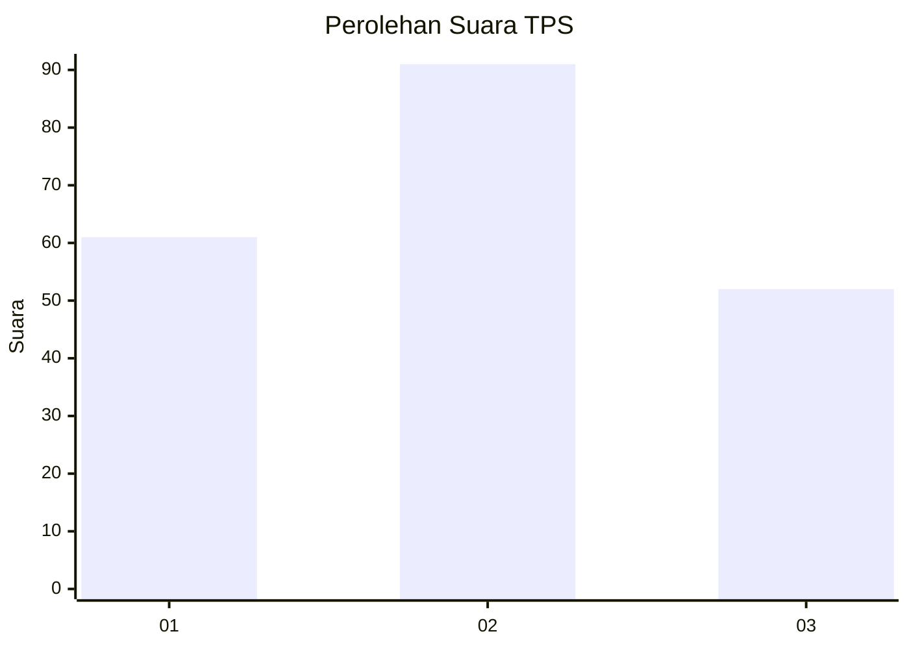
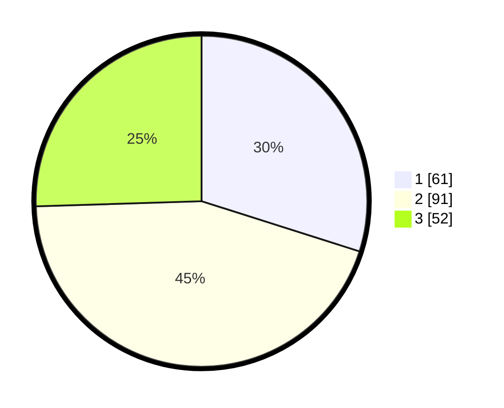

# Hasil

## Grafik

## Tabel

| No. | Nama Paslon    | Suara | Suara (raw) | Persentase |
|:--- |:-------------- | -----:| -----------:| ----------:|
| 1   | ANIES MUHAIMIN | 61    | [61][p-1]   | 29,90      |
| 2   | PRABOWO GIBRAN | 91    | [91][p-2]   | 44,61      |
| 3   | GANJAR MAHFUD  | 52    | [52][p-3]   | 25,49      |

[p-1]: https://github.com/gigit-pemilu/pemilu-2024-14-riau/blob/main/pilpres/hitung-suara/sub/14-riau/sub/04-indragiri-hilir/sub/04-tembilahan/sub/1001-tembilahan-kota/sub/005-tps/sub/paslon-1.txt
[p-2]: https://github.com/gigit-pemilu/pemilu-2024-14-riau/blob/main/pilpres/hitung-suara/sub/14-riau/sub/04-indragiri-hilir/sub/04-tembilahan/sub/1001-tembilahan-kota/sub/005-tps/sub/paslon-2.txt
[p-3]: https://github.com/gigit-pemilu/pemilu-2024-14-riau/blob/main/pilpres/hitung-suara/sub/14-riau/sub/04-indragiri-hilir/sub/04-tembilahan/sub/1001-tembilahan-kota/sub/005-tps/sub/paslon-3.txt

## Foto C Plano

https://sirekap-obj-formc.kpu.go.id/86e8/pemilu/ppwp/14/04/04/10/01/1404041001005-20240214-212312--18c12143-fd22-465f-aec0-c1cc58347be0.jpg

https://sirekap-obj-formc.kpu.go.id/86e8/pemilu/ppwp/14/04/04/10/01/1404041001005-20240214-212348--d91c67f6-c783-4f85-9637-2fa99e4579e1.jpg

https://sirekap-obj-formc.kpu.go.id/86e8/pemilu/ppwp/14/04/04/10/01/1404041001005-20240214-212454--8b0bffbb-9f18-4ef2-bd58-6d89b0a60cf3.jpg

## Metadata

| Key        | Value               |
| ---------- | ------------------- |
| Time Stamp | 2024-02-24 22:31:28 |

