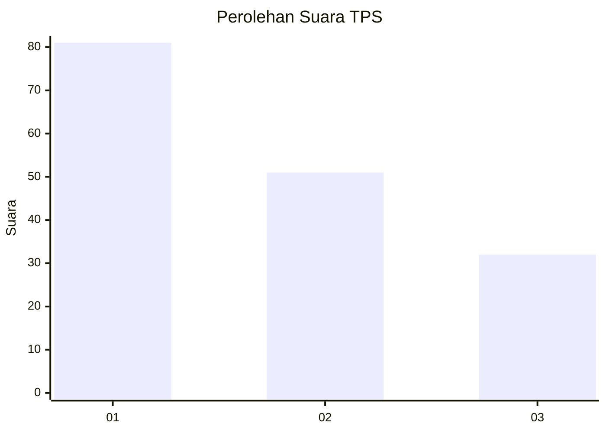
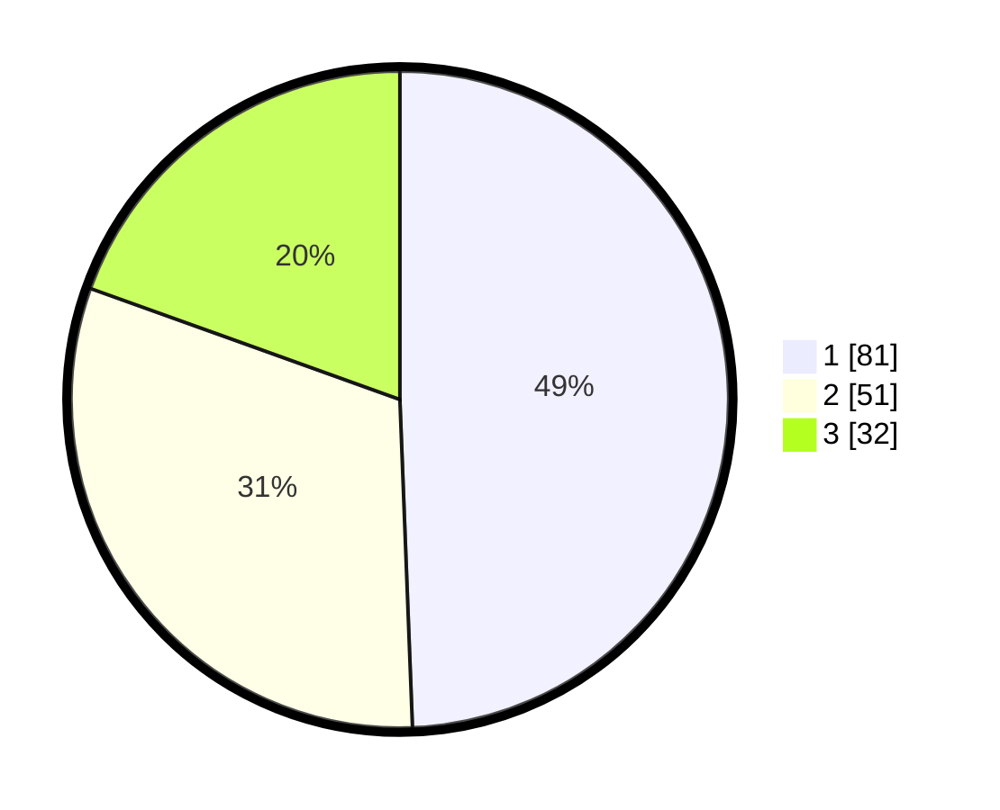

# Hasil

## Grafik

## Tabel

| No. | Nama Paslon    | Suara | Suara (raw) | Persentase |
|:--- |:-------------- | -----:| -----------:| ----------:|
| 1   | ANIES MUHAIMIN | 81    | [81][p-1]   | 49,39      |
| 2   | PRABOWO GIBRAN | 51    | [51][p-2]   | 31,10      |
| 3   | GANJAR MAHFUD  | 32    | [32][p-3]   | 19,51      |

[p-1]: https://github.com/gigit-pemilu/pemilu-2024-14-riau/blob/main/pilpres/hitung-suara/sub/14-riau/sub/04-indragiri-hilir/sub/04-tembilahan/sub/1001-tembilahan-kota/sub/009-tps/sub/paslon-1.txt
[p-2]: https://github.com/gigit-pemilu/pemilu-2024-14-riau/blob/main/pilpres/hitung-suara/sub/14-riau/sub/04-indragiri-hilir/sub/04-tembilahan/sub/1001-tembilahan-kota/sub/009-tps/sub/paslon-2.txt
[p-3]: https://github.com/gigit-pemilu/pemilu-2024-14-riau/blob/main/pilpres/hitung-suara/sub/14-riau/sub/04-indragiri-hilir/sub/04-tembilahan/sub/1001-tembilahan-kota/sub/009-tps/sub/paslon-3.txt

## Foto C Plano

https://sirekap-obj-formc.kpu.go.id/4cf4/pemilu/ppwp/14/04/04/10/01/1404041001009-20240215-193032--b90eb5f2-a8b6-40b0-91e6-32dd79aebd8e.jpg

https://sirekap-obj-formc.kpu.go.id/4cf4/pemilu/ppwp/14/04/04/10/01/1404041001009-20240215-002227--d2e598a4-1260-43ea-8651-646e116950a6.jpg

https://sirekap-obj-formc.kpu.go.id/4cf4/pemilu/ppwp/14/04/04/10/01/1404041001009-20240215-002324--dd2cb7ad-0452-438c-b473-1bbf961211cc.jpg

## Metadata

| Key        | Value               |
| ---------- | ------------------- |
| Time Stamp | 2024-02-15 20:30:46 |

## DATA PEMILIH TETAP

Jumlah pemilih dalam DPT: **288**.
 * L: **632**.
 * P: **756**.

## DATA PENGGUNA HAK PILIH

Jumlah pengguna hak pilih dalam DPT: **206**.
 * L: **890**.
 * P: **686**.

Jumlah pengguna hak pilih dalam DPTb: **2**.
 * L: **888**.
 * P: **3**.

Jumlah pengguna hak pilih dalam DPK: **808**.
 * L: **888**.
 * P: **400**.

Jumlah pengguna hak pilih: **208**.
 * L: **890**.
 * P: **377**.

## JUMLAH SUARA SAH DAN TIDAK SAH

JUMLAH SELURUH SUARA SAH: **703**.

JUMLAH SUARA TIDAK SAH: **5**.

JUMLAH SELURUH SUARA SAH DAN SUARA TIDAK SAH: **208**.

