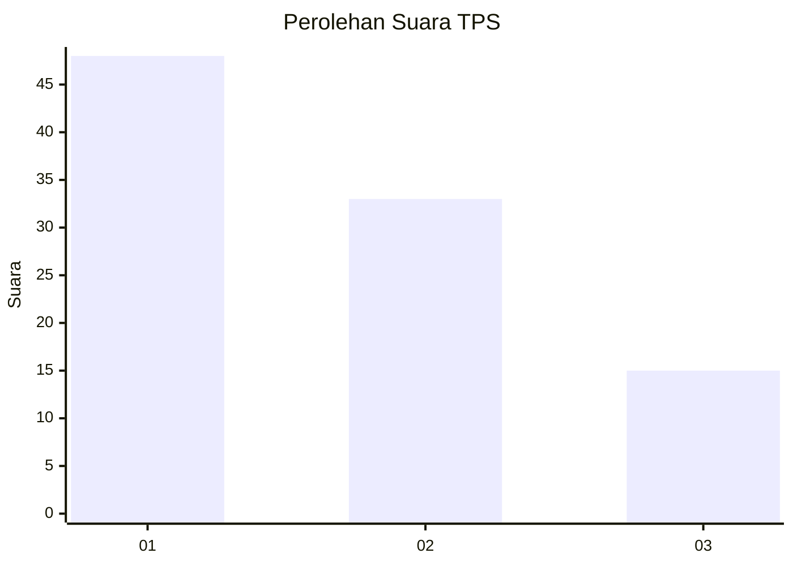
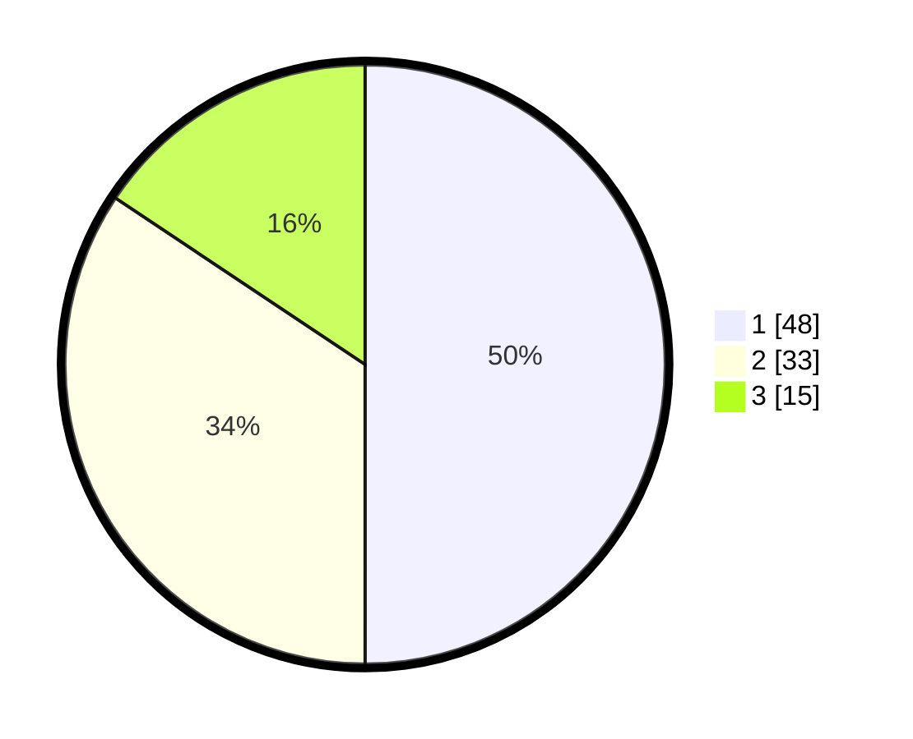

# Hasil

## Grafik

## Tabel

| No. | Nama Paslon    | Suara | Suara (raw) | Persentase |
|:--- |:-------------- | -----:| -----------:| ----------:|
| 1   | ANIES MUHAIMIN | 48    | [48][p-1]   | 50,00      |
| 2   | PRABOWO GIBRAN | 33    | [33][p-2]   | 34,38      |
| 3   | GANJAR MAHFUD  | 15    | [15][p-3]   | 15,63      |

[p-1]: https://github.com/gigit-pemilu/pemilu-2024-14-riau/blob/main/pilpres/hitung-suara/sub/14-riau/sub/04-indragiri-hilir/sub/04-tembilahan/sub/1001-tembilahan-kota/sub/029-tps/sub/paslon-1.txt
[p-2]: https://github.com/gigit-pemilu/pemilu-2024-14-riau/blob/main/pilpres/hitung-suara/sub/14-riau/sub/04-indragiri-hilir/sub/04-tembilahan/sub/1001-tembilahan-kota/sub/029-tps/sub/paslon-2.txt
[p-3]: https://github.com/gigit-pemilu/pemilu-2024-14-riau/blob/main/pilpres/hitung-suara/sub/14-riau/sub/04-indragiri-hilir/sub/04-tembilahan/sub/1001-tembilahan-kota/sub/029-tps/sub/paslon-3.txt

## Foto C Plano

https://sirekap-obj-formc.kpu.go.id/8c55/pemilu/ppwp/14/04/04/10/01/1404041001029-20240214-235950--b70c19f5-c5e8-442d-ad64-03d87f991bd0.jpg

https://sirekap-obj-formc.kpu.go.id/8c55/pemilu/ppwp/14/04/04/10/01/1404041001029-20240215-001100--89716d24-318b-4330-8c40-08bf818f012e.jpg

https://sirekap-obj-formc.kpu.go.id/8c55/pemilu/ppwp/14/04/04/10/01/1404041001029-20240215-001217--999cd7c0-d6f1-44aa-b6da-0c020c132abd.jpg

## Metadata

| Key        | Value               |
| ---------- | ------------------- |
| Time Stamp | 2024-02-25 10:00:00 |

