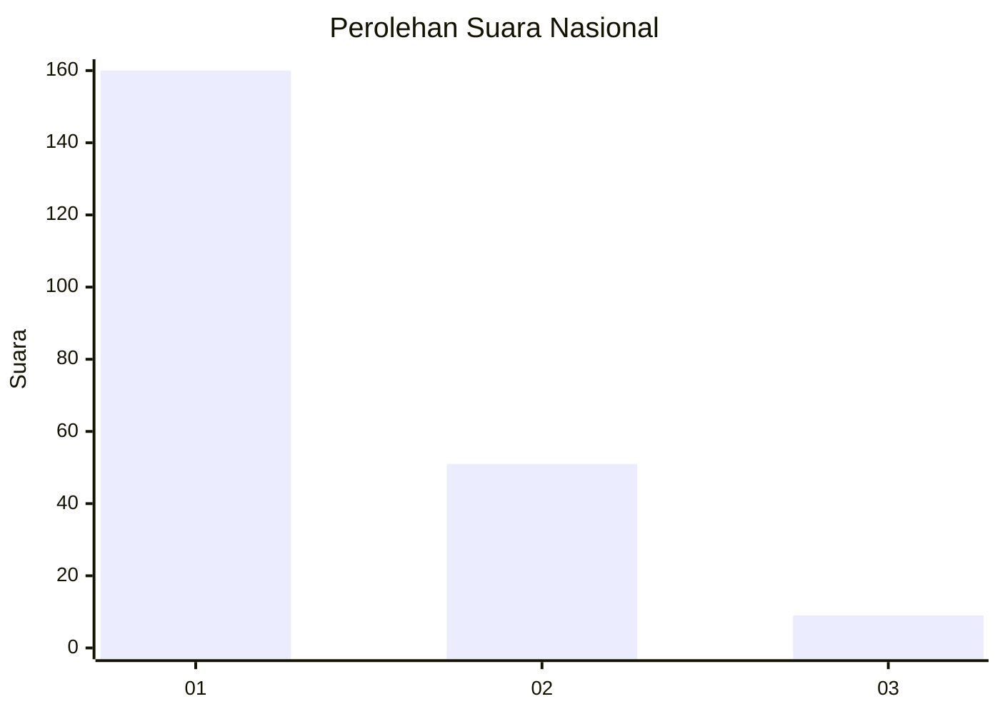
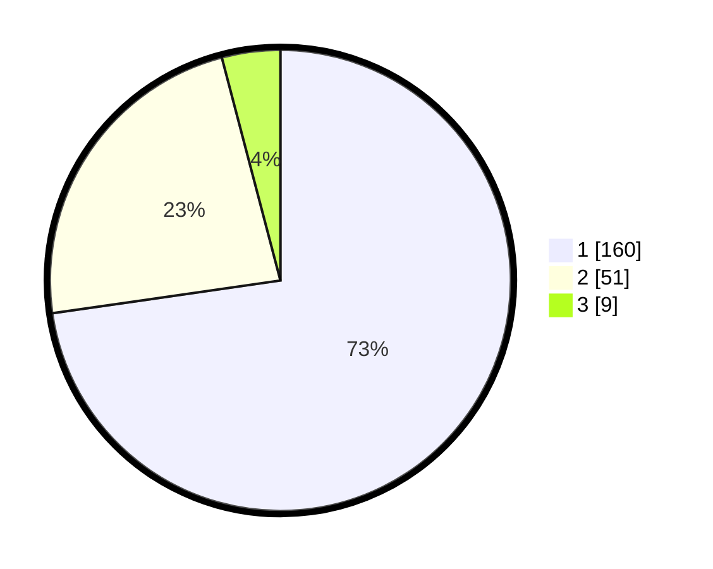

# Hasil

## Grafik

## Tabel

| No. | Nama Paslon    | Suara | Suara (raw) | Persentase |
|:--- |:-------------- | -----:| -----------:| ----------:|
| 1   | ANIES MUHAIMIN | 160   | [160][p-1]  | 72,73      |
| 2   | PRABOWO GIBRAN | 51    | [51][p-2]   | 23,18      |
| 3   | GANJAR MAHFUD  | 9     | [9][p-3]    | 4,09       |

[p-1]: https://github.com/gigit-pemilu/pemilu-2024/blob/main/pilpres/hitung-suara/sub/14-riau/sub/04-indragiri-hilir/sub/04-tembilahan/sub/1007-seberang-tembilahan-barat/sub/005-tps/sub/paslon-1.txt
[p-2]: https://github.com/gigit-pemilu/pemilu-2024/blob/main/pilpres/hitung-suara/sub/14-riau/sub/04-indragiri-hilir/sub/04-tembilahan/sub/1007-seberang-tembilahan-barat/sub/005-tps/sub/paslon-2.txt
[p-3]: https://github.com/gigit-pemilu/pemilu-2024/blob/main/pilpres/hitung-suara/sub/14-riau/sub/04-indragiri-hilir/sub/04-tembilahan/sub/1007-seberang-tembilahan-barat/sub/005-tps/sub/paslon-3.txt

## Foto C Plano

https://sirekap-obj-formc.kpu.go.id/ec1b/pemilu/ppwp/14/04/04/10/07/1404041007005-20240215-082516--ffbfe0e4-efba-44f3-9f6e-10a245645fbb.jpg

https://sirekap-obj-formc.kpu.go.id/ec1b/pemilu/ppwp/14/04/04/10/07/1404041007005-20240215-082546--ae7b3e7e-757c-4ac3-a261-53d8424c67f1.jpg

https://sirekap-obj-formc.kpu.go.id/ec1b/pemilu/ppwp/14/04/04/10/07/1404041007005-20240215-082607--0c183ab5-aaf0-4b14-8d06-0e49b31b5bd8.jpg

## Metadata

| Key        | Value               |
| ---------- | ------------------- |
| Time Stamp | 2024-02-25 15:00:00 |

