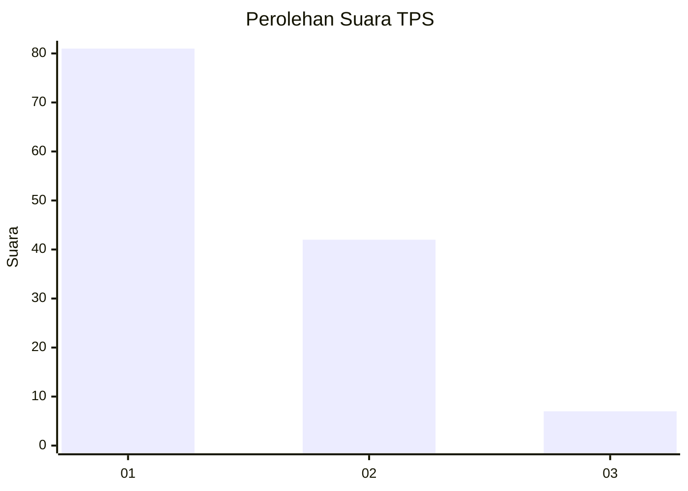
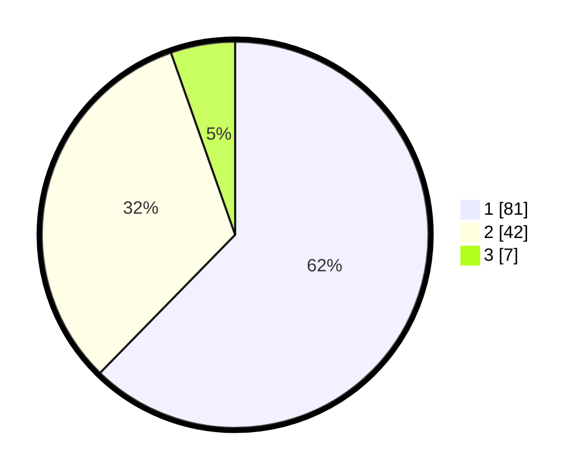

# Hasil

## Grafik

## Tabel

| No. | Nama Paslon    | Suara | Suara (raw) | Persentase |
|:--- |:-------------- | -----:| -----------:| ----------:|
| 1   | ANIES MUHAIMIN | 81    | [81][p-1]   | 62,31      |
| 2   | PRABOWO GIBRAN | 42    | [42][p-2]   | 32,31      |
| 3   | GANJAR MAHFUD  | 7     | [7][p-3]    | 5,38       |

[p-1]: https://github.com/gigit-pemilu/pemilu-2024-14-riau/blob/main/pilpres/hitung-suara/sub/14-riau/sub/04-indragiri-hilir/sub/06-gaung-anak-serka/sub/2001-kuala-gaung/sub/004-tps/sub/paslon-1.txt
[p-2]: https://github.com/gigit-pemilu/pemilu-2024-14-riau/blob/main/pilpres/hitung-suara/sub/14-riau/sub/04-indragiri-hilir/sub/06-gaung-anak-serka/sub/2001-kuala-gaung/sub/004-tps/sub/paslon-2.txt
[p-3]: https://github.com/gigit-pemilu/pemilu-2024-14-riau/blob/main/pilpres/hitung-suara/sub/14-riau/sub/04-indragiri-hilir/sub/06-gaung-anak-serka/sub/2001-kuala-gaung/sub/004-tps/sub/paslon-3.txt

## Foto C Plano

https://sirekap-obj-formc.kpu.go.id/4646/pemilu/ppwp/14/04/06/20/01/1404062001004-20240215-112703--5aa00912-2055-4041-9026-58f25fb47860.jpg

https://sirekap-obj-formc.kpu.go.id/4646/pemilu/ppwp/14/04/06/20/01/1404062001004-20240215-112939--939302e4-dc31-49b5-b9f8-b19f93a160c8.jpg

https://sirekap-obj-formc.kpu.go.id/4646/pemilu/ppwp/14/04/06/20/01/1404062001004-20240215-113159--d429449b-ea6c-4a60-bdf5-794b3a3b1b05.jpg

## Metadata

| Key        | Value               |
| ---------- | ------------------- |
| Time Stamp | 2024-02-25 15:00:00 |

