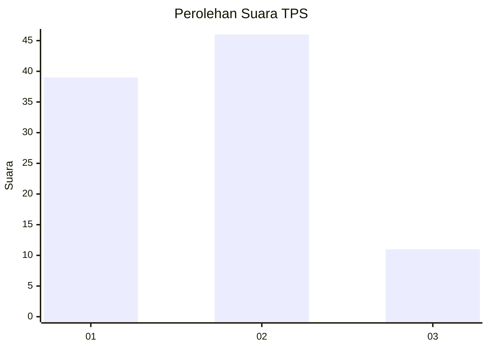
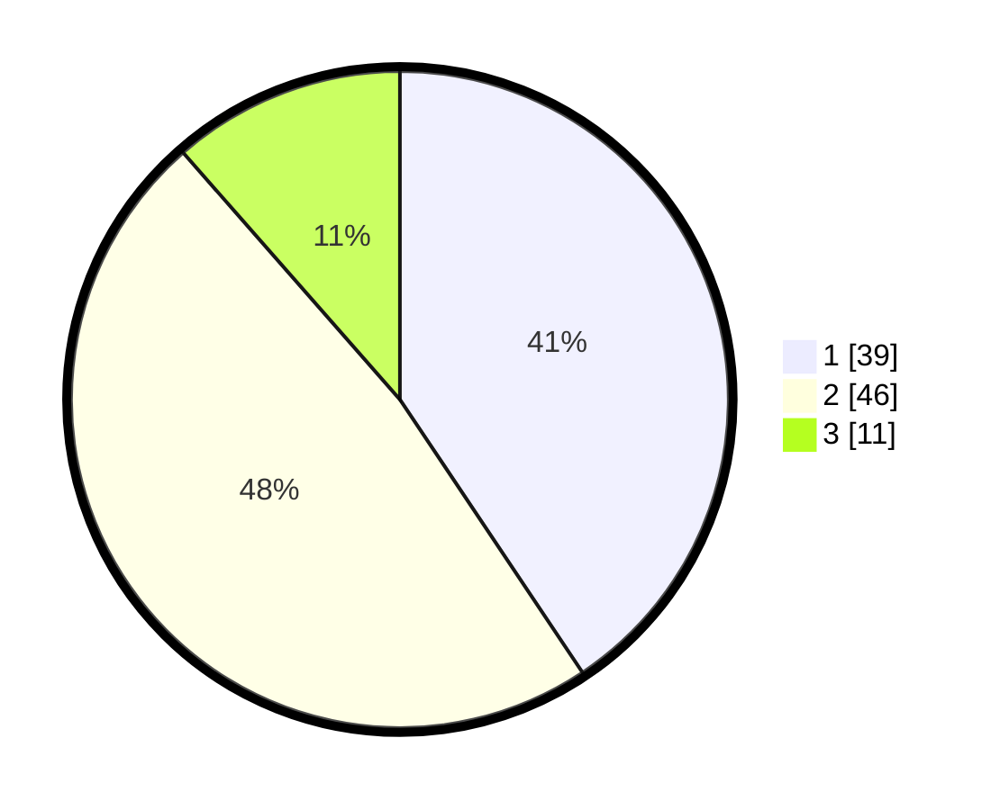

# Hasil

## Grafik

## Tabel

| No. | Nama Paslon    | Suara | Suara (raw) | Persentase |
|:--- |:-------------- | -----:| -----------:| ----------:|
| 1   | ANIES MUHAIMIN | 39    | [39][p-1]   | 40,63      |
| 2   | PRABOWO GIBRAN | 46    | [46][p-2]   | 47,92      |
| 3   | GANJAR MAHFUD  | 11    | [11][p-3]   | 11,46      |

[p-1]: https://github.com/gigit-pemilu/pemilu-2024-14-riau/blob/main/pilpres/hitung-suara/sub/14-riau/sub/04-indragiri-hilir/sub/07-mandah/sub/2005-igal/sub/014-tps/sub/paslon-1.txt
[p-2]: https://github.com/gigit-pemilu/pemilu-2024-14-riau/blob/main/pilpres/hitung-suara/sub/14-riau/sub/04-indragiri-hilir/sub/07-mandah/sub/2005-igal/sub/014-tps/sub/paslon-2.txt
[p-3]: https://github.com/gigit-pemilu/pemilu-2024-14-riau/blob/main/pilpres/hitung-suara/sub/14-riau/sub/04-indragiri-hilir/sub/07-mandah/sub/2005-igal/sub/014-tps/sub/paslon-3.txt

## Foto C Plano

https://sirekap-obj-formc.kpu.go.id/4815/pemilu/ppwp/14/04/07/20/05/1404072005014-20240214-212831--3ba8ca90-4820-49f4-942e-fb7834fa25b5.jpg

https://sirekap-obj-formc.kpu.go.id/4815/pemilu/ppwp/14/04/07/20/05/1404072005014-20240214-211415--6d394ef8-f53d-4b1e-abb8-b21c1d0d4773.jpg

https://sirekap-obj-formc.kpu.go.id/4815/pemilu/ppwp/14/04/07/20/05/1404072005014-20240214-211552--ecc9525d-c38f-425a-9e5e-ae9c65fdd4a6.jpg

## Metadata

| Key        | Value               |
| ---------- | ------------------- |
| Time Stamp | 2024-02-25 23:00:00 |

