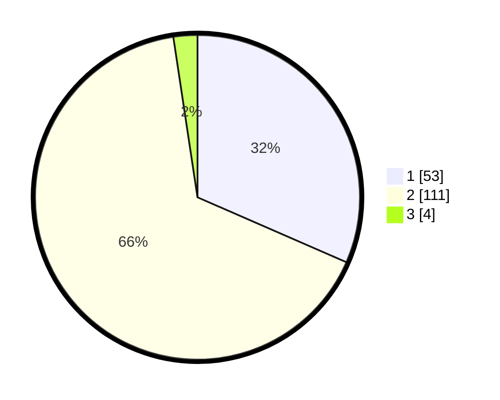

# Hasil

## Grafik

## Tabel

| No. | Nama Paslon    | Suara | Suara (raw) | Persentase |
|:--- |:-------------- | -----:| -----------:| ----------:|
| 1   | ANIES MUHAIMIN | 53    | [53][p-1]   | 31,55      |
| 2   | PRABOWO GIBRAN | 111   | [111][p-2]  | 66,07      |
| 3   | GANJAR MAHFUD  | 4     | [4][p-3]    | 2,38       |

[p-1]: https://github.com/gigit-pemilu/pemilu-2024-14-riau/blob/main/pilpres/hitung-suara/sub/14-riau/sub/04-indragiri-hilir/sub/07-mandah/sub/2016-suraya-mandiri/sub/001-tps/sub/paslon-1.txt
[p-2]: https://github.com/gigit-pemilu/pemilu-2024-14-riau/blob/main/pilpres/hitung-suara/sub/14-riau/sub/04-indragiri-hilir/sub/07-mandah/sub/2016-suraya-mandiri/sub/001-tps/sub/paslon-2.txt
[p-3]: https://github.com/gigit-pemilu/pemilu-2024-14-riau/blob/main/pilpres/hitung-suara/sub/14-riau/sub/04-indragiri-hilir/sub/07-mandah/sub/2016-suraya-mandiri/sub/001-tps/sub/paslon-3.txt

## Foto C Plano

https://sirekap-obj-formc.kpu.go.id/6076/pemilu/ppwp/14/04/07/20/16/1404072016001-20240215-083804--16f50428-6a75-460c-86ba-c5065e5a6b2a.jpg

https://sirekap-obj-formc.kpu.go.id/6076/pemilu/ppwp/14/04/07/20/16/1404072016001-20240215-083859--4d39fb6c-b3cb-4a9d-a57e-9e0d98458ac7.jpg

https://sirekap-obj-formc.kpu.go.id/6076/pemilu/ppwp/14/04/07/20/16/1404072016001-20240215-084000--a7d9257d-cf0b-4f2b-9ece-ee434713b665.jpg

## Metadata

| Key        | Value               |
| ---------- | ------------------- |
| Time Stamp | 2024-02-25 23:00:00 |

