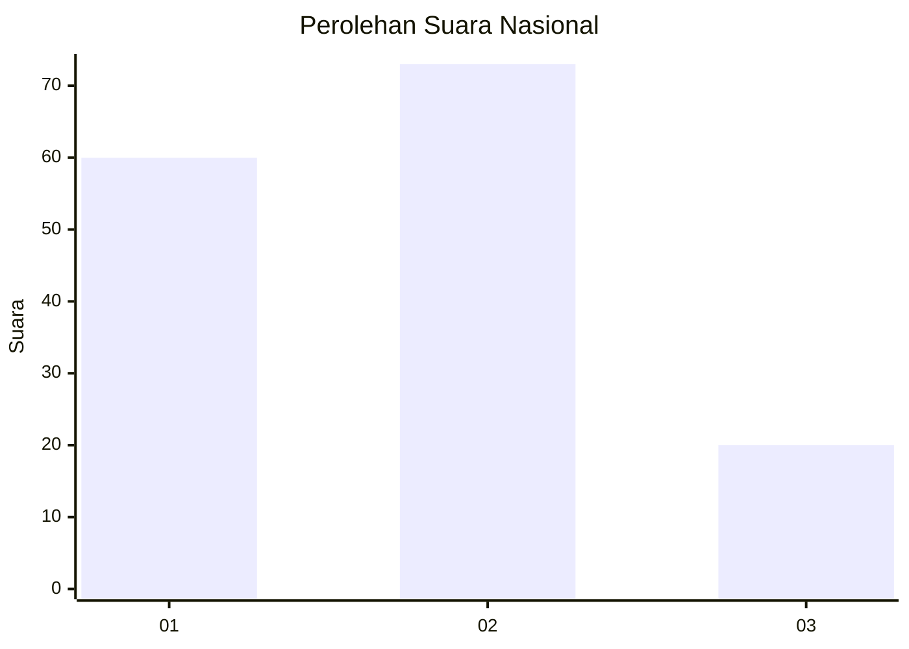
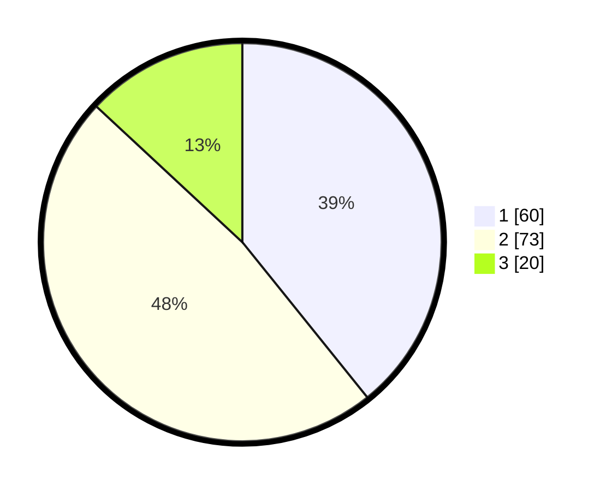

# Hasil

## Grafik

## Tabel

| No. | Nama Paslon    | Suara | Suara (raw) | Persentase |
|:--- |:-------------- | -----:| -----------:| ----------:|
| 1   | ANIES MUHAIMIN | 60    | [60][p-1]   | 39,22      |
| 2   | PRABOWO GIBRAN | 73    | [73][p-2]   | 47,71      |
| 3   | GANJAR MAHFUD  | 20    | [20][p-3]   | 13,07      |

[p-1]: https://github.com/gigit-pemilu/pemilu-2024/blob/main/pilpres/hitung-suara/sub/14-riau/sub/04-indragiri-hilir/sub/08-kateman/sub/1001-tegaraja/sub/004-tps/sub/paslon-1.txt
[p-2]: https://github.com/gigit-pemilu/pemilu-2024/blob/main/pilpres/hitung-suara/sub/14-riau/sub/04-indragiri-hilir/sub/08-kateman/sub/1001-tegaraja/sub/004-tps/sub/paslon-2.txt
[p-3]: https://github.com/gigit-pemilu/pemilu-2024/blob/main/pilpres/hitung-suara/sub/14-riau/sub/04-indragiri-hilir/sub/08-kateman/sub/1001-tegaraja/sub/004-tps/sub/paslon-3.txt

## Foto C Plano

https://sirekap-obj-formc.kpu.go.id/974d/pemilu/ppwp/14/04/08/10/01/1404081001004-20240215-005118--fcae598d-b0b9-4178-a727-6e65d416b82b.jpg

https://sirekap-obj-formc.kpu.go.id/974d/pemilu/ppwp/14/04/08/10/01/1404081001004-20240214-193737--f131b453-b249-4883-8911-745b437a31e6.jpg

https://sirekap-obj-formc.kpu.go.id/974d/pemilu/ppwp/14/04/08/10/01/1404081001004-20240214-194014--fffa1419-29df-4169-b9fa-a2274f02d44b.jpg

## Metadata

| Key        | Value               |
| ---------- | ------------------- |
| Time Stamp | 2024-02-24 22:31:28 |

