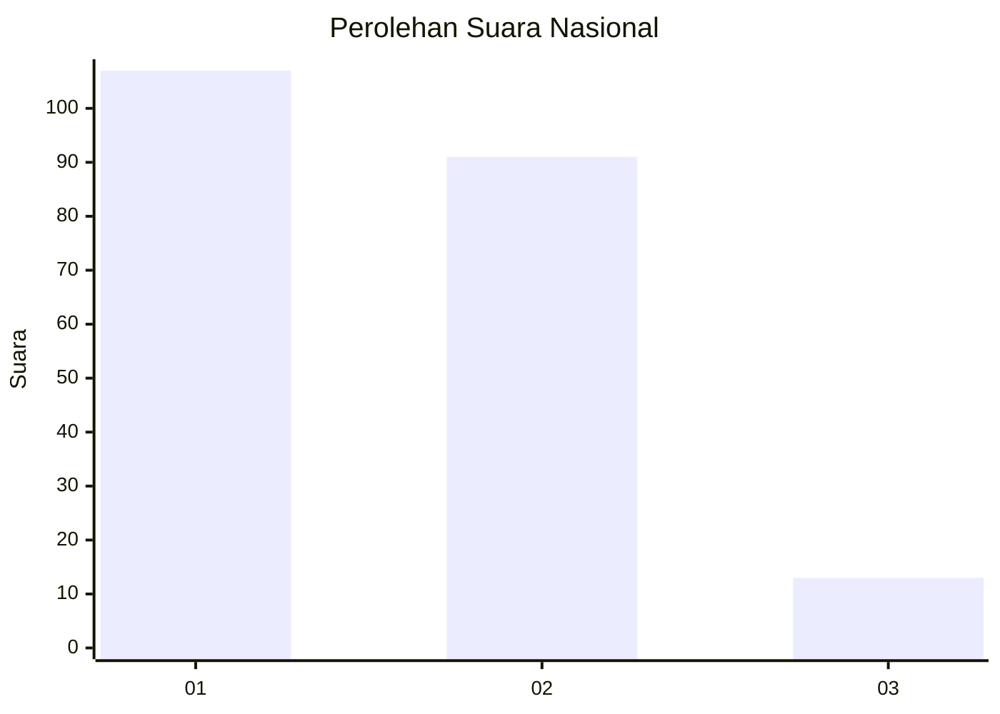
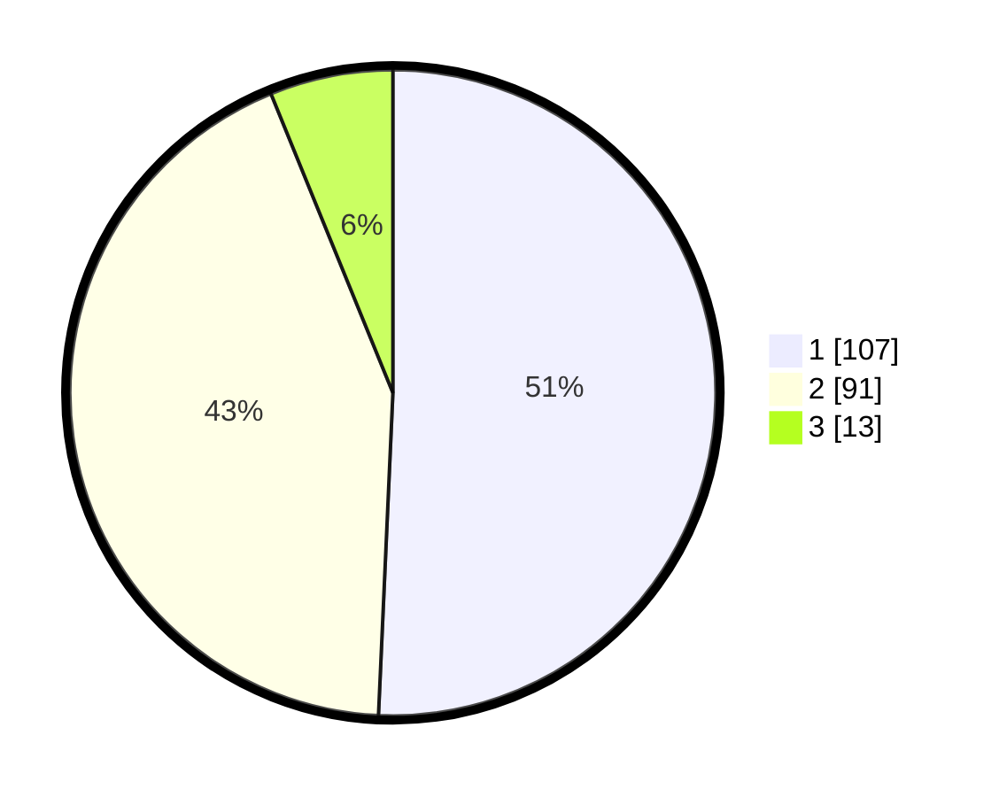

# Hasil

## Grafik

## Tabel

| No. | Nama Paslon    | Suara | Suara (raw) | Persentase |
|:--- |:-------------- | -----:| -----------:| ----------:|
| 1   | ANIES MUHAIMIN | 107   | [107][p-1]  | 50,71      |
| 2   | PRABOWO GIBRAN | 91    | [91][p-2]   | 43,13      |
| 3   | GANJAR MAHFUD  | 13    | [13][p-3]   | 6,16       |

[p-1]: https://github.com/gigit-pemilu/pemilu-2024/blob/main/pilpres/hitung-suara/sub/14-riau/sub/04-indragiri-hilir/sub/08-kateman/sub/2004-penjuru/sub/008-tps/sub/paslon-1.txt
[p-2]: https://github.com/gigit-pemilu/pemilu-2024/blob/main/pilpres/hitung-suara/sub/14-riau/sub/04-indragiri-hilir/sub/08-kateman/sub/2004-penjuru/sub/008-tps/sub/paslon-2.txt
[p-3]: https://github.com/gigit-pemilu/pemilu-2024/blob/main/pilpres/hitung-suara/sub/14-riau/sub/04-indragiri-hilir/sub/08-kateman/sub/2004-penjuru/sub/008-tps/sub/paslon-3.txt

## Foto C Plano

https://sirekap-obj-formc.kpu.go.id/316c/pemilu/ppwp/14/04/08/20/04/1404082004008-20240217-021407--60bfdd12-c5c0-4bf1-ac62-59bd278e8a6c.jpg

https://sirekap-obj-formc.kpu.go.id/316c/pemilu/ppwp/14/04/08/20/04/1404082004008-20240217-020702--3fc5efb5-ae38-4b14-919e-47d8be6533f5.jpg

https://sirekap-obj-formc.kpu.go.id/316c/pemilu/ppwp/14/04/08/20/04/1404082004008-20240217-021218--c8513502-ad07-40e8-8be6-c25474dc74ed.jpg

## Metadata

| Key        | Value               |
| ---------- | ------------------- |
| Time Stamp | 2024-02-25 17:00:00 |

