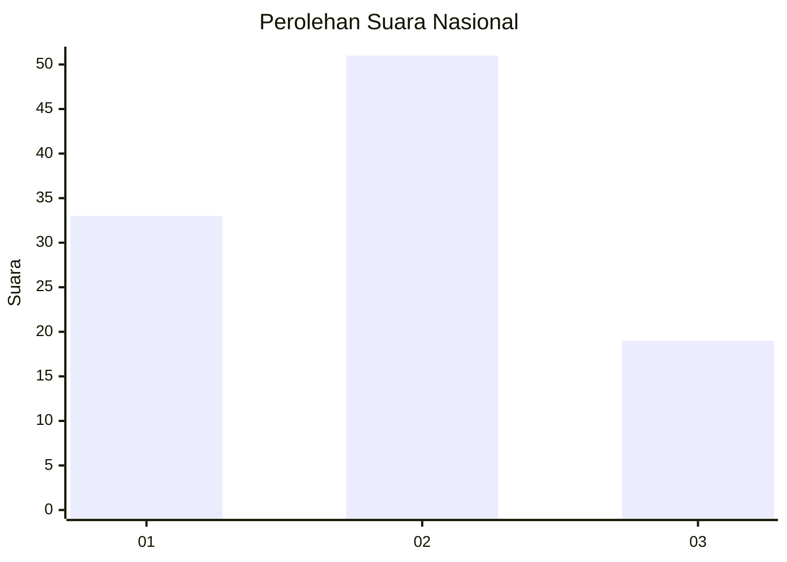
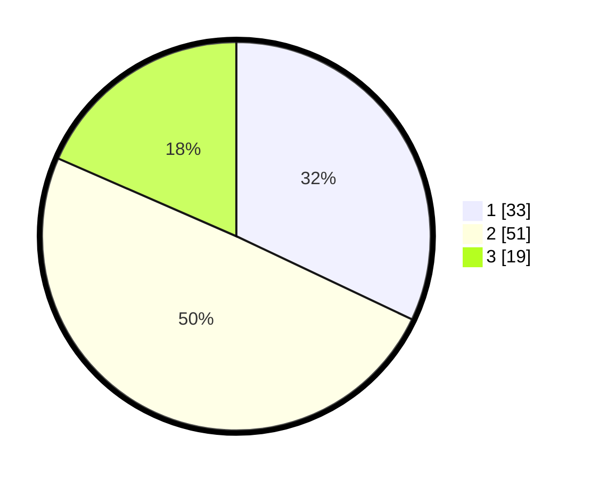

# Hasil

## Grafik

## Tabel

| No. | Nama Paslon    | Suara | Suara (raw) | Persentase |
|:--- |:-------------- | -----:| -----------:| ----------:|
| 1   | ANIES MUHAIMIN | 33    | [33][p-1]   | 32,04      |
| 2   | PRABOWO GIBRAN | 51    | [51][p-2]   | 49,51      |
| 3   | GANJAR MAHFUD  | 19    | [19][p-3]   | 18,45      |

[p-1]: https://github.com/gigit-pemilu/pemilu-2024/blob/main/pilpres/hitung-suara/sub/14-riau/sub/04-indragiri-hilir/sub/08-kateman/sub/2008-sungaiteritip/sub/006-tps/sub/paslon-1.txt
[p-2]: https://github.com/gigit-pemilu/pemilu-2024/blob/main/pilpres/hitung-suara/sub/14-riau/sub/04-indragiri-hilir/sub/08-kateman/sub/2008-sungaiteritip/sub/006-tps/sub/paslon-2.txt
[p-3]: https://github.com/gigit-pemilu/pemilu-2024/blob/main/pilpres/hitung-suara/sub/14-riau/sub/04-indragiri-hilir/sub/08-kateman/sub/2008-sungaiteritip/sub/006-tps/sub/paslon-3.txt

## Foto C Plano

https://sirekap-obj-formc.kpu.go.id/85f8/pemilu/ppwp/14/04/08/20/08/1404082008006-20240215-014221--8a90a11a-8393-4cf4-93be-981ad5a223af.jpg

https://sirekap-obj-formc.kpu.go.id/85f8/pemilu/ppwp/14/04/08/20/08/1404082008006-20240215-014851--a516c7b2-9e83-41be-a42a-d495cd47af29.jpg

https://sirekap-obj-formc.kpu.go.id/85f8/pemilu/ppwp/14/04/08/20/08/1404082008006-20240215-015109--6a282800-20c7-4d95-9530-20bdb02016f3.jpg

## Metadata

| Key        | Value               |
| ---------- | ------------------- |
| Time Stamp | 2024-02-24 22:31:28 |

