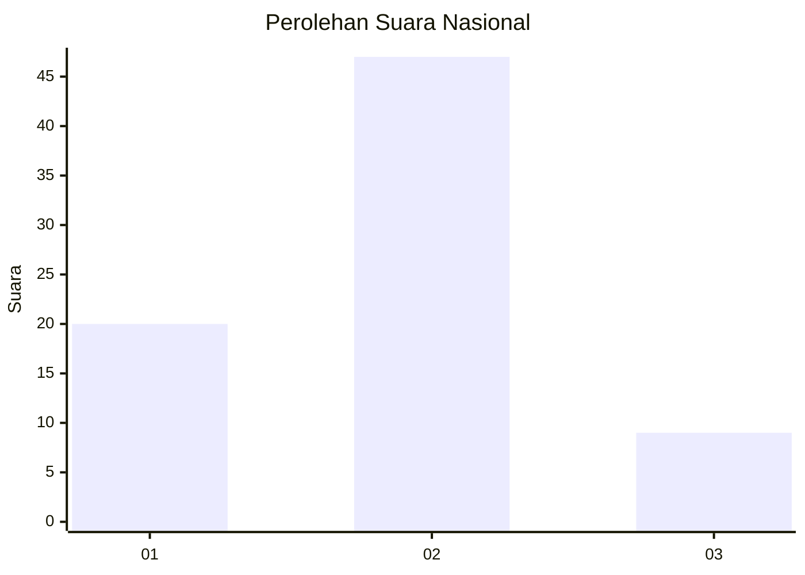
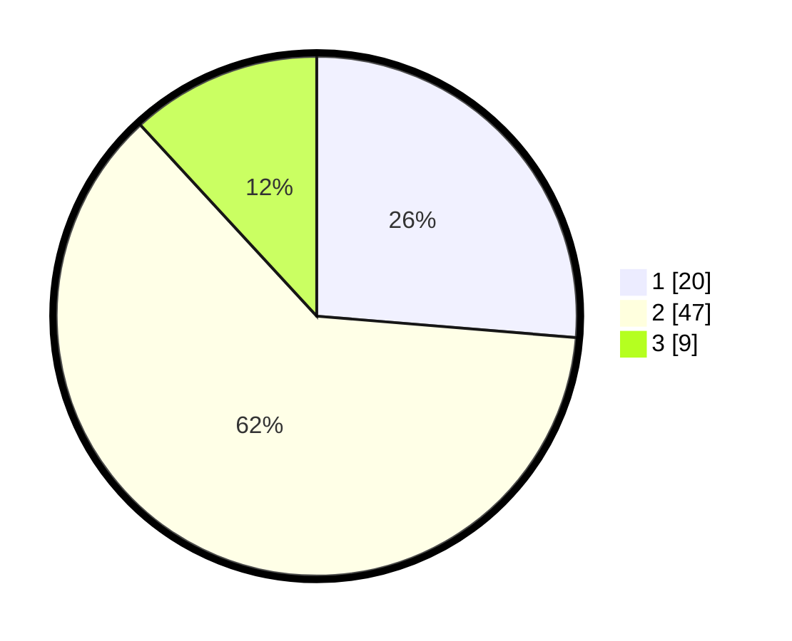

# Hasil

## Grafik

## Tabel

| No. | Nama Paslon    | Suara | Suara (raw) | Persentase |
|:--- |:-------------- | -----:| -----------:| ----------:|
| 1   | ANIES MUHAIMIN | 20    | [20][p-1]   | 26,32      |
| 2   | PRABOWO GIBRAN | 47    | [47][p-2]   | 61,84      |
| 3   | GANJAR MAHFUD  | 9     | [9][p-3]    | 11,84      |

[p-1]: https://github.com/gigit-pemilu/pemilu-2024/blob/main/pilpres/hitung-suara/sub/14-riau/sub/04-indragiri-hilir/sub/08-kateman/sub/2011-makmur-jaya/sub/005-tps/sub/paslon-1.txt
[p-2]: https://github.com/gigit-pemilu/pemilu-2024/blob/main/pilpres/hitung-suara/sub/14-riau/sub/04-indragiri-hilir/sub/08-kateman/sub/2011-makmur-jaya/sub/005-tps/sub/paslon-2.txt
[p-3]: https://github.com/gigit-pemilu/pemilu-2024/blob/main/pilpres/hitung-suara/sub/14-riau/sub/04-indragiri-hilir/sub/08-kateman/sub/2011-makmur-jaya/sub/005-tps/sub/paslon-3.txt

## Foto C Plano

https://sirekap-obj-formc.kpu.go.id/4598/pemilu/ppwp/14/04/08/20/11/1404082011005-20240214-231631--f6ea2ca9-fa8c-4fc5-801b-262debcb4c9a.jpg

https://sirekap-obj-formc.kpu.go.id/4598/pemilu/ppwp/14/04/08/20/11/1404082011005-20240214-231355--ed2150d6-b27b-4f6d-adef-0eb12f843e56.jpg

https://sirekap-obj-formc.kpu.go.id/4598/pemilu/ppwp/14/04/08/20/11/1404082011005-20240214-231144--10217e50-8176-4aa5-9af5-e38446450702.jpg

## Metadata

| Key        | Value               |
| ---------- | ------------------- |
| Time Stamp | 2024-02-24 22:31:28 |

