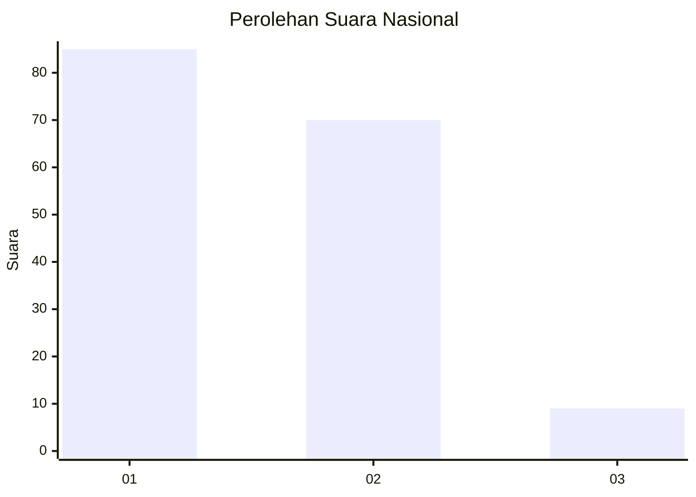
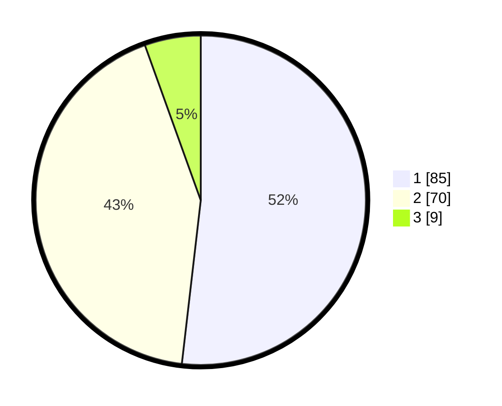

# Hasil

## Grafik

## Tabel

| No. | Nama Paslon    | Suara | Suara (raw) | Persentase |
|:--- |:-------------- | -----:| -----------:| ----------:|
| 1   | ANIES MUHAIMIN | 85    | [85][p-1]   | 51,83      |
| 2   | PRABOWO GIBRAN | 70    | [70][p-2]   | 42,68      |
| 3   | GANJAR MAHFUD  | 9     | [9][p-3]    | 5,49       |

[p-1]: https://github.com/gigit-pemilu/pemilu-2024/blob/main/pilpres/hitung-suara/sub/14-riau/sub/04-indragiri-hilir/sub/09-keritang/sub/1003-kota-baru-reteh/sub/007-tps/sub/paslon-1.txt
[p-2]: https://github.com/gigit-pemilu/pemilu-2024/blob/main/pilpres/hitung-suara/sub/14-riau/sub/04-indragiri-hilir/sub/09-keritang/sub/1003-kota-baru-reteh/sub/007-tps/sub/paslon-2.txt
[p-3]: https://github.com/gigit-pemilu/pemilu-2024/blob/main/pilpres/hitung-suara/sub/14-riau/sub/04-indragiri-hilir/sub/09-keritang/sub/1003-kota-baru-reteh/sub/007-tps/sub/paslon-3.txt

## Foto C Plano

https://sirekap-obj-formc.kpu.go.id/904c/pemilu/ppwp/14/04/09/10/03/1404091003007-20240214-193805--a593ff61-a7eb-475a-aa24-3bd5aee6b723.jpg

https://sirekap-obj-formc.kpu.go.id/904c/pemilu/ppwp/14/04/09/10/03/1404091003007-20240214-193242--aaeeebe1-8cf8-4f83-8f07-7e60eea4e9cc.jpg

https://sirekap-obj-formc.kpu.go.id/904c/pemilu/ppwp/14/04/09/10/03/1404091003007-20240214-193351--94591339-cde5-41cb-bf14-c74d1cf263d8.jpg

## Metadata

| Key        | Value               |
| ---------- | ------------------- |
| Time Stamp | 2024-02-24 22:31:28 |

