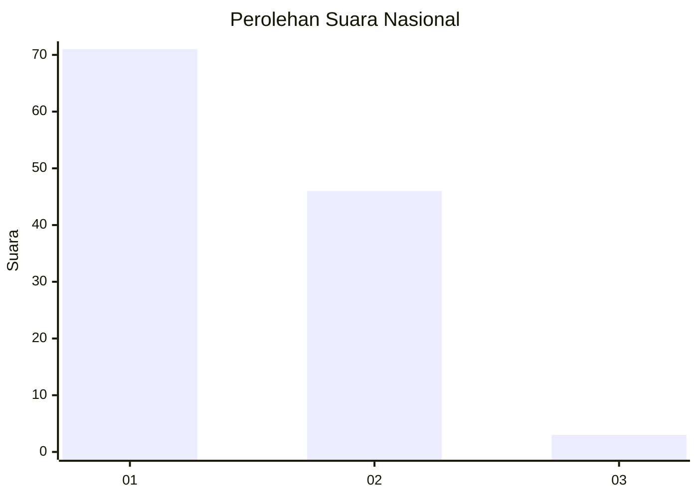
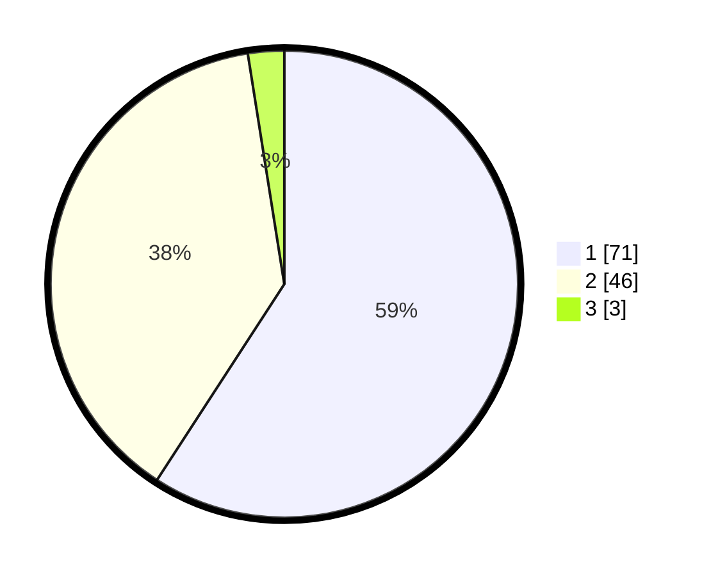

# Hasil

## Grafik

## Tabel

| No. | Nama Paslon    | Suara | Suara (raw) | Persentase |
|:--- |:-------------- | -----:| -----------:| ----------:|
| 1   | ANIES MUHAIMIN | 71    | [71][p-1]   | 59,17      |
| 2   | PRABOWO GIBRAN | 46    | [46][p-2]   | 38,33      |
| 3   | GANJAR MAHFUD  | 3     | [3][p-3]    | 2,50       |

[p-1]: https://github.com/gigit-pemilu/pemilu-2024/blob/main/pilpres/hitung-suara/sub/14-riau/sub/04-indragiri-hilir/sub/09-keritang/sub/2008-kuala-keritang/sub/011-tps/sub/paslon-1.txt
[p-2]: https://github.com/gigit-pemilu/pemilu-2024/blob/main/pilpres/hitung-suara/sub/14-riau/sub/04-indragiri-hilir/sub/09-keritang/sub/2008-kuala-keritang/sub/011-tps/sub/paslon-2.txt
[p-3]: https://github.com/gigit-pemilu/pemilu-2024/blob/main/pilpres/hitung-suara/sub/14-riau/sub/04-indragiri-hilir/sub/09-keritang/sub/2008-kuala-keritang/sub/011-tps/sub/paslon-3.txt

## Foto C Plano

https://sirekap-obj-formc.kpu.go.id/1dad/pemilu/ppwp/14/04/09/20/08/1404092008011-20240214-232316--f09bda08-26d5-4b85-a182-d853249e9773.jpg

https://sirekap-obj-formc.kpu.go.id/1dad/pemilu/ppwp/14/04/09/20/08/1404092008011-20240214-232409--5f6694ea-988c-43cb-a110-933180eacc94.jpg

https://sirekap-obj-formc.kpu.go.id/1dad/pemilu/ppwp/14/04/09/20/08/1404092008011-20240214-232432--0fb7a7d6-2c7d-4ff1-9dff-d7214048c5cf.jpg

## Metadata

| Key        | Value               |
| ---------- | ------------------- |
| Time Stamp | 2024-02-15 12:00:28 |

