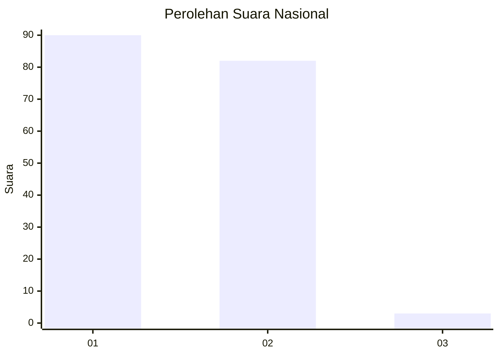
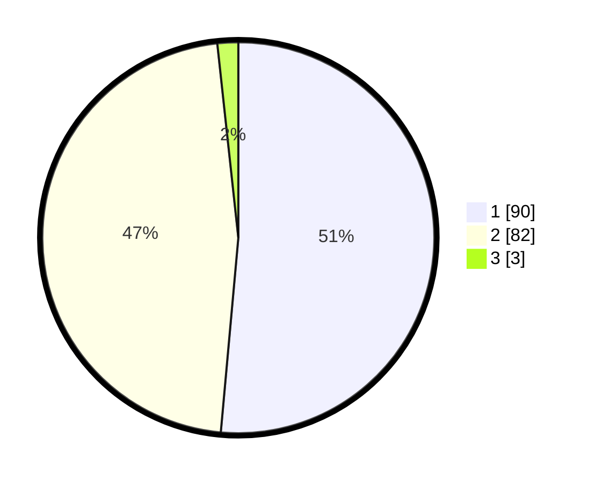

# Hasil

## Grafik

## Tabel

| No. | Nama Paslon    | Suara | Suara (raw) | Persentase |
|:--- |:-------------- | -----:| -----------:| ----------:|
| 1   | ANIES MUHAIMIN | 90    | [90][p-1]   | 51,43      |
| 2   | PRABOWO GIBRAN | 82    | [82][p-2]   | 46,86      |
| 3   | GANJAR MAHFUD  | 3     | [3][p-3]    | 1,71       |

[p-1]: https://github.com/gigit-pemilu/pemilu-2024/blob/main/pilpres/hitung-suara/sub/14-riau/sub/04-indragiri-hilir/sub/09-keritang/sub/2010-telukkelasa/sub/010-tps/sub/paslon-1.txt
[p-2]: https://github.com/gigit-pemilu/pemilu-2024/blob/main/pilpres/hitung-suara/sub/14-riau/sub/04-indragiri-hilir/sub/09-keritang/sub/2010-telukkelasa/sub/010-tps/sub/paslon-2.txt
[p-3]: https://github.com/gigit-pemilu/pemilu-2024/blob/main/pilpres/hitung-suara/sub/14-riau/sub/04-indragiri-hilir/sub/09-keritang/sub/2010-telukkelasa/sub/010-tps/sub/paslon-3.txt

## Foto C Plano

https://sirekap-obj-formc.kpu.go.id/69ee/pemilu/ppwp/14/04/09/20/10/1404092010010-20240215-042333--d6652de3-c712-4c50-90d7-339f8b4f3e3d.jpg

https://sirekap-obj-formc.kpu.go.id/69ee/pemilu/ppwp/14/04/09/20/10/1404092010010-20240215-042354--117e8562-6a70-40eb-9df9-511a050d77a9.jpg

https://sirekap-obj-formc.kpu.go.id/69ee/pemilu/ppwp/14/04/09/20/10/1404092010010-20240215-042418--51ca40de-f2f7-4d76-ad85-e1ea0c5bad4b.jpg

## Metadata

| Key        | Value               |
| ---------- | ------------------- |
| Time Stamp | 2024-02-25 16:00:00 |

