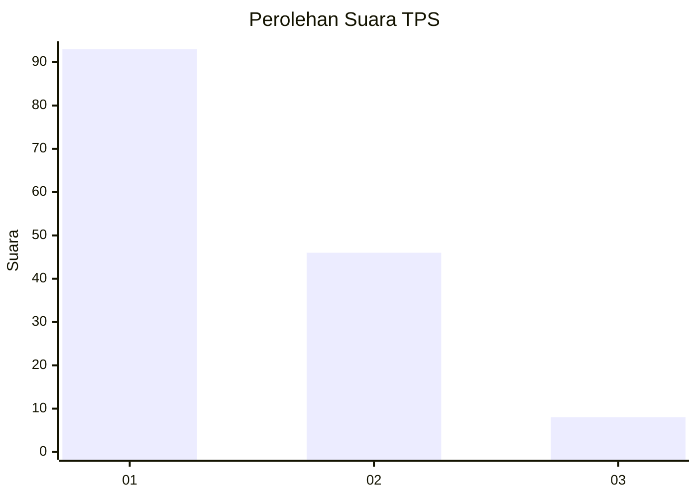
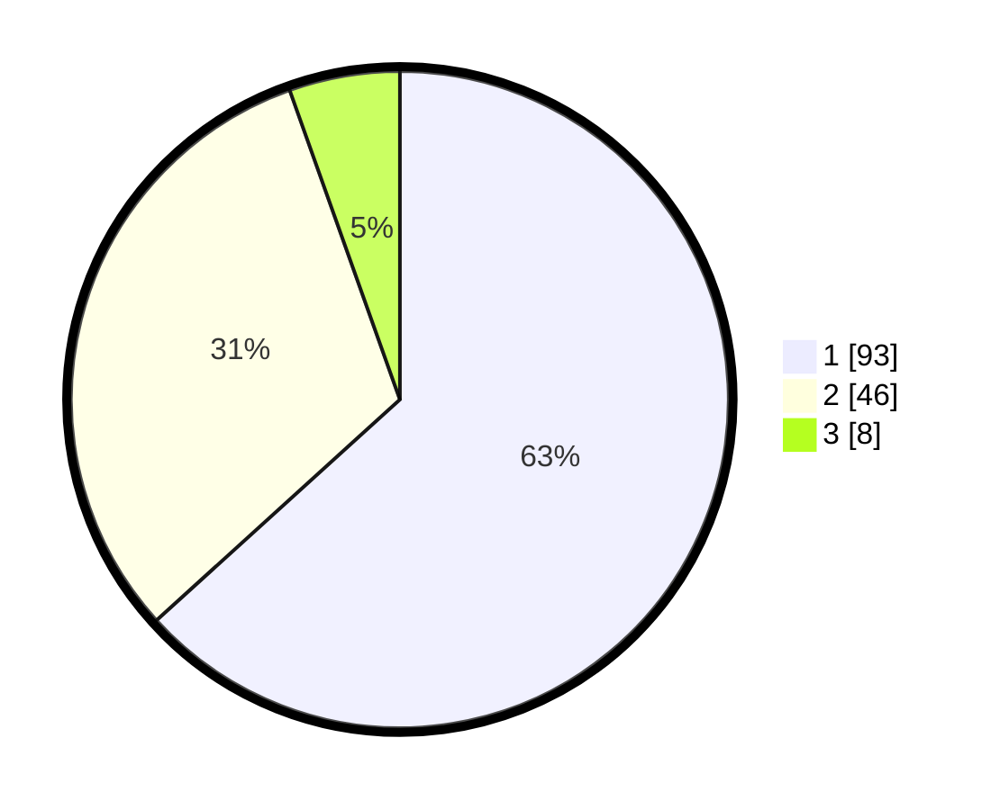

# Hasil

## Grafik

## Tabel

| No. | Nama Paslon    | Suara | Suara (raw) | Persentase |
|:--- |:-------------- | -----:| -----------:| ----------:|
| 1   | ANIES MUHAIMIN | 93    | [93][p-1]   | 63,27      |
| 2   | PRABOWO GIBRAN | 46    | [46][p-2]   | 31,29      |
| 3   | GANJAR MAHFUD  | 8     | [8][p-3]    | 5,44       |

[p-1]: https://github.com/gigit-pemilu/pemilu-2024-14-riau/blob/main/pilpres/hitung-suara/sub/14-riau/sub/04-indragiri-hilir/sub/09-keritang/sub/2015-nyiur-permai/sub/002-tps/sub/paslon-1.txt
[p-2]: https://github.com/gigit-pemilu/pemilu-2024-14-riau/blob/main/pilpres/hitung-suara/sub/14-riau/sub/04-indragiri-hilir/sub/09-keritang/sub/2015-nyiur-permai/sub/002-tps/sub/paslon-2.txt
[p-3]: https://github.com/gigit-pemilu/pemilu-2024-14-riau/blob/main/pilpres/hitung-suara/sub/14-riau/sub/04-indragiri-hilir/sub/09-keritang/sub/2015-nyiur-permai/sub/002-tps/sub/paslon-3.txt

## Foto C Plano

https://sirekap-obj-formc.kpu.go.id/de7b/pemilu/ppwp/14/04/09/20/15/1404092015002-20240215-085135--1c1e4d45-89c7-4fa1-a201-6b1b3f3398cb.jpg

https://sirekap-obj-formc.kpu.go.id/de7b/pemilu/ppwp/14/04/09/20/15/1404092015002-20240215-085155--287fe6f7-ac7e-47ab-9838-d67ca5315b3c.jpg

https://sirekap-obj-formc.kpu.go.id/de7b/pemilu/ppwp/14/04/09/20/15/1404092015002-20240215-085212--34478b7c-f833-4113-ae2f-6a169a0f5866.jpg

## Metadata

| Key        | Value               |
| ---------- | ------------------- |
| Time Stamp | 2024-02-24 22:31:28 |

