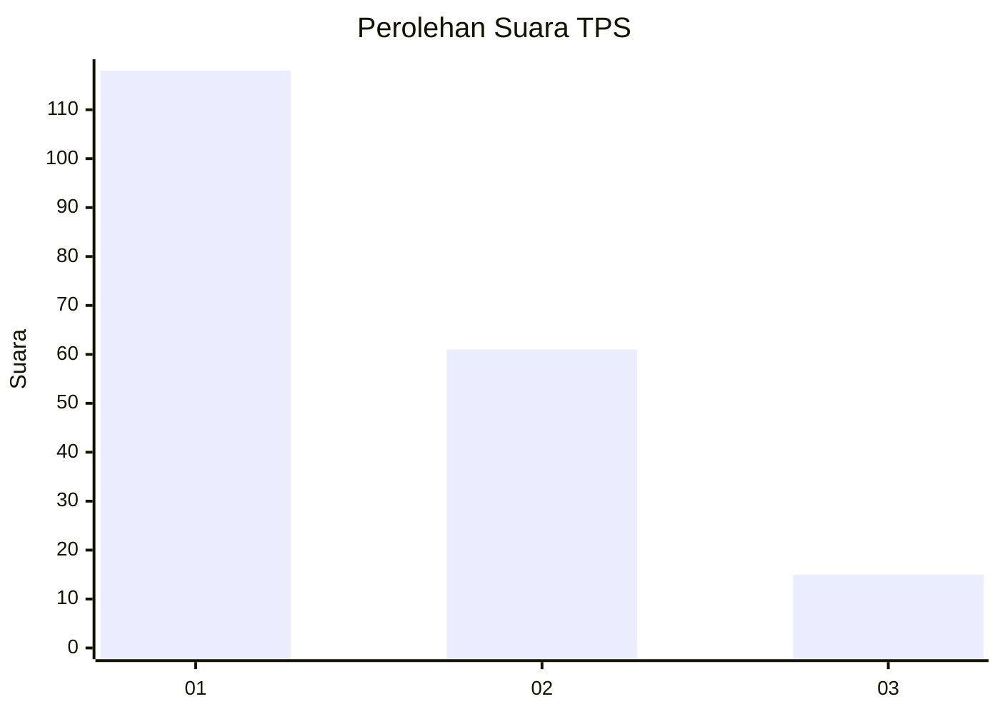
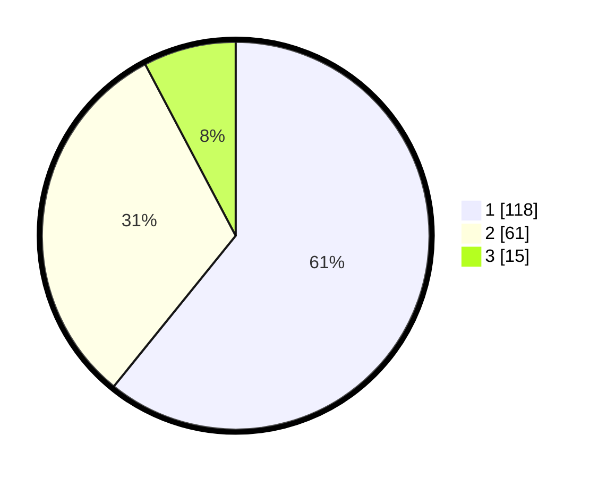

# Hasil

## Grafik

## Tabel

| No. | Nama Paslon    | Suara | Suara (raw) | Persentase |
|:--- |:-------------- | -----:| -----------:| ----------:|
| 1   | ANIES MUHAIMIN | 118   | [118][p-1]  | 60,82      |
| 2   | PRABOWO GIBRAN | 61    | [61][p-2]   | 31,44      |
| 3   | GANJAR MAHFUD  | 15    | [15][p-3]   | 7,73       |

[p-1]: https://github.com/gigit-pemilu/pemilu-2024-14-riau/blob/main/pilpres/hitung-suara/sub/14-riau/sub/04-indragiri-hilir/sub/11-batang-tuaka/sub/1001-sungaipiring/sub/003-tps/sub/paslon-1.txt
[p-2]: https://github.com/gigit-pemilu/pemilu-2024-14-riau/blob/main/pilpres/hitung-suara/sub/14-riau/sub/04-indragiri-hilir/sub/11-batang-tuaka/sub/1001-sungaipiring/sub/003-tps/sub/paslon-2.txt
[p-3]: https://github.com/gigit-pemilu/pemilu-2024-14-riau/blob/main/pilpres/hitung-suara/sub/14-riau/sub/04-indragiri-hilir/sub/11-batang-tuaka/sub/1001-sungaipiring/sub/003-tps/sub/paslon-3.txt

## Foto C Plano

https://sirekap-obj-formc.kpu.go.id/8e11/pemilu/ppwp/14/04/11/10/01/1404111001003-20240215-091748--97975b83-e8ef-4d03-88cb-fffcbe1a560d.jpg

https://sirekap-obj-formc.kpu.go.id/8e11/pemilu/ppwp/14/04/11/10/01/1404111001003-20240215-092352--4121cf72-3e5f-4204-81c9-3bfc79b8384e.jpg

https://sirekap-obj-formc.kpu.go.id/8e11/pemilu/ppwp/14/04/11/10/01/1404111001003-20240215-092603--24013808-b297-45d6-bacf-81ff004e34aa.jpg

## Metadata

| Key        | Value               |
| ---------- | ------------------- |
| Time Stamp | 2024-02-25 21:00:00 |

