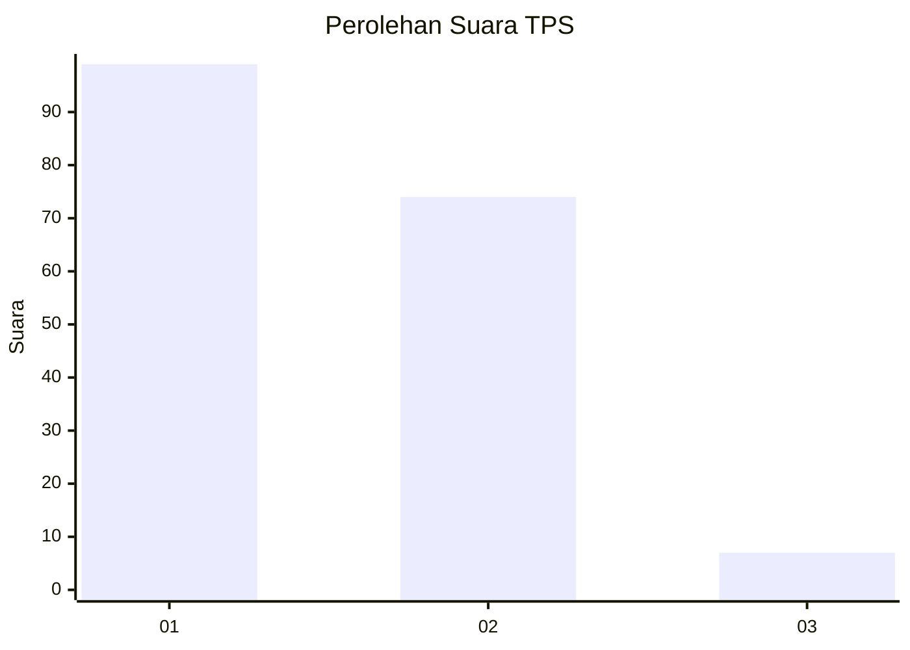
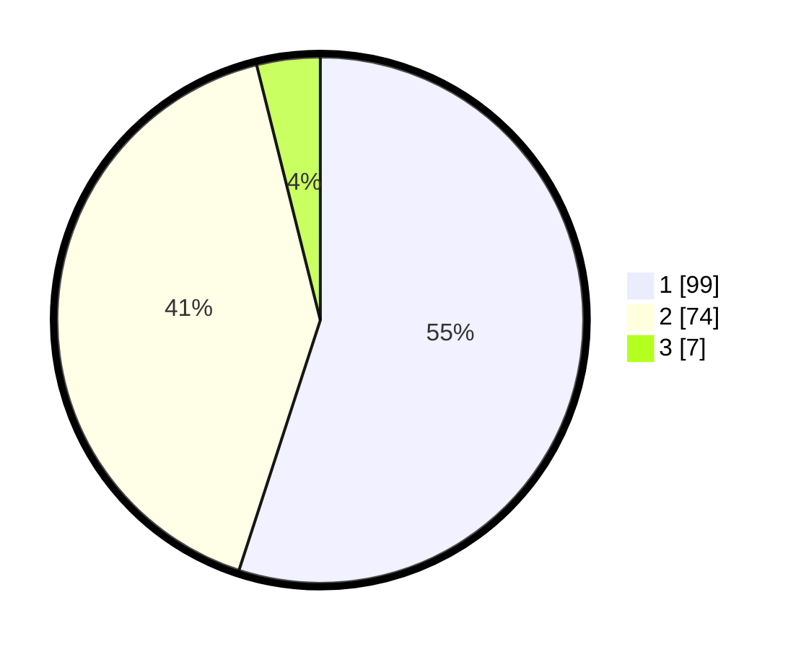

# Hasil

## Grafik

## Tabel

| No. | Nama Paslon    | Suara | Suara (raw) | Persentase |
|:--- |:-------------- | -----:| -----------:| ----------:|
| 1   | ANIES MUHAIMIN | 99    | [99][p-1]   | 55,00      |
| 2   | PRABOWO GIBRAN | 74    | [74][p-2]   | 41,11      |
| 3   | GANJAR MAHFUD  | 7     | [7][p-3]    | 3,89       |

[p-1]: https://github.com/gigit-pemilu/pemilu-2024-14-riau/blob/main/pilpres/hitung-suara/sub/14-riau/sub/04-indragiri-hilir/sub/11-batang-tuaka/sub/1001-sungaipiring/sub/006-tps/sub/paslon-1.txt
[p-2]: https://github.com/gigit-pemilu/pemilu-2024-14-riau/blob/main/pilpres/hitung-suara/sub/14-riau/sub/04-indragiri-hilir/sub/11-batang-tuaka/sub/1001-sungaipiring/sub/006-tps/sub/paslon-2.txt
[p-3]: https://github.com/gigit-pemilu/pemilu-2024-14-riau/blob/main/pilpres/hitung-suara/sub/14-riau/sub/04-indragiri-hilir/sub/11-batang-tuaka/sub/1001-sungaipiring/sub/006-tps/sub/paslon-3.txt

## Foto C Plano

https://sirekap-obj-formc.kpu.go.id/a663/pemilu/ppwp/14/04/11/10/01/1404111001006-20240215-005457--abdbc3cf-aafb-4a43-a3ce-b4583206dff7.jpg

https://sirekap-obj-formc.kpu.go.id/a663/pemilu/ppwp/14/04/11/10/01/1404111001006-20240215-005310--e782864c-cb12-4b29-aafa-7710aa2e30cc.jpg

https://sirekap-obj-formc.kpu.go.id/a663/pemilu/ppwp/14/04/11/10/01/1404111001006-20240215-005143--969b0854-e2b8-48f5-b1a8-b8e1f2109e86.jpg

## Metadata

| Key        | Value               |
| ---------- | ------------------- |
| Time Stamp | 2024-02-25 12:00:00 |

