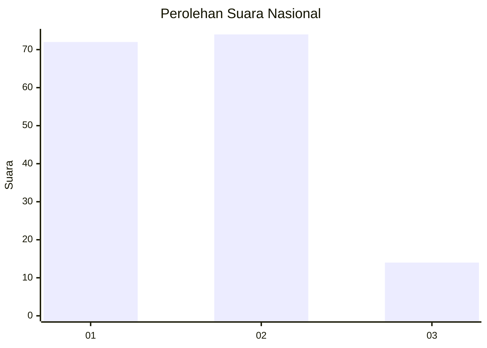
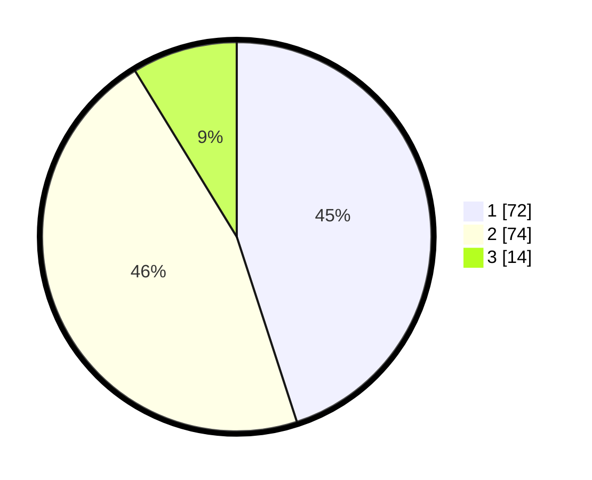

# Hasil

## Grafik

## Tabel

| No. | Nama Paslon    | Suara | Suara (raw) | Persentase |
|:--- |:-------------- | -----:| -----------:| ----------:|
| 1   | ANIES MUHAIMIN | 72    | [72][p-1]   | 45,00      |
| 2   | PRABOWO GIBRAN | 74    | [74][p-2]   | 46,25      |
| 3   | GANJAR MAHFUD  | 14    | [14][p-3]   | 8,75       |

[p-1]: https://github.com/gigit-pemilu/pemilu-2024/blob/main/pilpres/hitung-suara/sub/14-riau/sub/04-indragiri-hilir/sub/11-batang-tuaka/sub/1001-sungaipiring/sub/007-tps/sub/paslon-1.txt
[p-2]: https://github.com/gigit-pemilu/pemilu-2024/blob/main/pilpres/hitung-suara/sub/14-riau/sub/04-indragiri-hilir/sub/11-batang-tuaka/sub/1001-sungaipiring/sub/007-tps/sub/paslon-2.txt
[p-3]: https://github.com/gigit-pemilu/pemilu-2024/blob/main/pilpres/hitung-suara/sub/14-riau/sub/04-indragiri-hilir/sub/11-batang-tuaka/sub/1001-sungaipiring/sub/007-tps/sub/paslon-3.txt

## Foto C Plano

https://sirekap-obj-formc.kpu.go.id/c772/pemilu/ppwp/14/04/11/10/01/1404111001007-20240214-225608--53c25579-574a-46c1-8623-5c7bea229615.jpg

https://sirekap-obj-formc.kpu.go.id/c772/pemilu/ppwp/14/04/11/10/01/1404111001007-20240214-225711--32c9076c-29b7-49f3-acdb-ef903921c683.jpg

https://sirekap-obj-formc.kpu.go.id/c772/pemilu/ppwp/14/04/11/10/01/1404111001007-20240214-225810--457ec2e7-0e44-4fb5-beba-6fe5b954a3f2.jpg

## Metadata

| Key        | Value               |
| ---------- | ------------------- |
| Time Stamp | 2024-02-22 11:00:00 |

