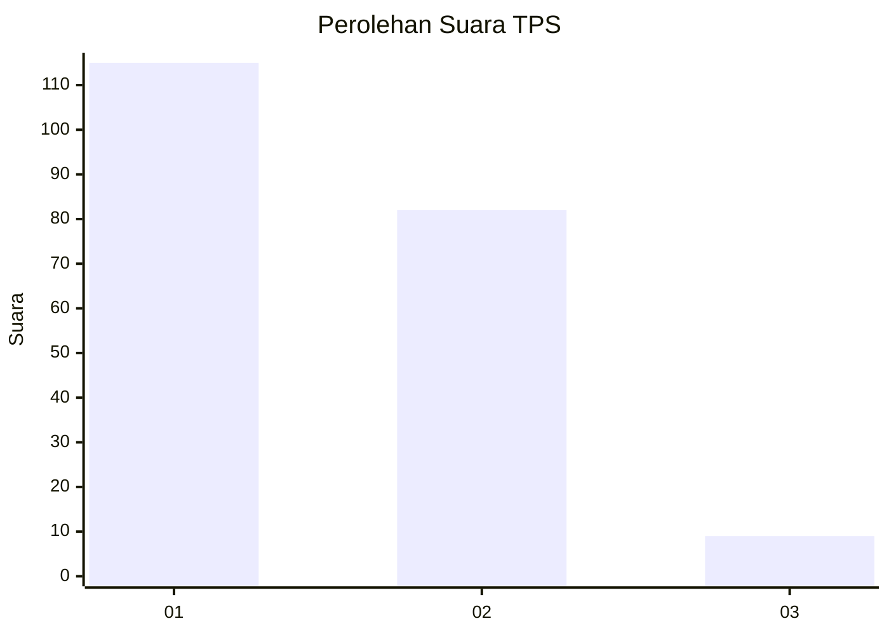
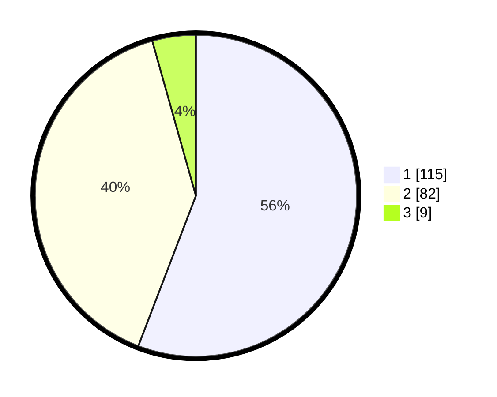

# Hasil

## Grafik

## Tabel

| No. | Nama Paslon    | Suara | Suara (raw) | Persentase |
|:--- |:-------------- | -----:| -----------:| ----------:|
| 1   | ANIES MUHAIMIN | 115   | [115][p-1]  | 55,83      |
| 2   | PRABOWO GIBRAN | 82    | [82][p-2]   | 39,81      |
| 3   | GANJAR MAHFUD  | 9     | [9][p-3]    | 4,37       |

[p-1]: https://github.com/gigit-pemilu/pemilu-2024-14-riau/blob/main/pilpres/hitung-suara/sub/14-riau/sub/04-indragiri-hilir/sub/12-gaung/sub/1006-kuala-lahang/sub/004-tps/sub/paslon-1.txt
[p-2]: https://github.com/gigit-pemilu/pemilu-2024-14-riau/blob/main/pilpres/hitung-suara/sub/14-riau/sub/04-indragiri-hilir/sub/12-gaung/sub/1006-kuala-lahang/sub/004-tps/sub/paslon-2.txt
[p-3]: https://github.com/gigit-pemilu/pemilu-2024-14-riau/blob/main/pilpres/hitung-suara/sub/14-riau/sub/04-indragiri-hilir/sub/12-gaung/sub/1006-kuala-lahang/sub/004-tps/sub/paslon-3.txt

## Foto C Plano

https://sirekap-obj-formc.kpu.go.id/0a1b/pemilu/ppwp/14/04/12/10/06/1404121006004-20240214-205941--043749a1-2e69-46cc-a619-02edba88190c.jpg

https://sirekap-obj-formc.kpu.go.id/0a1b/pemilu/ppwp/14/04/12/10/06/1404121006004-20240214-201703--4ee3fda0-0ceb-4359-8cb3-405d4f394366.jpg

https://sirekap-obj-formc.kpu.go.id/0a1b/pemilu/ppwp/14/04/12/10/06/1404121006004-20240214-201754--c0fdc344-d31d-4553-a55c-2eb9ac0772b7.jpg

## Metadata

| Key        | Value               |
| ---------- | ------------------- |
| Time Stamp | 2024-02-24 22:31:28 |

