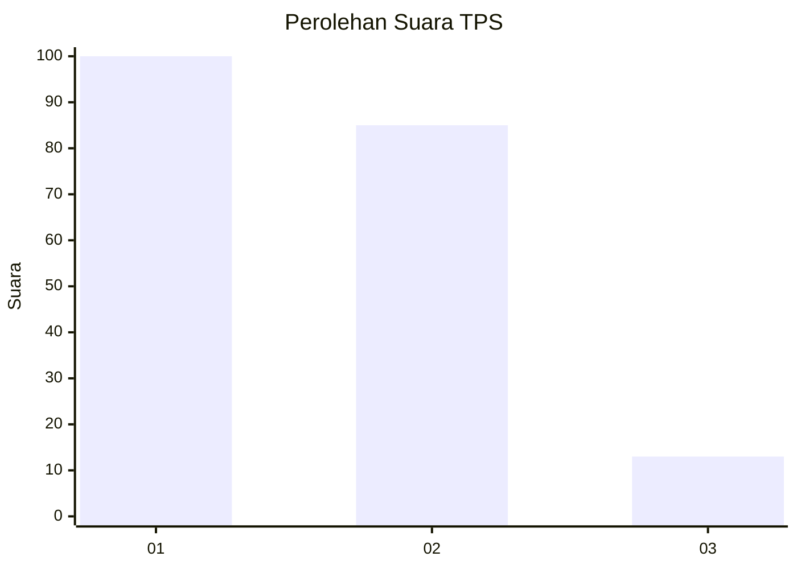
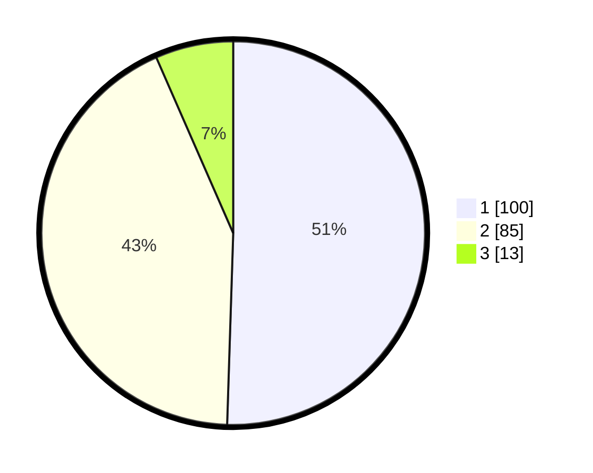

# Hasil

## Grafik

## Tabel

| No. | Nama Paslon    | Suara | Suara (raw) | Persentase |
|:--- |:-------------- | -----:| -----------:| ----------:|
| 1   | ANIES MUHAIMIN | 100   | [100][p-1]  | 50,51      |
| 2   | PRABOWO GIBRAN | 85    | [85][p-2]   | 42,93      |
| 3   | GANJAR MAHFUD  | 13    | [13][p-3]   | 6,57       |

[p-1]: https://github.com/gigit-pemilu/pemilu-2024-14-riau/blob/main/pilpres/hitung-suara/sub/14-riau/sub/04-indragiri-hilir/sub/12-gaung/sub/1006-kuala-lahang/sub/006-tps/sub/paslon-1.txt
[p-2]: https://github.com/gigit-pemilu/pemilu-2024-14-riau/blob/main/pilpres/hitung-suara/sub/14-riau/sub/04-indragiri-hilir/sub/12-gaung/sub/1006-kuala-lahang/sub/006-tps/sub/paslon-2.txt
[p-3]: https://github.com/gigit-pemilu/pemilu-2024-14-riau/blob/main/pilpres/hitung-suara/sub/14-riau/sub/04-indragiri-hilir/sub/12-gaung/sub/1006-kuala-lahang/sub/006-tps/sub/paslon-3.txt

## Foto C Plano

https://sirekap-obj-formc.kpu.go.id/3a2e/pemilu/ppwp/14/04/12/10/06/1404121006006-20240222-103940--139d37d5-b74f-4ee7-92b3-848bfb64ad88.jpg

https://sirekap-obj-formc.kpu.go.id/3a2e/pemilu/ppwp/14/04/12/10/06/1404121006006-20240214-193341--4031a984-d066-4cda-bcec-71079a7d5a32.jpg

https://sirekap-obj-formc.kpu.go.id/3a2e/pemilu/ppwp/14/04/12/10/06/1404121006006-20240214-195151--d5d1bb1c-e402-4488-9bfc-8085b5532136.jpg

## Metadata

| Key        | Value               |
| ---------- | ------------------- |
| Time Stamp | 2024-02-25 15:00:00 |

