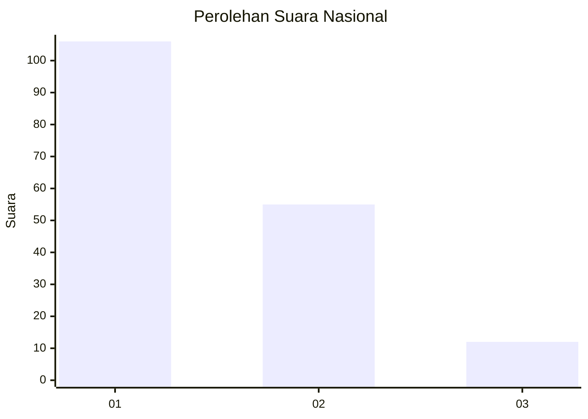
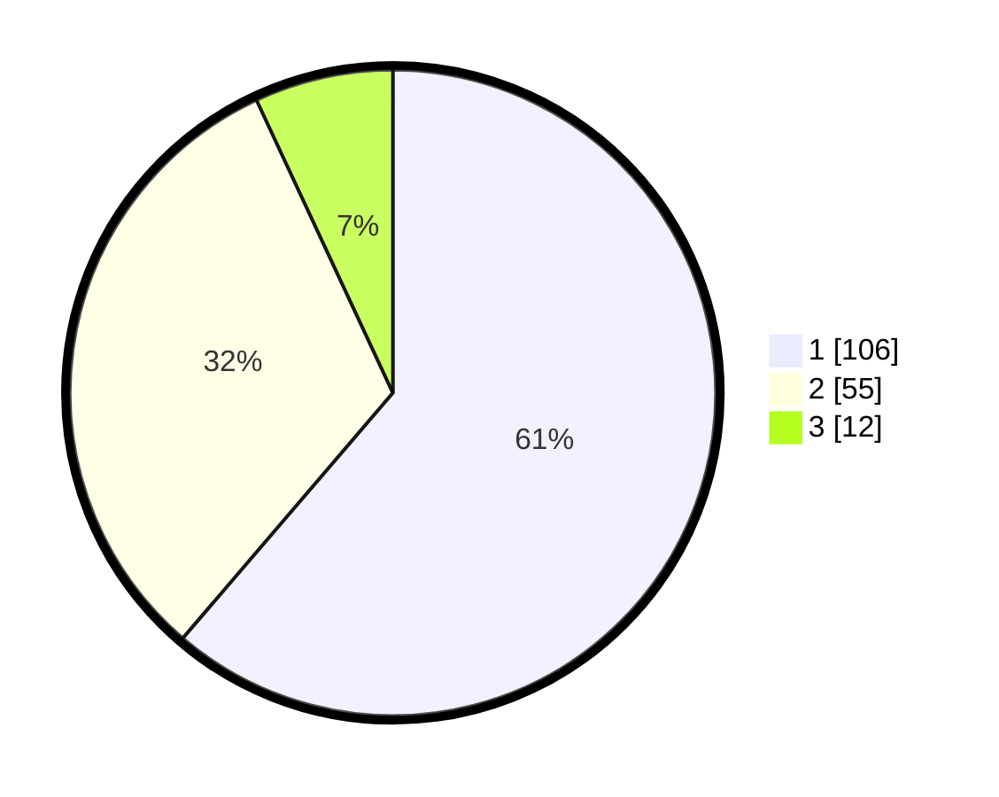

# Hasil

## Grafik

## Tabel

| No. | Nama Paslon    | Suara | Suara (raw) | Persentase |
|:--- |:-------------- | -----:| -----------:| ----------:|
| 1   | ANIES MUHAIMIN | 106   | [106][p-1]  | 61,27      |
| 2   | PRABOWO GIBRAN | 55    | [55][p-2]   | 31,79      |
| 3   | GANJAR MAHFUD  | 12    | [12][p-3]   | 6,94       |

[p-1]: https://github.com/gigit-pemilu/pemilu-2024/blob/main/pilpres/hitung-suara/sub/14-riau/sub/04-indragiri-hilir/sub/12-gaung/sub/2004-belantaraya/sub/022-tps/sub/paslon-1.txt
[p-2]: https://github.com/gigit-pemilu/pemilu-2024/blob/main/pilpres/hitung-suara/sub/14-riau/sub/04-indragiri-hilir/sub/12-gaung/sub/2004-belantaraya/sub/022-tps/sub/paslon-2.txt
[p-3]: https://github.com/gigit-pemilu/pemilu-2024/blob/main/pilpres/hitung-suara/sub/14-riau/sub/04-indragiri-hilir/sub/12-gaung/sub/2004-belantaraya/sub/022-tps/sub/paslon-3.txt

## Foto C Plano

https://sirekap-obj-formc.kpu.go.id/b5e1/pemilu/ppwp/14/04/12/20/04/1404122004022-20240215-014659--b7f65e57-efc7-4b09-8dd5-08fc8b7320d2.jpg

https://sirekap-obj-formc.kpu.go.id/b5e1/pemilu/ppwp/14/04/12/20/04/1404122004022-20240215-014511--0979a1a1-daf3-4cc9-93db-05bceca81fcc.jpg

https://sirekap-obj-formc.kpu.go.id/b5e1/pemilu/ppwp/14/04/12/20/04/1404122004022-20240215-014649--8f4a5358-106f-44d1-996f-71629d473ecf.jpg

## Metadata

| Key        | Value               |
| ---------- | ------------------- |
| Time Stamp | 2024-02-25 13:00:00 |

