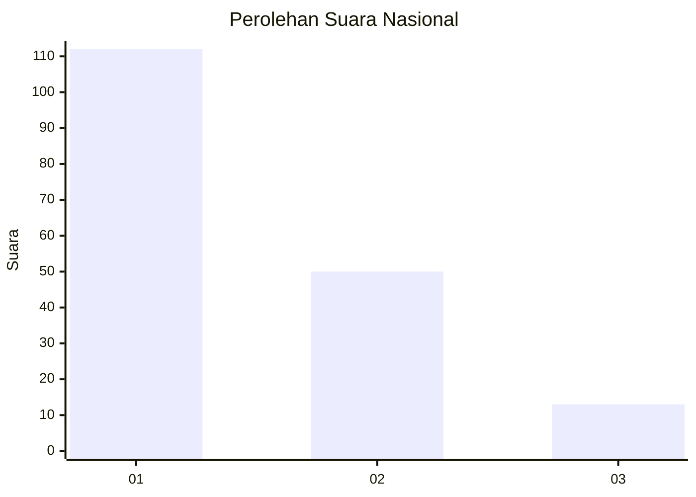
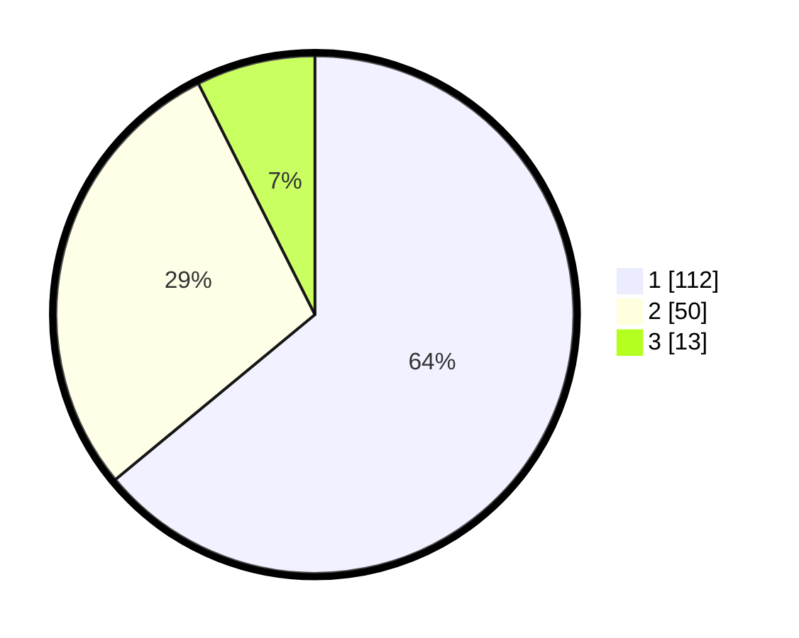

# Hasil

## Grafik

## Tabel

| No. | Nama Paslon    | Suara | Suara (raw) | Persentase |
|:--- |:-------------- | -----:| -----------:| ----------:|
| 1   | ANIES MUHAIMIN | 112   | [112][p-1]  | 64,00      |
| 2   | PRABOWO GIBRAN | 50    | [50][p-2]   | 28,57      |
| 3   | GANJAR MAHFUD  | 13    | [13][p-3]   | 7,43       |

[p-1]: https://github.com/gigit-pemilu/pemilu-2024/blob/main/pilpres/hitung-suara/sub/14-riau/sub/04-indragiri-hilir/sub/12-gaung/sub/2014-telukmerbau/sub/003-tps/sub/paslon-1.txt
[p-2]: https://github.com/gigit-pemilu/pemilu-2024/blob/main/pilpres/hitung-suara/sub/14-riau/sub/04-indragiri-hilir/sub/12-gaung/sub/2014-telukmerbau/sub/003-tps/sub/paslon-2.txt
[p-3]: https://github.com/gigit-pemilu/pemilu-2024/blob/main/pilpres/hitung-suara/sub/14-riau/sub/04-indragiri-hilir/sub/12-gaung/sub/2014-telukmerbau/sub/003-tps/sub/paslon-3.txt

## Foto C Plano

https://sirekap-obj-formc.kpu.go.id/43fa/pemilu/ppwp/14/04/12/20/14/1404122014003-20240215-143850--d4da1c6b-7e2c-4a61-ae67-d86baccb0ac3.jpg

https://sirekap-obj-formc.kpu.go.id/43fa/pemilu/ppwp/14/04/12/20/14/1404122014003-20240215-143903--62e1c39b-2a95-41f2-8d0e-7ab382d1742a.jpg

https://sirekap-obj-formc.kpu.go.id/43fa/pemilu/ppwp/14/04/12/20/14/1404122014003-20240215-143917--0bdb91ca-288c-4331-b7b6-e025f81232d4.jpg

## Metadata

| Key        | Value               |
| ---------- | ------------------- |
| Time Stamp | 2024-02-19 06:16:00 |

